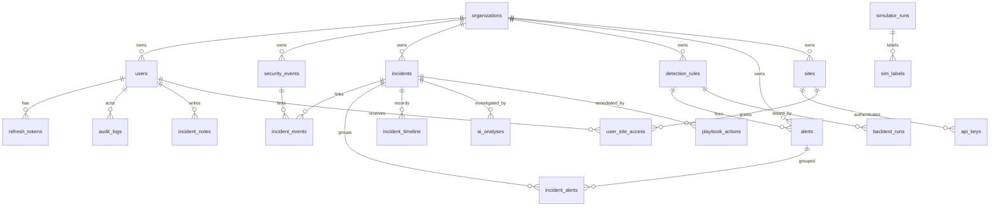

# Database

## 1. Database Type, Version, Connection Config, ORM/Driver
Database is MySQL 8 according to README and Docker Compose documentation. Backend uses Spring Data JPA/Hibernate with Flyway migrations and MySQL Connector/J. Dev DB URL is `jdbc:mysql://localhost:3306/sentinelai?createDatabaseIfNotExist=true&serverTimezone=UTC&allowPublicKeyRetrieval=true&useSSL=false`; user/password default to `sentinel`/`sentinel`. Production uses env variables `DB_URL`, `DB_USER`, `DB_PASSWORD` and `useSSL=true` by default.

## 2. Every Table/Collection
The schema source of truth is the Flyway SQL below. Exact columns, data types, primary/foreign keys, constraints, indexes, and defaults are in these files.

| Migration | Creates/alters | Seed data | Purpose |
|---|---|---|---|
| `backend/src/main/resources/db/migration/V10__audit_logs.sql` | creates: audit_logs; alters: none | none | -- SentinelAI :: audit_logs (audit module) -- insert-only, tamper-evident hash chain |
| `backend/src/main/resources/db/migration/V11__notifications.sql` | creates: notifications; alters: none | none | -- SentinelAI :: notifications (notification module) |
| `backend/src/main/resources/db/migration/V12__honeytokens.sql` | creates: honeytokens; alters: none | none | -- SentinelAI :: honeytokens (honeytoken module) -- decoy credentials/resources |
| `backend/src/main/resources/db/migration/V13__entity_baselines.sql` | creates: entity_baselines; alters: none | none | -- SentinelAI :: entity_baselines (baseline module) -- rolling per-entity metric baselines |
| `backend/src/main/resources/db/migration/V14__playbook_actions.sql` | creates: playbook_actions; alters: none | none | -- SentinelAI :: playbook_actions (playbook module) -- proposed/approved response actions |
| `backend/src/main/resources/db/migration/V15__auth_tokens_and_lockout.sql` | creates: refresh_tokens; alters: users | none | -- SentinelAI :: auth hardening -- account lockout fields + hashed refresh tokens |
| `backend/src/main/resources/db/migration/V16__incident_correlation.sql` | creates: none; alters: incidents | none | -- SentinelAI :: incident correlation key -- lets the detection engine dedupe/correlate |
| `backend/src/main/resources/db/migration/V17__alerts.sql` | creates: alerts; alters: none | none | -- SentinelAI :: alerts -- a detection rule firing. Incidents are created in a later phase. |
| `backend/src/main/resources/db/migration/V18__security_event_client_id.sql` | creates: none; alters: security_events | none | -- SentinelAI :: optional client-supplied event id for idempotent ingestion. |
| `backend/src/main/resources/db/migration/V19__simulator.sql` | creates: simulator_runs, sim_labels; alters: none | none | -- SentinelAI :: simulator runs + ground-truth labels for the evaluation harness. |
| `backend/src/main/resources/db/migration/V1__baseline.sql` | creates: app_info; alters: none | app_info | -- SentinelAI :: Flyway baseline (Phase 0/1) |
| `backend/src/main/resources/db/migration/V20__incident_alerts_and_timeline.sql` | creates: incident_alerts, incident_timeline; alters: none | none | -- SentinelAI :: correlation layer -- alerts grouped into incidents + an incident timeline. |
| `backend/src/main/resources/db/migration/V21__sites_and_api_keys.sql` | creates: sites, api_keys, user_site_access; alters: security_events, incidents, detection_rules | sites, user_site_access | -- SentinelAI :: multi-site tenancy under an org, with per-site ingest API keys. |
| `backend/src/main/resources/db/migration/V22__admin_risk.sql` | creates: admin_baselines, pending_admin_actions; alters: none | none | -- SentinelAI :: admin-action risk — per-admin baselines + risk-gated pending actions. |
| `backend/src/main/resources/db/migration/V23__kafka_outbox_dlq.sql` | creates: outbox, processed_messages, dlq_messages; alters: none | none | -- SentinelAI :: Phase 11 — Kafka pipeline persistence. |
| `backend/src/main/resources/db/migration/V24__ai_investigation.sql` | creates: none; alters: ai_analyses, playbook_actions, security_events | none | -- SentinelAI :: Phase 12 — AI investigation pipeline. |
| `backend/src/main/resources/db/migration/V25__playbook_soar.sql` | creates: none; alters: playbook_actions | none | -- SentinelAI :: Phase 13 — SOAR-lite playbooks. |
| `backend/src/main/resources/db/migration/V26__demo_attack_event_types.sql` | creates: none; alters: security_events | none | -- SentinelAI :: Demo Center — event types for the extra attack scenarios (port scan, web attacks, |
| `backend/src/main/resources/db/migration/V27__log_sources.sql` | creates: none; alters: sites | none | -- SentinelAI :: Log Sources (QRadar-style collection) on top of sites. |
| `backend/src/main/resources/db/migration/V28__event_outcome.sql` | creates: none; alters: security_events | none | -- SentinelAI :: normalized event outcome (QRadar-style SUCCESS / FAILURE) for parsing and search. |
| `backend/src/main/resources/db/migration/V29__building_blocks.sql` | creates: building_blocks; alters: none | building_blocks | -- SentinelAI :: QRadar-style building blocks — named, reusable event conditions that detection rules |
| `backend/src/main/resources/db/migration/V2__organizations.sql` | creates: organizations; alters: none | organizations | -- SentinelAI :: organizations (tenancy root) -- referenced by all org-scoped tables |
| `backend/src/main/resources/db/migration/V30__incident_notes.sql` | creates: incident_notes; alters: none | none | -- SentinelAI :: analyst notes on offenses (incidents). |
| `backend/src/main/resources/db/migration/V31__reference_sets.sql` | creates: reference_sets, reference_set_items; alters: none | reference_sets | -- SentinelAI :: QRadar-style reference sets (watchlists): named lists of IPs / users / strings that |
| `backend/src/main/resources/db/migration/V32__case_management.sql` | creates: none; alters: incidents, incident_notes | none | -- SentinelAI :: case management on incidents — a terminal CLOSED status, analyst priority, and |
| `backend/src/main/resources/db/migration/V33__reports.sql` | creates: report_schedules, generated_reports; alters: none | none | -- SentinelAI :: reports — generated report files and simple daily/weekly schedules. |
| `backend/src/main/resources/db/migration/V3__users.sql` | creates: users; alters: none | none | -- SentinelAI :: users (auth module) |
| `backend/src/main/resources/db/migration/V4__security_events.sql` | creates: security_events; alters: none | none | -- SentinelAI :: security_events (event module) |
| `backend/src/main/resources/db/migration/V5__incidents.sql` | creates: incidents; alters: none | none | -- SentinelAI :: incidents (incident module) |
| `backend/src/main/resources/db/migration/V6__incident_events.sql` | creates: incident_events; alters: none | none | -- SentinelAI :: incident_events (many-to-many join incidents <-> security_events) |
| `backend/src/main/resources/db/migration/V7__detection_rules.sql` | creates: detection_rules; alters: none | none | -- SentinelAI :: detection_rules (detection module) |
| `backend/src/main/resources/db/migration/V8__backtest_runs.sql` | creates: backtest_runs; alters: none | none | -- SentinelAI :: backtest_runs (detection module) -- results of replaying a rule over history |
| `backend/src/main/resources/db/migration/V9__ai_analyses.sql` | creates: ai_analyses; alters: none | none | -- SentinelAI :: ai_analyses (ai module) |

## 3. Entity-To-Table Mapping
| Entity file | Table | Key details |
|---|---|---|
| `backend/src/main/java/com/sentinelai/adminrisk/domain/AdminBaseline.java` | `admin_baselines` | AdminBaselineId id, String data, Instant updatedAt |
| `backend/src/main/java/com/sentinelai/adminrisk/domain/PendingAdminAction.java` | `pending_admin_actions` | Long id, Long orgId, Long requestedBy, String action, String entityType, Long entityId, String payload, int riskScore, String riskBreakdown, PendingActionStatus status, Long approvedBy, Instant expiresAt |
| `backend/src/main/java/com/sentinelai/ai/domain/AiAnalysis.java` | `ai_analyses` | Long id, Incident incident, AgentType agentType, String prompt, String output, BigDecimal confidence, String evidenceEventIds, ValidationStatus validationStatus, AnalysisState analysisState, String templateVersion, String contextHash, BigDecimal faithfulnessScore |
| `backend/src/main/java/com/sentinelai/alert/domain/Alert.java` | `alerts` | Long id, Organization org, Long ruleId, Integer ruleVersion, String ruleType, Severity severity, String mitreTechnique, String message, String entityKey, Long triggeringEventId, String matchedEventIds, String runId |
| `backend/src/main/java/com/sentinelai/audit/domain/AuditLog.java` | `audit_logs` | Long id, Organization org, Long actorId, String action, String entityType, Long entityId, String details, String ipAddress, String prevHash, String entryHash, Instant createdAt |
| `backend/src/main/java/com/sentinelai/auth/domain/RefreshToken.java` | `refresh_tokens` | Long id, User user, String tokenHash, Instant expiresAt, boolean revoked, Instant createdAt |
| `backend/src/main/java/com/sentinelai/auth/domain/User.java` | `users` | Long id, Organization org, String username, String email, String passwordHash, Role role, boolean enabled, int failedLoginAttempts, Instant lockedUntil, Instant lastLoginAt |
| `backend/src/main/java/com/sentinelai/baseline/domain/EntityBaseline.java` | `entity_baselines` | EntityBaselineId id, Double meanValue, Double stdDev, Long sampleCount, Instant updatedAt |
| `backend/src/main/java/com/sentinelai/common/domain/Organization.java` | `organizations` | Long id, String name, Instant createdAt |
| `backend/src/main/java/com/sentinelai/detection/buildingblock/BuildingBlock.java` | `building_blocks` | Long id, Organization org, String name, String description, String conditions, Instant createdAt, Instant updatedAt |
| `backend/src/main/java/com/sentinelai/detection/domain/BacktestRun.java` | `backtest_runs` | Long id, DetectionRule rule, Instant runAt, Integer eventsScanned, Integer alertsFired, String configSnapshot |
| `backend/src/main/java/com/sentinelai/detection/domain/DetectionRule.java` | `detection_rules` | Long id, Organization org, String name, String description, String ruleType, String config, boolean enabled, Severity severity, String mitreTechnique, Integer version, User createdBy |
| `backend/src/main/java/com/sentinelai/event/domain/SecurityEvent.java` | `security_events` | Long id, Organization org, String clientEventId, EventType eventType, Severity severity, String sourceIp, String username, String userAgent, String resource, Byte assetCriticality, String rawPayload, String geoCountry |
| `backend/src/main/java/com/sentinelai/honeytoken/domain/Honeytoken.java` | `honeytokens` | Long id, Organization org, String type, String valueHash, String description, Integer triggeredCount, Instant createdAt |
| `backend/src/main/java/com/sentinelai/incident/domain/Incident.java` | `incidents` | Long id, Organization org, String title, String description, IncidentStatus status, Severity severity, Integer riskScore, String riskBreakdown, IncidentFeedback feedback, String correlationKey, User assignedTo, User createdBy |
| `backend/src/main/java/com/sentinelai/incident/domain/IncidentAlert.java` | `incident_alerts` | IncidentAlertId id, Incident incident, Alert alert, Instant addedAt |
| `backend/src/main/java/com/sentinelai/incident/domain/IncidentEvent.java` | `incident_events` | IncidentEventId id, Incident incident, SecurityEvent event, Instant addedAt |
| `backend/src/main/java/com/sentinelai/incident/domain/IncidentTimeline.java` | `incident_timeline` | Long id, Long incidentId, String type, String actor, String detail, Instant createdAt |
| `backend/src/main/java/com/sentinelai/kafka/dlq/DlqMessage.java` | `dlq_messages` | Long id, String originalTopic, String handler, String messageId, String kafkaKey, String payload, int attempts, String error, String headers, Status status, Instant createdAt, Instant replayedAt |
| `backend/src/main/java/com/sentinelai/kafka/idempotency/ProcessedMessage.java` | `processed_messages` | Key id, Instant processedAt, String consumerGroup, String messageId |
| `backend/src/main/java/com/sentinelai/kafka/outbox/OutboxMessage.java` | `outbox` | Long id, String aggregateType, Long aggregateId, String topic, String kafkaKey, String payload, OutboxStatus status, int attempts, Instant createdAt, Instant publishedAt |
| `backend/src/main/java/com/sentinelai/notification/domain/Notification.java` | `notifications` | Long id, User user, Long incidentId, String message, boolean read, Instant createdAt |
| `backend/src/main/java/com/sentinelai/offense/IncidentNote.java` | `incident_notes` | Long id, Incident incident, User author, String body, Instant createdAt, Instant updatedAt, User editedBy |
| `backend/src/main/java/com/sentinelai/playbook/domain/PlaybookAction.java` | `playbook_actions` | Long id, Incident incident, User proposedBy, String actionType, String targetRef, String reason, Long analysisId, PlaybookActionStatus status, Severity riskLevel, Instant expiresAt, String dryRunResult, String beforeState |
| `backend/src/main/java/com/sentinelai/reference/ReferenceSet.java` | `reference_sets` | Long id, Organization org, String name, ReferenceSetType elementType, String description, Instant createdAt, Instant updatedAt |
| `backend/src/main/java/com/sentinelai/reference/ReferenceSetItem.java` | `reference_set_items` | Long id, ReferenceSet set, String value, String note, User addedBy, Instant createdAt |
| `backend/src/main/java/com/sentinelai/report/GeneratedReport.java` | `generated_reports` | Long id, Long orgId, ReportType reportType, ReportFormat format, Instant rangeFrom, Instant rangeTo, Status status, int rowCount, int sizeBytes, String error, Long scheduleId, Long createdBy |
| `backend/src/main/java/com/sentinelai/report/ReportSchedule.java` | `report_schedules` | Long id, Long orgId, String name, ReportType reportType, ReportFormat format, ScheduleFrequency frequency, Integer dayOfWeek, int hourUtc, boolean enabled, Instant lastRunAt, Instant nextRunAt, Long createdBy |
| `backend/src/main/java/com/sentinelai/simulator/domain/SimLabel.java` | `sim_labels` | Long id, Long eventId, String scenarioId, String runId, boolean attack, String expectedRule, Instant createdAt |
| `backend/src/main/java/com/sentinelai/simulator/domain/SimulatorRun.java` | `simulator_runs` | Long id, String runId, long seed, String scenarios, int intensity, int eventsGenerated, Instant createdAt |
| `backend/src/main/java/com/sentinelai/site/domain/ApiKey.java` | `api_keys` | Long id, Site site, String keyHash, String scope, Instant lastUsedAt, Instant revokedAt, Instant createdAt |
| `backend/src/main/java/com/sentinelai/site/domain/Site.java` | `sites` | Long id, Organization org, String name, String domain, String description, SiteStatus status, Instant lastEventAt, Instant createdAt |
| `backend/src/main/java/com/sentinelai/site/domain/UserSiteAccess.java` | `user_site_access` | UserSiteAccessId id, Instant createdAt |

## 4. Relationships
- Organization has many users, events, incidents, rules, alerts, sites, audit logs, reference sets, building blocks, honeytokens, pending admin actions.
- User has many refresh tokens, audit logs, notes, playbook approvals, site access rows.
- Incident links to events, alerts, timeline entries, notes, AI analyses, playbook actions.
- Site has API keys and user access rows.
- Detection rules generate alerts and backtest runs.

## 5. Repositories/DAO/Queries
| Repository | Extends | Custom queries/methods | Called by |
|---|---|---|---|
| `backend/src/main/java/com/sentinelai/adminrisk/domain/AdminBaselineRepository.java` | `JpaRepository<AdminBaseline, AdminBaselineId>` | findById_UserId | Services in same module or Not found in code |
| `backend/src/main/java/com/sentinelai/adminrisk/domain/PendingAdminActionRepository.java` | `JpaRepository<PendingAdminAction, Long>` | findByOrgIdAndStatusOrderByIdDesc | Services in same module or Not found in code |
| `backend/src/main/java/com/sentinelai/ai/repository/AiAnalysisRepository.java` | `JpaRepository<AiAnalysis, Long>` | "select a from AiAnalysis a where a.incident.org.id = :orgId " + "and a.analysisState = com.sentinelai.ai.domain.AnalysisState.COMPLETE"; findByIncident_Id; findByIncident_IdOrderByIdDesc; findByStatus; findCompleteByOrg; findFirstByIncident_IdAndContextHashAndAnalysisStateOrderByIdDesc | Services in same module or Not found in code |
| `backend/src/main/java/com/sentinelai/alert/repository/AlertRepository.java` | `JpaRepository<Alert, Long>` | "select a.mitreTechnique, count(a; findByOrg_IdOrderByIdDesc; findByRunId; countByOrg_Id; countByMitreTechnique | Services in same module or Not found in code |
| `backend/src/main/java/com/sentinelai/audit/repository/AuditLogRepository.java` | `Repository<AuditLog, Long>` | """ select a from AuditLog a where (:actorId is null or a.actorId = :actorId; findById; findAll; findAllByOrderByIdDesc; findAllByOrderByIdAsc; findTopByOrderByIdDesc; findByActorId; findByEntityTypeAndEntityId; countByActorIdAndCreatedAtAfter | Services in same module or Not found in code |
| `backend/src/main/java/com/sentinelai/auth/repository/RefreshTokenRepository.java` | `JpaRepository<RefreshToken, Long>` | "update RefreshToken rt set rt.revoked = true where rt.user.id = :userId and rt.revoked = false"; findByTokenHash | Services in same module or Not found in code |
| `backend/src/main/java/com/sentinelai/auth/repository/UserRepository.java` | `JpaRepository<User, Long>` | findByUsername; findByEmail; existsByUsername; existsByEmail; findByRole; findByOrg_Id; findByIdAndOrg_Id | Services in same module or Not found in code |
| `backend/src/main/java/com/sentinelai/baseline/repository/EntityBaselineRepository.java` | `JpaRepository<EntityBaseline, EntityBaselineId>` | findById_EntityKey | Services in same module or Not found in code |
| `backend/src/main/java/com/sentinelai/common/repository/OrganizationRepository.java` | `JpaRepository<Organization, Long>` | findByName | Services in same module or Not found in code |
| `backend/src/main/java/com/sentinelai/detection/buildingblock/BuildingBlockRepository.java` | `JpaRepository<BuildingBlock, Long>` | findByOrg_IdOrderByNameAsc; findByOrg_IdAndName; existsByOrg_IdAndName | Services in same module or Not found in code |
| `backend/src/main/java/com/sentinelai/detection/repository/BacktestRunRepository.java` | `JpaRepository<BacktestRun, Long>` | findByRule_Id | Services in same module or Not found in code |
| `backend/src/main/java/com/sentinelai/detection/repository/DetectionRuleRepository.java` | `JpaRepository<DetectionRule, Long>` | findByName; findByEnabledTrue; findByOrg_IdAndEnabledTrue; findByOrg_IdOrderByIdAsc; existsByName | Services in same module or Not found in code |
| `backend/src/main/java/com/sentinelai/event/repository/SecurityEventRepository.java` | `JpaRepository<SecurityEvent, Long>, JpaSpecificationExecutor<SecurityEvent>` | """ select count(distinct e.username; """ select distinct e.username from SecurityEvent e where e.org.id = :orgId and e.sourceIp = :ip and e.username is not null"""; """ select distinct e.username from SecurityEvent e where e.org.id = :orgId and e.entityKey = :entityKey and e.username is not null"""; """ select e.geoCountry, e.eventType, count(e; findByEventType; findBySeverity; findBySourceIp; findByUsername; findByEventTimestampBetween; countByOrg_IdAndSeverity; countByOrg_IdAndEventType; countByOrg_IdAndEventTimestampAfter | Services in same module or Not found in code |
| `backend/src/main/java/com/sentinelai/honeytoken/repository/HoneytokenRepository.java` | `JpaRepository<Honeytoken, Long>` | findByOrg_Id; findByValueHash | Services in same module or Not found in code |
| `backend/src/main/java/com/sentinelai/incident/repository/IncidentAlertRepository.java` | `JpaRepository<IncidentAlert, IncidentAlertId>` | findById_IncidentId; findById_AlertId; existsById_AlertId; countById_IncidentId | Services in same module or Not found in code |
| `backend/src/main/java/com/sentinelai/incident/repository/IncidentEventRepository.java` | `JpaRepository<IncidentEvent, IncidentEventId>` | findById_IncidentId; findById_EventId; countById_IncidentId | Services in same module or Not found in code |
| `backend/src/main/java/com/sentinelai/incident/repository/IncidentRepository.java` | `JpaRepository<Incident, Long>, JpaSpecificationExecutor<Incident>` | findByStatus; findBySeverity; findByAssignedTo_Id; countByOrg_Id; countByOrg_IdAndStatus; countByOrg_IdAndSeverity; findFirstByOrg_IdAndCorrelationKeyAndStatusInOrderByIdDesc; findByOrg_IdAndFeedbackIn | Services in same module or Not found in code |
| `backend/src/main/java/com/sentinelai/incident/repository/IncidentTimelineRepository.java` | `JpaRepository<IncidentTimeline, Long>` | findByIncidentIdOrderByIdAsc | Services in same module or Not found in code |
| `backend/src/main/java/com/sentinelai/kafka/dlq/DlqMessageRepository.java` | `JpaRepository<DlqMessage, Long>` | findByStatusOrderByIdDesc; findByStatus; countByStatus | Services in same module or Not found in code |
| `backend/src/main/java/com/sentinelai/kafka/idempotency/ProcessedMessageRepository.java` | `JpaRepository<ProcessedMessage, ProcessedMessage.Key>` | countByIdConsumerGroup | Services in same module or Not found in code |
| `backend/src/main/java/com/sentinelai/kafka/outbox/OutboxRepository.java` | `JpaRepository<OutboxMessage, Long>` | "select count(o; "select o from OutboxMessage o where o.aggregateType = :type and o.aggregateId = :id"; findByStatusOrderByIdAsc; countByStatus; findByAggregate | Services in same module or Not found in code |
| `backend/src/main/java/com/sentinelai/notification/repository/NotificationRepository.java` | `JpaRepository<Notification, Long>` | findByUser_Id; findByUser_IdAndReadFalse | Services in same module or Not found in code |
| `backend/src/main/java/com/sentinelai/offense/IncidentNoteRepository.java` | `JpaRepository<IncidentNote, Long>` | findByIncident_IdOrderByIdAsc; countByIncident_Id | Services in same module or Not found in code |
| `backend/src/main/java/com/sentinelai/playbook/repository/PlaybookActionRepository.java` | `JpaRepository<PlaybookAction, Long>` | findByIncident_Id; findByIncident_IdOrderByIdDesc; findByStatus; findByStatusInAndExpiresAtBefore; findByIncident_Org_IdAndApprovedAtNotNull | Services in same module or Not found in code |
| `backend/src/main/java/com/sentinelai/reference/ReferenceSetItemRepository.java` | `JpaRepository<ReferenceSetItem, Long>` | "select i.value from ReferenceSetItem i where i.set.id = :setId and i.value like '%/%'"; findBySet_IdOrderByIdDesc; countBySet_Id; existsBySet_IdAndValue | Services in same module or Not found in code |
| `backend/src/main/java/com/sentinelai/reference/ReferenceSetRepository.java` | `JpaRepository<ReferenceSet, Long>` | findByOrg_IdOrderByNameAsc; findByOrg_IdAndName; existsByOrg_IdAndName | Services in same module or Not found in code |
| `backend/src/main/java/com/sentinelai/report/GeneratedReportRepository.java` | `JpaRepository<GeneratedReport, Long>` | """ select new com.sentinelai.report.ReportSummary(r.id, r.reportType, r.format, r.rangeFrom, r.rangeTo, r.status, r.rowCount, r.sizeBytes, r.error, r.scheduleI | Services in same module or Not found in code |
| `backend/src/main/java/com/sentinelai/report/ReportScheduleRepository.java` | `JpaRepository<ReportSchedule, Long>` | findByOrgIdOrderByIdAsc; findByEnabledTrueAndNextRunAtLessThanEqual | Services in same module or Not found in code |
| `backend/src/main/java/com/sentinelai/simulator/repository/SimLabelRepository.java` | `JpaRepository<SimLabel, Long>` | findByRunId | Services in same module or Not found in code |
| `backend/src/main/java/com/sentinelai/simulator/repository/SimulatorRunRepository.java` | `JpaRepository<SimulatorRun, Long>` | findTop50ByOrderByIdDesc | Services in same module or Not found in code |
| `backend/src/main/java/com/sentinelai/site/repository/ApiKeyRepository.java` | `JpaRepository<ApiKey, Long>` | "select k from ApiKey k join fetch k.site s join fetch s.org where k.keyHash = :hash"; findByKeyHash; findWithSiteAndOrgByKeyHash; findBySite_Id | Services in same module or Not found in code |
| `backend/src/main/java/com/sentinelai/site/repository/SiteRepository.java` | `JpaRepository<Site, Long>` | findByOrg_IdOrderByIdAsc | Services in same module or Not found in code |
| `backend/src/main/java/com/sentinelai/site/repository/UserSiteAccessRepository.java` | `JpaRepository<UserSiteAccess, UserSiteAccessId>` | findById_UserId; existsById_UserIdAndId_SiteId | Services in same module or Not found in code |

## 6. Migrations, Schema, Seed Data, Initialization
Flyway initializes the schema from `V1__baseline.sql` through `V32__case_management.sql`. No `schema.sql` or `data.sql` was found in code. Java seeders include `DevDataSeeder.java` and `ProdAdminSeeder.java`.

## 7. Data Flow
- Auth: `users`, `refresh_tokens`, `audit_logs`, sometimes `security_events`.
- Event ingest: `security_events`, `alerts`, `incidents`, `incident_events`, `incident_alerts`, `incident_timeline`, `outbox`, DLQ/idempotency tables.
- Incident/offense: `incidents`, joins, timeline, notes, AI analyses, playbook actions.
- Rules: `detection_rules`, `building_blocks`, `backtest_runs`.
- Dashboard/search: read events, alerts, incidents, risk/detection tables.
- Sites/log sources: `sites`, `api_keys`, `user_site_access`, event site fields.
- Reference/threat intel: `reference_sets`, `reference_set_items`.
- ML export: event/label feature rows; exact logic in `MlExportController.java`.
- Admin risk: `admin_baselines`, `pending_admin_actions`, `users`, audit, refresh tokens.

## 8. Sample Records
Seed data exists for `Default Org`, `Default Site`, default building blocks, reference sets, development users/detection data in Java seeders, and sample log files in `backend/src/main/resources/samples`.
