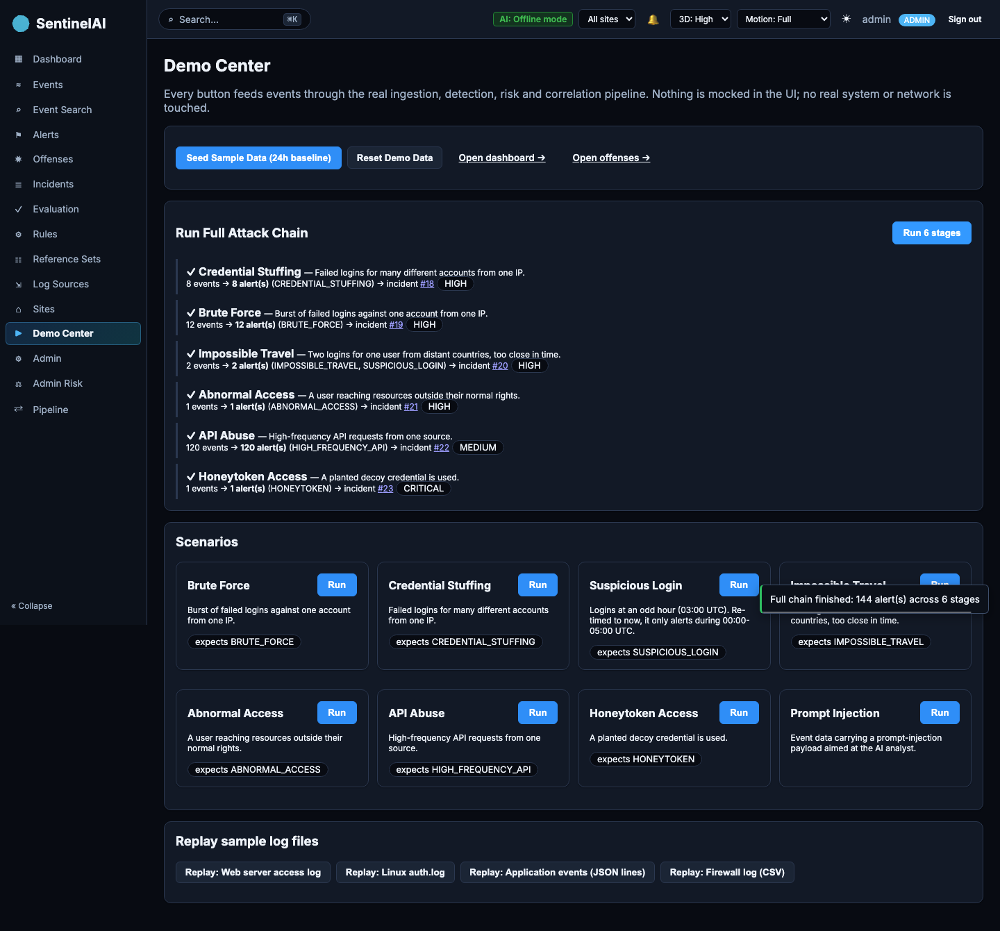
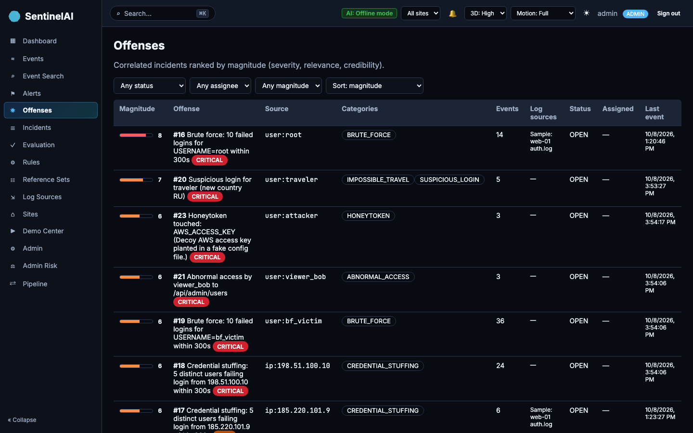
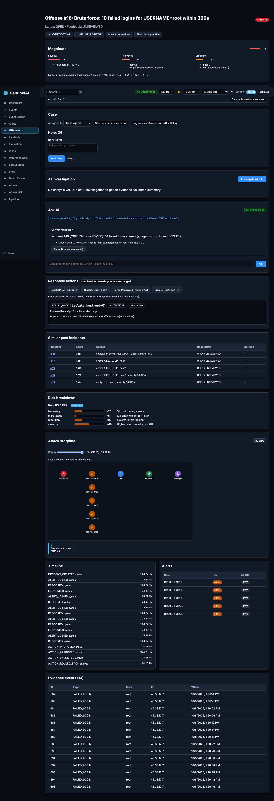
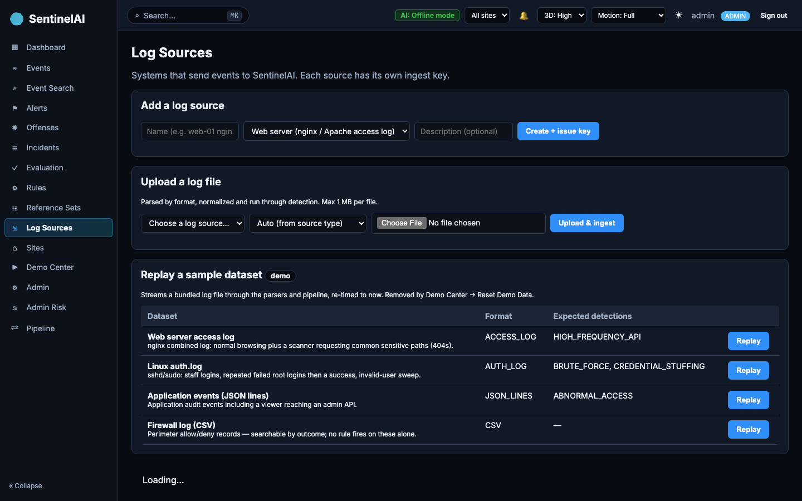
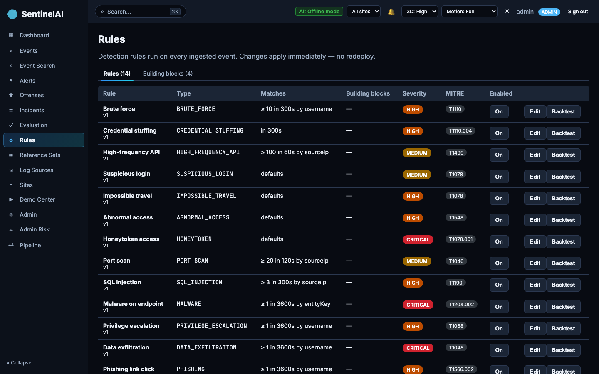
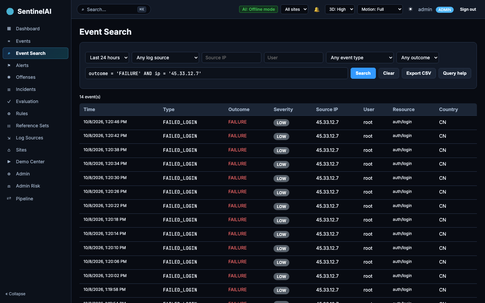
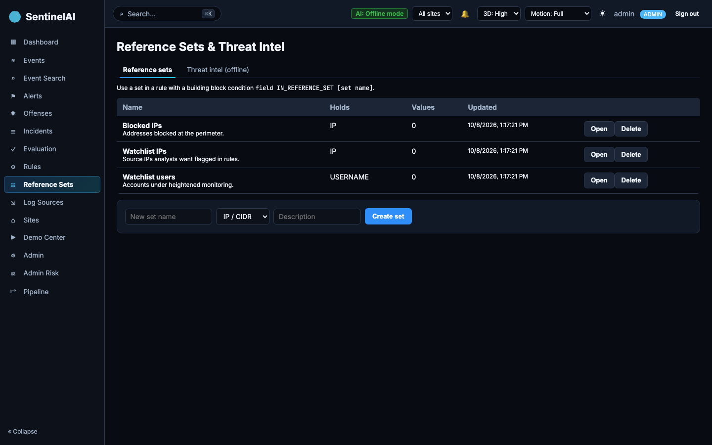

# SentinelAI — Demo Guide

A click-by-click guide to demonstrating SentinelAI as a QRadar-style SIEM: **collect → parse →
correlate → score → respond → audit**. Everything runs **offline with no API keys**. All demo events
come from the existing simulator or bundled sample log files and go through the real ingestion,
detection, risk and correlation pipeline. Nothing is mocked in the UI, and no real system or network
is touched.

> Verified on 2026-10-08 by running `./scripts/demo.sh up` and exercising every button below through
> the UI (Playwright) and the API. Results quoted here are from that run.

---

## 1. Start the demo (one command)

```bash
./scripts/demo.sh up        # build + start; prints the URL when healthy
open http://localhost:8088
```

- **Requirements:** Docker with Compose (Docker Desktop, or colima + docker-compose). No `.env`, no
  keys. The **first** `up` needs internet once to pull base images and Maven/npm dependencies. After
  that the stack runs fully offline.
- **Other commands:** `./scripts/demo.sh down` (stop, keep data), `reset` (stop and wipe the demo DB),
  `logs`, `status`.
- **Port:** 8088 (set `DEMO_PORT` to change it). The stack can run next to the production stack on :80.
- **Profile:** the `demo` Spring profile. It seeds users and rules, turns on the Demo Center and
  quick-login, uses the offline AI, and runs the synchronous pipeline (Kafka and Redis off).

**Logging in.** The login page shows **Login as Admin / Analyst / Viewer** buttons in demo mode only.
These are public demo accounts (`admin / Admin@123`, `analyst / Analyst@123`, `viewer / Viewer@123`).
Never use the demo profile with real data.

**Suggested 10-minute flow.** Admin → **Demo Center** → *Seed Sample Data* → *Run Full Attack Chain*
→ open an offense → *Ask AI* → *Block IP* (Dry-run → Approve → Execute → Rollback) → **Event Search**
→ **Rules** → **Log Sources** (*Replay auth.log*) → **Offenses**.

---

## 2. Pages, buttons and what appears

### Demo Center (Admin, demo mode only) — `/demo-center`



| Button | What it triggers | What appears |
|---|---|---|
| **Seed Sample Data (24h baseline)** | The simulator's `normal` scenario, stretched across the last 24h | Toast "Seeded 243 baseline events"; the dashboard charts fill; **no** offenses (benign traffic) |
| **Reset Demo Data** | Deletes only demo data: simulator and replay events, their alerts, and incidents made entirely of them (plus those incidents' actions, analyses and notes) | Toast with counts. Users, rules, log sources, uploaded/real events and the **audit log** are kept |
| **Run Full Attack Chain** (6 stages) | Runs credential stuffing → brute force → impossible travel → abnormal access → API abuse → honeytoken, one after another, re-timed to "now" | A live stepper: each stage turns ✓ and shows events → alerts (rules) → offense link and severity. Final toast, e.g. "Full chain finished: 144 alert(s) across 6 stages" |
| **Scenario cards → Run** | One existing simulator scenario, re-timed to "now" | A result line on the card plus a toast. Verified: brute force → BRUTE_FORCE; credential stuffing → CREDENTIAL_STUFFING (**one** offense keyed by the attacker IP); impossible travel → IMPOSSIBLE_TRAVEL + SUSPICIOUS_LOGIN; abnormal access; API abuse → HIGH_FREQUENCY_API; honeytoken → HONEYTOKEN (CRITICAL) |
| **Replay: …** | Streams a bundled sample log file through the real **parsers** under its own log source, re-timed to now | Parse report (accepted / skipped / parse errors) plus alerts and offenses (see Log Sources) |

Every action also triggers **live refresh**: the dashboard, alerts, events, incidents and offenses
reload instantly, including in other open tabs.

### Offenses — `/offenses` (QRadar: Offenses)



- **What it is:** correlated incidents ranked by **magnitude** (0–10).
- **Columns:** magnitude bar, offense (title and severity), **offense source** (the correlated entity,
  e.g. `user:root`, `ip:185.220.101.9`), categories (rules that fired), event count, log sources,
  status, assignee, last event.
- **Filters:** status, assignee, minimum magnitude. Sort by magnitude or by most recent activity.
  Refreshes live.

**Magnitude formula** (shown on every offense):

```
severity    = risk score / 10
relevance   = 2 + 4 if a privileged account is targeted + min(4, asset criticality)
credibility = 3 + 2 if ≥2 rule types + 2 if ≥2 log sources or event types
                + 3 if a threat-intel match + 2 if an analyst confirmed it   (0 if marked false positive)
magnitude   = round((3·severity + 2·relevance + 1·credibility) / 6)
```

The weights are configurable (`sentinel.offense.magnitude.*`). Verified example: the replayed
`auth.log` root brute force scores **severity 9, relevance 6** (privileged `root`) and
**credibility 6** (threat-intel match), so `round((27+12+6)/6)` = **8**.

### Offense detail — `/offenses/{id}`



| Panel | What to click | What appears |
|---|---|---|
| **Status / feedback** | → INVESTIGATING, Mark true/false positive | The status changes. *False positive* drops credibility to 0, which lowers the magnitude |
| **Magnitude** | — | The three components, the reasons behind each, and the exact formula with the numbers filled in |
| **Threat intelligence matches** | — | IPs found on the offline lists (e.g. `45.33.12.7 · Sample brute-force sources`) |
| **Case** | Assign; add a note | Assignee dropdown (analysts and admins); notes with author and time; each change is added to the timeline and the audit log |
| **AI investigation** | *Investigate with AI* | The offline engine's evidence-validated analysis: **VALID**, faithfulness 1.0, model `sentinel-local-v1`, with claims citing event ids and recommendations |
| **Ask AI** (badge "AI: Offline mode") | Question chips or free text | Answers built from the incident's own events. *What happened?* gives a summary plus timeline; *Why is this risky?*, *What should I do?*, *Which IPs are involved?* (country, internal/external, event types) and *Which MITRE techniques?* are also answered. Anything else gets the list of supported questions |
| **Response actions** (labelled "simulated") | **Block IP / Disable User / Force Password Reset / Isolate Host** buttons for the IPs, users and hosts in the evidence | Proposes the action. Then **Dry-run** (blast radius, e.g. "Isolate host web-01 — affects 11 user(s), 1 admin(s)") → **Approve** → **Execute** → **Rollback**. If the admin-risk guard asks for step-up, a confirm dialog appears |
| **Risk breakdown / Attack storyline / Timeline / Alerts / Evidence** | 2D/3D toggle, replay slider | Unchanged from before. The timeline now also lists ACTION_PROPOSED/APPROVED/EXECUTED/ROLLED_BACK and NOTE_ADDED |

Approval rules: HIGH/CRITICAL actions need an **ADMIN** approver and pass the admin-risk guard. In the
demo profile one presenter may approve their own proposal (`require-distinct-approver: false`); in
other profiles a second admin is required. Every step is audited, and
`GET /api/audit-logs/verify` → `valid: true` was confirmed after the full flow.

### Log Sources — `/log-sources` (QRadar: Log Sources / DSMs)



| Action | Result |
|---|---|
| **Add a log source** (name + type: web server / auth / firewall / application / generic) | An ingest **API key shown once** (only its SHA-256 is stored) plus a ready-made `curl` snippet |
| Table | Status (**receiving / idle / no events yet / disabled**), last event, **events/sec** (60s window), total events, **parse errors**, active keys |
| **Disable / Enable** | A disabled source's key gets `403 LOG_SOURCE_DISABLED` |
| **Rotate key / Delete** | The old key stops working. Delete keeps past events; the default source can't be deleted |
| **Upload a log file** (≤1 MB; format auto from the source type or chosen) | Parse report: lines, accepted, skipped (not security-relevant), parse errors with samples |
| **Replay a sample dataset** (demo mode) | Same as the Demo Center replay |

Verified replay results:

| Dataset | Parsed | Detections |
|---|---|---|
| nginx access log | 180 accepted, 1 parse error (intentional) | HIGH_FREQUENCY_API from the scanner `185.220.101.4` |
| Linux auth.log | 32 accepted, 11 skipped (session/cron lines), 1 parse error | BRUTE_FORCE (root from `45.33.12.7`), CREDENTIAL_STUFFING (invalid-user sweep) |
| App events (JSON lines) | 21 accepted, 1 parse error | ABNORMAL_ACCESS |
| Firewall (CSV) | 40 accepted | none (allow/deny records, searchable by outcome) |

**Agent:** `agent/sentinel_agent.py` follows a log file and ships it to `POST /api/ingest/raw` with the
key (see `agent/README.md`). JSON events can be posted to `POST /api/ingest/events`.

### Rules — `/rules` (QRadar: Rules + Building Blocks)



- **Rules tab:** each rule shows what it matches ("≥ 10 in 300s by username"), its building blocks,
  severity, MITRE technique and an **On/Off** toggle.
- **Edit** (admin): severity, MITRE, threshold, window, group-by, building-block checkboxes and
  advanced JSON. Saved changes apply to detection **immediately**. The server validates every edit
  (known type, numeric bounds, existing blocks).
- **Backtest:** runs the rule over the last 7 days without creating alerts.
- **Building blocks tab:** reusable AND-ed conditions (`field op values`; operators EQUALS, IN,
  IN_CIDR, NOT_IN_CIDR, CONTAINS, IN_REFERENCE_SET, …). Seeded: *External source IP*, *Privileged
  account*, *Failed outcome*, *Outside business hours*. "Used by" lists the rules that reference a
  block. Blocks in use can't be deleted or renamed.
- **How it gates detection:** a rule only evaluates events that match all of its blocks. Missing
  blocks fail closed. This is verified by tests, e.g. a brute-force rule with *External source IP*
  ignores 10.x sources.

### Event Search — `/search` (QRadar: Log Activity / AQL)



- **Filters:** time range, log source, IP, user, event type, outcome.
- **Query box:** combine `field op value` with AND/OR/NOT and parentheses, e.g.
  `sourceIp = '10.0.0.5' AND outcome = 'FAILURE'`. Operators are `= != > >= < <= LIKE CONTAINS IN`.
  Click **Query help** for the field list and examples.
- **Behaviour:** errors are specific (e.g. "Unknown field 'color' at position 1"). Results are
  paginated, newest first. **Export CSV** downloads up to 10,000 rows, with spreadsheet-formula
  escaping.
- **Safety:** queries are compiled to parameterized JPA criteria. A value like `'x'' OR 1=1 --'`
  is treated as data (0 rows).

### Reference Sets & Threat Intel — `/reference-sets` (QRadar: Reference Sets, X-Force)



- **Reference sets:** seeded *Watchlist IPs*, *Watchlist users* and *Blocked IPs*. Analysts add or
  remove values (IPs, CIDRs, usernames, text; invalid entries are reported). Admins create and delete
  sets. Use a set in a rule through a building block, e.g. `sourceIp IN_REFERENCE_SET [Watchlist IPs]`.
- **Threat intel (offline):** blocklists loaded at startup from bundled files (plus an optional local
  directory), with counts and an **IP checker**. Matches show on offenses and add **+3 credibility**.
  Use a list in a building block as `TI:<list id>`.

### Other pages

- **Dashboard:** KPIs, the attack globe, charts and the MITRE heatmap. It refreshes on its timer and
  instantly after any demo action.
- **Events, Alerts, Incidents:** unchanged, plus live refresh.
- **Admin:** the simulator (seeded, deterministic, for the Evaluation page) and a link to Rules.

---

## 3. QRadar concept map

| QRadar | SentinelAI |
|---|---|
| Log source, protocol, DSM | Log Sources + ingest API key; per-format parsers (access log, auth.log, JSON lines, CSV); agent |
| Log Activity, AQL | Event Search query language + filters + CSV |
| Custom rules, building blocks | Rules page (data-driven, validated) + building blocks gating the engine |
| Reference sets | Reference sets (IP/CIDR, user, text) via `IN_REFERENCE_SET` |
| X-Force threat intel | Offline bundled blocklists (sample feeds) → credibility |
| Offenses, magnitude | Offenses page; magnitude from severity, relevance and credibility |
| SOAR / Resilient | Human-approved actions: dry-run → approve → execute → rollback (simulated adapters) |
| Watson for Cyber Security | Offline local analyst + Ask AI (no LLM, no key) |

---

## 4. Partial, simulated or unsupported (be upfront in the viva)

- **Response actions are simulated.** Firewall, identity and EDR adapters are in-memory mocks. Nothing
  outside SentinelAI changes, and the mock state resets when the backend restarts.
- **The "AI" is a deterministic rule/template engine**, not a language model. A real OpenAI-compatible
  model can be plugged in with `AI_PROVIDER=http` + `LLM_API_KEY` (not used in the demo).
- **Threat-intel lists are sample data** chosen to match the bundled datasets. They are not an
  authoritative feed.
- **Suspicious Login scenario:** its simulator signal is the 03:00 UTC hour, which re-timing to "now"
  doesn't preserve. It only alerts if run between 00:00 and 05:00 UTC, so it is excluded from the
  full chain.
- **Prompt Injection scenario:** ingests an event carrying an injection payload. No enabled rule matches
  it, so it raises **no alert or incident** by itself. Its purpose is to show that hostile text is stored
  and searched as plain data. The AI injection guard only runs when an incident containing such an
  event is investigated, which this scenario alone doesn't produce.
- **New attack rules** (port scan, SQL injection, malware, privilege escalation, exfiltration,
  phishing, DDoS) are seeded and tested, but have **no Demo Center button**. The brief ruled out new
  traffic generators, so they fire only on uploaded or agent-shipped logs carrying those event types.
- **Full Attack Chain:** the stages are independent simulator scenarios with different entities, so
  they produce several offenses, not one multi-stage offense.
- **Re-running a scenario** repeatedly within its detection window raises more alerts per run,
  because in-memory window counts accumulate. Use **Reset Demo Data** between rehearsals for clean
  numbers.
- **Offense lists** compute magnitude over the 500 most recent incidents (configurable).
- **Syslog listener** (UDP/TCP) is not implemented. Collection is via the agent, the HTTP ingest API
  and file upload.
- **First build needs internet** (image and dependency download). Runtime is offline.
- **Full page reloads** log one `401 /api/auth/me` in the console. This is the normal token-refresh
  handshake. The dashboard's pipeline card logs a 404 because Kafka is off in the demo profile.

---

## 5. Case management, reports, assets, UBA, saved searches, notifications, playbooks

| Page / where | What to click | What appears | QRadar / SOC concept |
|---|---|---|---|
| **Offense detail → Case** | Status buttons (New → In Progress → Contained → Resolved → Closed; False Positive → Closed; reopen); Priority P1–P4; Assigned to; Add/Edit/Delete note | Status, priority and assignee update. Notes show author, time and "edited by". The **Case timeline** merges status, assignment, priority, notes, response actions, AI analyses and detection, with kind filters | Case management (QRadar offense notes/assignment, Resilient case) |
| **Incidents** | Filters: status, priority, assignee (or Unassigned), severity | Columns show priority and assignee. Viewers are read-only; every change is audited | Case queue |
| **Reports** | Pick a type (Incident Summary, Top Attackers, Alerts by MITRE Technique, Response Actions Taken), dates, PDF/CSV → **Generate** | The file downloads and is kept in *Generated reports*. Admins add **daily/weekly schedules** (UTC hour); **Run now** generates immediately | QRadar Reports + scheduling |
| **Assets** | Add/Edit, **Import from CSV** (sample `samples/assets.csv`), **Relink stored events** | Assets with criticality, owner, type, environment, linked events, open incidents and open vulns. **Details** lists vulnerabilities and incidents | Asset model / asset profiles |
| **Offense → Risk breakdown** | — | `asset_criticality +N: Max asset criticality 4: SRV-DB-02 (CRITICAL)` and magnitude relevance `+4 asset criticality` | Asset weight in offense magnitude |
| **Assets → Vulnerability scan (CSV)** | Upload `samples/vulnerabilities.csv` | Findings attach by hostname/IP (unmatched hosts reported). The incident page shows **Affected assets** with open CVEs, and risk gains a `vulnerabilities` factor naming the CVEs | Vulnerability scanner integration (QRadar VM) |
| **Rules** | `UBA: unusual login hour`, `UBA: new login location`, `UBA: failed-login spike` (on/off, thresholds in the editor) | Alerts such as "Unusual login hour for alice: 03:00 UTC (0% of 13 prior logins within ±1h)" | UBA (QRadar User Behavior Analytics, rule-based) |
| **Event Search** | **Save search** → *Saved searches*: Run / **Pin to dashboard** / Delete | Pinned searches appear on the **Dashboard** as widgets with a count and a 24-hour sparkline (live; click to open) | Saved searches + dashboard items |
| **Notifications** (admin) and the **bell** | Add channel (Email / Webhook / In-app), add rule (min severity, rule type, created/escalated, channels), **Test** | Email with no SMTP shows a **Mock channel** label and is only logged. The delivery log shows SENT / MOCKED / FAILED with attempts. The bell shows unread items | Offense notifications |
| **Playbooks** and offense → **Playbooks** panel | **Run: Brute Force Response** (or Data Exfiltration Response); admins edit steps (JSON), enable or auto-run | Step results: case moved to In Progress + priority, SOC notified, **Block IP proposed** (appears under Response actions for dry-run/approve), IP added to *Watchlist IPs*. The run history and audit log record it | SOAR playbooks (Resilient) |

### Partial / simulated (sections 5)
- **Risk is computed when alerts join an incident.** Importing assets or vulnerabilities later, or relinking, doesn't rescore existing incidents until they next receive an alert.
- **Email needs `sentinel.notifications.smtp.host`** (password only via `SMTP_PASSWORD`). Without it, email is a logged mock. Webhooks to unreachable hosts fail after retries, which is recorded and never blocks detection.
- **Playbooks only propose actions**, and the action adapters are in-memory mocks. Auto-run is off by default.
- **UBA baselines** are simple statistics over each user's stored events (hour histogram, known country and /24, hourly failure mean/σ), not ML. Users with too little history are skipped.
- **Report schedules** run inside the backend process (no distributed lock); one instance is assumed.
