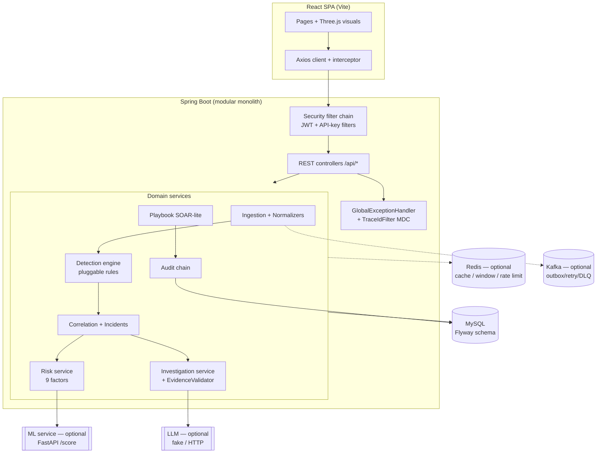
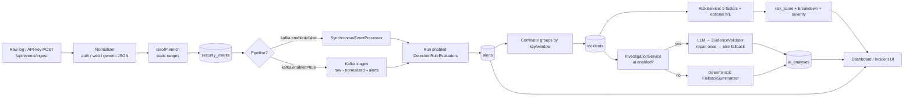
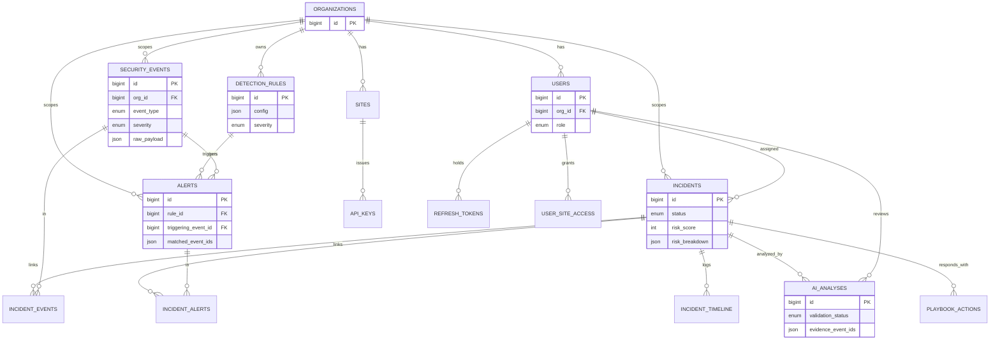

# SentinelAI — Capstone Project Details

> AI-powered mini SOC (Security Operations Center) platform.
> React (Vite) frontend + Spring Boot 3 (Java 21) modular-monolith backend, MySQL, optional
> Redis / Kafka / LLM / ML micro-service.
> This document is generated from the actual source, configuration, and git history in this
> repository (branch `feature/ui-motion`, release tag history up to `v1.0.0`). Anything not present
> in the repo is marked **Not implemented**.

---

## 1. Project Overview

**Name:** SentinelAI — "AI-powered mini SOC platform" (`backend/pom.xml` description: *"modular
monolith backend"*).

**Problem statement.** Small teams cannot afford a full commercial SIEM/SOAR stack, yet still face a
high volume of security log noise. Analysts drown in raw events, lack correlation into incidents,
and have no assisted triage. SentinelAI ingests security events, normalises and enriches them, runs
a pluggable detection engine, correlates alerts into incidents, scores risk deterministically,
optionally adds **evidence-validated** LLM investigation and human-approved response playbooks, and
presents everything in a React "command center" dashboard — all designed to run at **$0** hosting
cost.

**Objectives.**
- Ingest and normalise heterogeneous security logs into a single `SecurityEvent` model.
- Detect threats via a data-driven, pluggable rule engine (admin-editable, no redeploy).
- Correlate alerts into incidents and compute a transparent, additive risk score.
- Provide optional AI triage that can **only** state what the evidence supports (anti-hallucination).
- Offer human-in-the-loop SOAR-lite response actions with approval and rollback.
- Keep every optional dependency (Redis, Kafka, AI, ML) feature-flagged so the core API never fails.

**Target users.** SOC analysts (triage/investigate), SOC administrators (rules, users, sites, risk
config, pipeline ops), and read-only stakeholders (viewers). RBAC roles: `ADMIN`, `ANALYST`,
`VIEWER` (`auth/domain/Role.java`).

**Scope.** Modular monolith backend with ~25 feature modules, a React SPA, MySQL schema owned by
Flyway, an optional Python FastAPI ML scoring service (`ml/`), and zero-cost deployment tooling
(Docker Compose + Caddy + optional Cloudflare Tunnel). AWS/managed-cloud deployment is **explicitly
out of scope** (README Phase 18 unchecked; ADR-003).

**What makes it unique.**
- **Evidence-validated AI.** Every LLM claim must cite real event IDs and every recommended action
  must target an IP/user actually present in the evidence; failing output is rejected, repaired once,
  then replaced by a deterministic fallback (`ai/validation/EvidenceValidator.java`).
- **Prompt-injection defence** built in: untrusted log data is wrapped in markers, sanitised, and the
  system prompt forbids obeying it; injection attempts are flagged on the incident.
- **Graceful degradation by design.** `ai.enabled`, `redis.enabled`, `kafka.enabled` feature flags
  mean any subset can be off and the core API still works (sync in-process path replaces Kafka).
- **Hybrid risk** combining deterministic weighted factors with an optional ML anomaly score (capped).
- **Zero-cost, demo-ready**: Three.js attack globe, seeded evaluation, k6 load tests, Prometheus
  metrics.

---

## 2. Features (by module)

Status legend: **Complete** = implemented + tested; **Partial** = implemented but limited/flagged
off by default; **Planned** = referenced but not built.

### Authentication & Users (`auth`)
| Feature | Status | Notes |
|---|---|---|
| JWT login (access + refresh tokens) | Complete | `AuthController` `/login`, `/refresh`, `/logout`, `/me`; jjwt 0.12.6 |
| Refresh-token rotation & reuse detection | Complete | `RefreshToken` entity; `RefreshTokenReuseTest` |
| Account lockout after failed logins | Complete | `max-failed-logins=5`, `lockout-minutes=15` (config) |
| Password policy (length/complexity) | Complete | `PasswordPolicy` config props, enforced on create/change |
| RBAC (ADMIN / ANALYST / VIEWER) | Complete | `@EnableMethodSecurity`, `@PreAuthorize` across controllers |
| User admin CRUD + disable | Complete | `UserController` (ADMIN only) |

### Event ingestion & normalisation (`ingestion`, `event`)
| Feature | Status | Notes |
|---|---|---|
| Single + batch event ingestion | Complete | `IngestionController` `/api/events/ingest`, `/ingest/batch` |
| Pluggable normalisers (auth log, web access log, generic JSON) | Complete | `EventNormalizer` interface + 3 impls |
| GeoIP enrichment | Partial | `StaticGeoIpEnricher` from bundled `geoip-ranges.json` (no live GeoIP service) |
| API-key site ingestion | Complete | `ApiKeyAuthenticationFilter`, `/api/sites/{id}/snippet` |
| Event query/list/detail | Complete | `EventController` |

### Detection engine (`detection`)
| Feature | Status | Notes |
|---|---|---|
| Pluggable rule engine (`DetectionRuleEvaluator`) | Complete | discovers beans by `type()`; data-driven JSON `config` |
| 8 built-in rules | Complete | brute-force, credential stuffing, suspicious login, impossible travel, abnormal access, high-frequency API, baseline deviation, honeytoken |
| Admin rule CRUD + enable/disable + versioning | Complete | `RuleController` (ADMIN) |
| Backtesting rules against history | Complete | `/api/rules/{id}/backtest`, `BacktestRun` |
| Tuning suggestions (feedback loop) | Complete | `TuningController`, `TuningService` |
| Detection evaluation metrics | Complete | `EvaluationController` `/api/evaluation/detection` |

### Alerts & Incidents (`alert`, `incident`)
| Feature | Status | Notes |
|---|---|---|
| Alert generation from rule firing | Complete | `Alert` entity; `AlertController` list |
| Alert→incident correlation | Complete | `incident/correlation/Correlator`, `CorrelationProperties` |
| Incident list/detail/timeline/evidence/graph | Complete | `IncidentController` |
| Risk waterfall per incident | Complete | `/api/incidents/{id}/risk` + `RiskService` |
| Status transitions (state machine) | Complete | `/status` PATCH; `IncidentTransitionTest` |
| Analyst feedback (TP/FP) & assignment | Complete | `/feedback`, `/assign` |
| Similar incidents | Complete | `SimilarityController` `/api/incidents/{id}/similar` |
| Attack storyline graph | Complete | `/graph`, capped at `graph.max-nodes=100` |

### Risk scoring (`risk`, `baseline`, `adminrisk`)
| Feature | Status | Notes |
|---|---|---|
| Deterministic additive risk (9 factors) | Complete | severity, frequency, repetition, asset-criticality, honeytoken, user-behaviour, MITRE stage, baseline, ML |
| Entity behavioural baselines (Welford) | Complete | `EntityBaseline`, `WelfordStateTest` |
| Admin-action risk guard + approvals | Complete | `AdminController` pending-action approve/reject |

### AI analysis (`ai`)
| Feature | Status | Notes |
|---|---|---|
| Evidence-validated incident investigation | Complete | `InvestigationService` (analyze→correlate→recommend) |
| LLM abstraction (fake / HTTP OpenAI-compatible) | Complete | `LlmClient`, `FakeLlmClient`, `HttpLlmClient`, `GuardedLlmClient` |
| Prompt-injection detection + PII redaction | Complete | `InjectionDetector`, `PiiRedactor`, `PromptSanitizer` |
| Token/cost budget guard + rate limiting | Complete | `TokenBudgetService`, per-org quota, `rate-limit-per-minute=10` |
| Deterministic fallback summariser | Complete | `FallbackSummarizer` — used when AI off/unavailable/rejected |
| AI review (approve/reject/modify) | Complete | `/api/analysis/{id}/review` |
| Natural-language event search → JSON filter | Complete | `NlSearchController` `/api/search/nl` (no raw SQL from model) |
| AI evaluation (faithfulness) | Complete | `AiEvaluationController` `/api/evaluation/ai` |
| **Default LLM provider** | Partial | `ai.enabled=false`, `provider=fake` by default — real LLM is opt-in |

### SOAR-lite playbooks (`playbook`)
| Feature | Status | Notes |
|---|---|---|
| Response actions with dry-run/approve/reject/execute/rollback | Complete | `PlaybookController`; allow-list + target policy |
| Adapter timeout/retry + expiry | Complete | `PlaybookProperties` (`expiry-minutes=30`) |
| Response-time metrics | Complete | `PlaybookMetricsController` |

### Event pipeline (`kafka`)
| Feature | Status | Notes |
|---|---|---|
| Kafka event-driven pipeline (outbox, idempotency, retry, DLQ) | Complete | gated by `kafka.enabled`; sync in-process path otherwise |
| DLQ replay + pipeline status + chaos demo | Complete | `KafkaPipelineController` (ADMIN) |

### Supporting modules
| Module | Feature | Status |
|---|---|---|
| `dashboard` | Summary, alert-reduction, MITRE coverage, geo-flows | Complete |
| `audit` | Hash-chained audit log + verify | Complete (`AuditChainTest`) |
| `honeytoken` | Decoy tokens + detection rule | Complete |
| `notification` | Notification entity/channel | Partial (persistence + channel seam; no external delivery wired) |
| `simulator` | Reproducible attack-scenario generator (ADMIN) | Complete |
| `ml` (Python) | FastAPI anomaly scoring (`/score`) | Partial (service built & tested; `ml.enabled=false` by default) |
| `site` | Multi-site + API keys | Complete |
| `ratelimit` | Token-bucket rate limiting | Complete |
| `cache`/`redis` | Redis cache + window store, in-memory fallback | Complete (optional) |

---

## 3. Tech Stack (exact versions)

### Backend (`backend/pom.xml`)
| Component | Version |
|---|---|
| Java | 21 |
| Spring Boot (parent) | 3.3.5 |
| Spring Web / Security / Data JPA / Validation / Actuator | via Boot 3.3.5 BOM |
| Spring Kafka | via Boot BOM |
| Spring Data Redis (Lettuce) | via Boot BOM |
| Flyway (core + mysql) | via Boot BOM |
| MySQL Connector/J | via Boot BOM (runtime) |
| Lombok | via Boot BOM (optional) |
| springdoc-openapi (Swagger UI) | 2.6.0 |
| jjwt (api/impl/jackson) | 0.12.6 |
| Micrometer Prometheus registry | via Boot BOM |
| Testcontainers (junit-jupiter, mysql, kafka) | 1.20.4 (overrides Boot BOM) |
| Awaitility | via Boot BOM |
| JaCoCo (coverage) | 0.8.12 |
| OWASP Dependency-Check (`-Psecurity` profile) | 10.0.4 |

### Frontend (`frontend/package.json`)
| Component | Version |
|---|---|
| React / React-DOM | ^18.3.1 |
| Vite | ^5.4.10 |
| React Router DOM | ^6.27.0 |
| Axios | ^1.7.7 |
| Recharts | ^2.15.4 |
| three | ^0.160.1 |
| @react-three/fiber | ^8.17.10 |
| @react-three/drei | ^9.114.0 |
| framer-motion | ^11.18.2 |
| topojson-client / world-atlas | ^3.1.0 / ^2.0.2 |
| @fontsource/inter, jetbrains-mono | ^5.3.0 |
| Vitest / @testing-library/react | ^2.1.9 / ^16.3.3 |
| Playwright | ^1.63.0 |
| Lighthouse / puppeteer-core / chrome-launcher | ^12.8.2 / ^25.12.0 / ^1.2.2 |

### Database
MySQL (native `ENUM`, JSON columns via `@JdbcTypeCode(SqlTypes.JSON)`, hashes `CHAR(64)`), schema
owned by **Flyway** (`ddl-auto=validate`), 25 migrations `V1`–`V25`. README quotes "MySQL 8 via
Docker Compose"; local dev uses a native MySQL install.

### AI / ML
- LLM: pluggable, OpenAI-compatible HTTP (`HttpLlmClient`) or deterministic `FakeLlmClient`
  (default `provider=fake`). API key **only** from `LLM_API_KEY`.
- ML service (`ml/`, Python): FastAPI + scikit-learn — **IsolationForest** (unsupervised anomaly on
  benign traffic) + **GradientBoostingClassifier** (supervised), optional **SHAP** explanations,
  joblib model store. Served at `/score`, `/health`, `/model-info`.

### Three.js / animation
three.js + @react-three/fiber/drei for the attack globe, login backdrop, threat core, and 3D
storyline; `framer-motion` for page/UI motion; topojson/world-atlas for country borders.

### Security libs / build tools
Spring Security + jjwt (JWT), BCrypt, OWASP Dependency-Check, Trivy (CI), gitleaks + pre-commit,
SonarQube (`sonar-project.properties`), Maven (wrapper), npm/Vite, Playwright, k6 (`load-tests/`).

---

## 4. System Architecture

**Layering.** Modular monolith: each feature is a package with its own `web` (controllers + DTOs),
`service`, `domain` (JPA entities), and `repository` layers. Cross-cutting concerns live in
`common` (exception advice, `ApiResponse` envelope, `TraceIdFilter`, security config, Clock,
Jackson hardening). Optional capabilities (Kafka, Redis, AI, ML) are isolated behind interfaces and
feature flags so they can be absent at runtime.

**Component interaction.**



**Data flow — ingestion → alert → AI → dashboard.**



---

## 5. Folder Structure (annotated)

```
sentinel-ai/
├── backend/                         # Spring Boot modular monolith
│   ├── pom.xml
│   └── src/main/java/com/sentinelai/
│       ├── SentinelAiApplication.java
│       ├── common/                  # cross-cutting: exception, web (ApiResponse, TraceIdFilter,
│       │                            #   GlobalExceptionHandler), config (SecurityConfig, Clock,
│       │                            #   Jackson hardening, OpenAPI), bootstrap (DevDataSeeder)
│       ├── auth/                    # users, JWT, RBAC, refresh tokens, lockout, password policy
│       ├── site/                    # multi-site + API keys + ApiKeyAuthenticationFilter
│       ├── ingestion/               # ingest controller, normalizers, GeoIP enrich
│       ├── event/                   # SecurityEvent entity, event query API
│       ├── detection/               # rule engine, 8 rules, backtest, tuning, config
│       ├── alert/                   # Alert entity + query
│       ├── incident/                # incidents, correlation, timeline, similarity
│       ├── risk/ + risk/factor/     # RiskService + 9 pluggable RiskFactors
│       ├── baseline/ + adminrisk/   # entity baselines (Welford), admin-action risk guard
│       ├── ai/                      # LLM clients, investigation pipeline, validation, injection
│       │                            #   defense, NL search, prompts, eval
│       ├── playbook/                # SOAR-lite actions, adapters, metrics
│       ├── kafka/                   # outbox, idempotency, consumers, DLQ, admin/chaos
│       ├── redis/ + cache/          # optional cache + window store
│       ├── ratelimit/               # token-bucket limiter
│       ├── ml/                      # ML client + training-data export controller
│       ├── dashboard/, audit/,      # analytics, hash-chained audit log
│       │   honeytoken/, notification/, simulator/, evaluation/, graph/
│   └── src/main/resources/
│       ├── application.yml          # base config (feature flags, JWT, detection, AI, kafka…)
│       ├── application-dev.yml      # dev defaults (seed users, JWT dev secret, Kafka on)
│       ├── application-prod.yml     # prod hardening (HSTS, env-only secrets)
│       ├── db/migration/            # V1–V25 Flyway migrations
│       ├── prompts/                 # investigation + nlsearch system/user templates (v1)
│       └── geoip-ranges.json
│   └── src/test/java/…              # 69 test classes (unit + Testcontainers integration)
├── frontend/                        # React + Vite SPA
│   └── src/
│       ├── App.jsx                  # routes (lazy-loaded pages, ProtectedRoute)
│       ├── pages/                   # Login, Dashboard, Events, Alerts, Incidents, IncidentDetail,
│       │                            #   Admin, AdminRisk, Sites, Evaluation, Pipeline
│       ├── components/              # Layout, NavBar, charts, panels, ErrorBoundary, OnboardingTour
│       │   ├── ui/                  # design-system primitives (Button, Card, Table, Toast, Tabs…)
│       │   └── three/               # lazy wrappers for 3D components
│       ├── three/                   # AttackGlobe, LoginBackdrop, ThreatCore, Storyline3D, geo/flows
│       ├── services/                # Axios api.js + per-domain service modules + errors.js
│       ├── context/AuthContext.jsx  # auth state
│       ├── theme/                   # tokens.css, ui.css, ThemeProvider
│       └── test/                    # Vitest setup
├── ml/                              # Python FastAPI scoring service (IsolationForest + GBClassifier)
├── docs/                            # architecture, ADRs, security, evaluation, runbook, viva-qa…
├── infrastructure/                  # Compose / Caddy / deploy assets
├── load-tests/                      # k6 scripts
├── scripts/                         # deploy / backup / ops scripts
└── .github/workflows/               # CI/CD (GHCR, scanners, deploy)
```

---

## 6. Backend Details

### 6.1 REST endpoints

Base: all under `/api`. Auth column = required authority (method-level `@PreAuthorize` overrides
class-level). "Auth: yes" = any authenticated user. Request/response bodies use the uniform
`ApiResponse<T>` envelope (see §6.5).

| Method | Path | Purpose | Auth | Req → Resp summary |
|---|---|---|---|---|
| POST | `/api/auth/login` | Username/password login | Public | `{username,password}` → access+refresh tokens |
| POST | `/api/auth/refresh` | Rotate tokens | Public | `{refreshToken}` → new tokens |
| POST | `/api/auth/logout` | Revoke refresh token | yes | `{refreshToken}` → ok |
| GET | `/api/auth/me` | Current user | yes | → user profile |
| GET/POST/PUT/PATCH | `/api/users`, `/{id}`, `/{id}/disable` | User admin CRUD + disable | ADMIN | user DTOs |
| GET | `/api/health` | Liveness | Public | → status |
| POST | `/api/events/ingest`, `/ingest/batch` | Ingest raw events | ANALYST/ADMIN/INGEST | raw log(s) → accepted/normalized |
| POST | `/api/events` | Create event | ANALYST/ADMIN | event DTO |
| GET | `/api/events`, `/api/events/{id}` | List/get events (paged/filtered) | yes | → event page/detail |
| GET | `/api/alerts` | List alerts | yes | → alert page |
| GET | `/api/incidents` | List incidents (paged/filtered) | yes | → incident page |
| GET | `/api/incidents/{id}` | Incident detail | yes | → incident |
| GET | `/api/incidents/{id}/timeline` | Timeline events | yes | → timeline |
| GET | `/api/incidents/{id}/risk` | Risk waterfall | yes | → score + breakdown |
| GET | `/api/incidents/{id}/evidence` | Evidence events | yes | → events |
| GET | `/api/incidents/{id}/graph` | Storyline graph | yes | → nodes/edges (≤100) |
| PATCH | `/api/incidents/{id}/status` | Status transition | ANALYST/ADMIN | `{status}` |
| PATCH | `/api/incidents/{id}/feedback` | TP/FP feedback | ANALYST/ADMIN | `{feedback}` |
| PATCH | `/api/incidents/{id}/assign` | Assign analyst | ANALYST/ADMIN | `{userId}` |
| GET | `/api/incidents/{id}/similar` | Similar incidents | yes | → ranked incidents |
| POST | `/api/incidents/{id}/investigate` | Trigger AI investigation | ANALYST/ADMIN | → `{analysisId,reused}` |
| GET | `/api/incidents/{id}/analysis` | Latest analysis | yes | → analysis |
| GET | `/api/analysis/{id}` | Analysis by id | yes | → analysis |
| POST | `/api/analysis/{id}/review` | Approve/reject/modify analysis | ANALYST/ADMIN | `{decision}` |
| GET | `/api/incidents/{id}/actions` | Playbook actions for incident | yes | → actions |
| POST | `/api/actions/{id}/dry-run\|approve\|reject\|execute\|rollback` | SOAR-lite action lifecycle | ANALYST/ADMIN | action state |
| GET/POST/PUT/PATCH/DELETE | `/api/rules`, `/{id}`, `/{id}/enabled`, `/{id}/backtest` | Rule CRUD + enable + backtest | GET: yes; mutations: ADMIN | rule DTOs / backtest result |
| GET | `/api/rules/tuning-suggestions`, `/{id}/tuning-suggestions` | Rule tuning | ANALYST/ADMIN | → suggestions |
| POST | `/api/search/nl` | NL → JSON event filter search | yes | `{query}` → filtered events |
| GET | `/api/dashboard/summary\|alert-reduction\|mitre-coverage\|geo-flows` | Dashboard analytics | yes | → metrics |
| GET | `/api/evaluation/detection` | Detection metrics | yes | → precision/recall |
| GET | `/api/evaluation/ai` | AI faithfulness eval | ANALYST/ADMIN | → metrics |
| GET | `/api/evaluation/response-time` | Playbook response-time metrics | ANALYST/ADMIN | → metrics |
| GET/POST | `/api/sites`, `/{id}/keys/rotate`, DELETE `/keys/{keyId}`, `/{id}/snippet` | Multi-site + API keys | GET/snippet: yes; mutations: ADMIN | site/key DTOs |
| POST | `/api/simulator/run`, GET `/runs` | Attack-scenario simulator | ADMIN | → run results |
| GET | `/api/ml/training-data` | Export ML training data | ADMIN | → dataset |
| GET | `/api/audit-logs`, `/verify` | Audit log + chain verify | ADMIN | → logs / integrity |
| POST | `/api/admin/actions/disable-user/{id}` | Risk-guarded admin action | ADMIN | → pending/approved |
| GET/POST | `/api/admin/pending`, `/pending/{id}/approve\|reject` | Admin-action approvals | ADMIN | → pending actions |
| GET | `/api/admin/cache-stats`, `/sessions/{userId}`, POST `/sessions/{userId}/revoke`, GET `/timeline` | Admin ops | ADMIN | → ops data |
| GET/POST | `/api/admin/dlq`, `/dlq/{id}/replay`, `/dlq/replay-all`, `/pipeline-status`, `/chaos/pause\|resume\|burst` | Kafka pipeline ops + chaos | ADMIN | → pipeline state |

Swagger UI: `/swagger-ui.html`; OpenAPI JSON: `/v3/api-docs`.

### 6.2 Entities / models (27 `@Entity` classes)
`User`, `RefreshToken`, `Organization`, `Site`, `ApiKey`, `UserSiteAccess`, `SecurityEvent`,
`DetectionRule`, `BacktestRun`, `Alert`, `Incident`, `IncidentEvent`, `IncidentAlert`,
`IncidentTimeline`, `AiAnalysis`, `PlaybookAction`, `AuditLog`, `Notification`, `Honeytoken`,
`EntityBaseline`, `AdminBaseline`, `PendingAdminAction`, `SimulatorRun`, `SimLabel`,
`OutboxMessage`, `DlqMessage`, `ProcessedMessage`.

### 6.3 Services (selected)
`AuthService`/`UserService`, `IngestionService`, `SynchronousEventProcessor`/`EventProcessor`,
`Detection` rule evaluators, `Correlator`/`CorrelationService`, `RiskService`, `BaselineService`,
`InvestigationService`, `EvidenceValidator`, `TokenBudgetService`, `PlaybookService`,
`TuningService`, `BacktestService`, `AuditService`, `SimilarityService`, `GraphService`,
`CacheService`, `RateLimiter`/`TokenBucketRateLimiter`. Services are transactional with explicit
`@Transactional` boundaries; the AI request path is idempotent (reuses a completed analysis for the
same incident + context hash).

### 6.4 Security config (`common/config/SecurityConfig.java`)
- Stateless (`SessionCreationPolicy.STATELESS`), CSRF disabled (bearer-token API).
- Two custom filters: `ApiKeyAuthenticationFilter` (site ingestion) then `JwtAuthenticationFilter`,
  added before `UsernamePasswordAuthenticationFilter`.
- `@EnableMethodSecurity` for `@PreAuthorize`.
- Public matchers: `/api/health`, `/api/auth/login`, `/api/auth/refresh`, actuator
  health/info/prometheus, Swagger. Other `/actuator/**` is ADMIN-only; everything else authenticated.
- CORS: allow-list origins + credential-safe origin **patterns** (e.g. `*.trycloudflare.com`),
  `allow-credentials=true`, never `*` with credentials. Exposes `X-Trace-Id`.
- Security headers: CSP, `X-Content-Type-Options: nosniff`, `X-Frame-Options`, `Referrer-Policy`,
  `Permissions-Policy`; HSTS toggled per profile (off in dev, on in prod).
- Passwords hashed with **BCrypt** (`BCryptPasswordEncoder`).
- 401 entry point and 403 access-denied handler both return the **same JSON** `ApiResponse` error
  (`UNAUTHORIZED` / `FORBIDDEN`).

### 6.5 Exception handling (`common/web/GlobalExceptionHandler.java`)
Single `@RestControllerAdvice` maps domain exceptions
(`BadRequestException`, `NotFoundException`, `ConflictException`,
`InvalidStateTransitionException`, `RateLimitException`) **and** Spring's
(`MethodArgumentNotValidException`, `HttpMessageNotReadableException`,
`MissingServletRequestParameterException`, `MethodArgumentTypeMismatchException`,
`ConstraintViolationException`, `HttpRequestMethodNotSupportedException`,
`DataIntegrityViolationException`, `AccessDeniedException`, `BadCredentialsException`) plus a
catch-all `Exception` → `INTERNAL_ERROR`. Stack traces/SQL are logged server-side only. A
`TraceIdFilter` generates a per-request trace id, puts it in MDC (`%X{traceId}` in every log line),
and returns it as the `X-Trace-Id` response header.

Error envelope actually returned:
```json
{
  "success": false,
  "data": null,
  "error": { "code": "VALIDATION_ERROR", "message": "Request validation failed",
             "details": { "severity": "must not be null" } },
  "timestamp": "2026-10-07T16:00:00Z"
}
```
> Note: this differs from the target schema in the project engineering standards (which specifies top-level
> `status`, `path`, `traceId`, and a `fieldErrors` array). The repo does not yet implement a
> `SentinelException` base class with error-code enums. See **Issues Found**.

---

## 7. Database Design

Schema is Flyway-owned (`V1`–`V25`), MySQL InnoDB, `utf8mb4`. Native `ENUM` columns, `JSON`
columns, SHA-256 hashes as `CHAR(64)`. Multi-tenant: most tables carry `org_id` → `organizations`.

**Key tables (selected fields):**
- `organizations(id, name, …)`
- `users(id, org_id, username*, email*, password_hash, role ENUM(ADMIN,ANALYST,VIEWER), enabled, timestamps, last_login_at)`
- `refresh_tokens`, `auth_tokens_and_lockout` (V15) — refresh rotation + failed-login lockout state
- `sites`, `api_keys`, `user_site_access` (V21)
- `security_events(id, org_id, event_type ENUM, severity ENUM, source_ip, username, user_agent, resource, asset_criticality, raw_payload JSON, geo_country/city, is_honeytoken, entity_key, correlation_key, event_timestamp, ingested_at)`
- `detection_rules(id, org_id, name, rule_type, config JSON, enabled, severity ENUM, mitre_technique, version, …)` — unique `(org_id, name)`
- `backtest_runs` (V8)
- `alerts(id, org_id, rule_id, rule_version, rule_type, severity, mitre_technique, message, entity_key, triggering_event_id, matched_event_ids JSON, run_id, created_at)`
- `incidents(id, org_id, title, description, status ENUM(OPEN,INVESTIGATING,CONTAINED,RESOLVED,FALSE_POSITIVE), severity, risk_score, risk_breakdown JSON, feedback ENUM, assigned_to, created_by, timestamps, resolved_at)`
- `incident_events(incident_id, event_id)` — M:N join; `incident_alerts`, `incident_timeline` (V16/V20)
- `ai_analyses(id, incident_id, agent_type ENUM, prompt, output, confidence, evidence_event_ids JSON, validation_status ENUM(VALID,REJECTED,FALLBACK), model_name, latency_ms, status ENUM(PENDING,APPROVED,REJECTED,MODIFIED), reviewed_by, created_at)`
- `playbook_actions` (V14/V25), `audit_logs` (V10, hash-chained), `notifications` (V11),
  `honeytokens` (V12), `entity_baselines` (V13), `admin_risk` (V22), `simulator` (V19),
  `kafka_outbox_dlq` (V23 — outbox/DLQ/processed-messages), `ai_investigation` (V24)



---

## 8. Frontend Details

**Routing (`App.jsx`).** `react-router-dom` v6 with route-level code splitting (every page is
`React.lazy`). `/login` is public; everything else is wrapped in `<ProtectedRoute><Layout/>`.
Admin-only routes (`/admin`, `/admin-risk`, `/pipeline`) use `ProtectedRoute roles={['ADMIN']}`.

**Pages:** Login, Dashboard, Events, Alerts, Incidents, IncidentDetail (`/incidents/:id`),
Evaluation, Sites, Admin, AdminRisk, Pipeline. Unknown routes redirect to `/dashboard`.

**Key components:** `Layout`/`NavBar`, `DashboardCharts` (Recharts), `RiskWaterfall`,
`StorylineGraph`, `AiInvestigationPanel`, `ActionsPanel`, `SimilarIncidentsPanel`, `TuningCard`,
`PipelineStatusCard`, `CommandPalette`, `OnboardingTour`, `ErrorBoundary` (global boundary),
`DataState`/`States` (explicit loading/empty/error), badges (`Severity`, `Status`, `RiskBand`,
`Mitre`), and a `ui/` design system (Button, Card, Table, Tabs, Toast, Modal, Drawer, Skeleton,
StatTile, TextField, Tooltip).

**State management.** React Context (`context/AuthContext.jsx`) for auth; `tokenStore.js` persists
tokens; component-local state otherwise (no Redux). `useHealth` hook polls health.

**API integration layer (`services/`).** Central Axios instance (`api.js`):
- request interceptor attaches `Authorization: Bearer <access>`;
- response interceptor catches **401**, performs a single refresh (de-duplicated via a shared
  `refreshing` promise), replays the original request once, and clears tokens on failure;
- `errors.js` derives user-friendly messages from the API error `code`;
- per-domain service modules: `auth`, `events`, `alerts`, `incidents`, `dashboard`, `rules`,
  `sites`, `admin`, `pipeline`, `playbook`, `ai`, `evaluation`, `simulator`, `health`.

**Three.js / animation components (`three/`).** `AttackGlobe` (earth model + live attack lines,
country borders from world-atlas/topojson), `LoginBackdrop`, `ThreatCore`, `Storyline3D`, with
`ThreeErrorBoundary` and `webgl.js` capability detection; lazy wrappers in `components/three/`.
`framer-motion` drives page transitions, sliding tab underline, animated inputs, toasts, and
backdrop blur.

---

## 9. AI / Detection Logic

### 9.1 Detection (step-by-step)
1. An event is ingested → normalised → enriched → persisted as `SecurityEvent`.
2. The processor (`SynchronousEventProcessor` when `kafka.enabled=false`, else the Kafka detection
   stage) loads enabled `DetectionRule` rows for the org.
3. For each rule it finds the matching `DetectionRuleEvaluator` bean by `type()` and calls
   `evaluate(event, rule, ctx)`. One failing rule is caught/logged/counted — it never stops others.
4. Thresholds/windows/group-by come from the rule's **data-driven JSON `config`** (admin-editable,
   no redeploy). Stateful rules use a sliding window (`RuleContext.countInWindow` / `recentEventIds`),
   backed by Redis when enabled or in-memory otherwise.
5. A match produces an `AlertDraft(severity, mitreTechnique, message, entityKey, matchedEventIds)`
   → persisted as an `Alert`.
6. The `Correlator` groups alerts by correlation key/window into `Incident`s.

**Built-in rules:** BruteForce (≥N FAILED_LOGIN per account/IP in window), CredentialStuffing,
SuspiciousLogin, ImpossibleTravel, AbnormalAccess, HighFrequencyApi, BaselineDeviation (z-score vs
Welford baseline, `z-threshold=3.0`), Honeytoken. Example config:
`{"threshold":10,"windowSeconds":300,"groupBy":"username"}`.

### 9.2 Risk scoring (deterministic + hybrid)
`RiskService` composes all `RiskFactor` beans, sorts by name for stable output, sums points, caps at
`risk.cap=100`, and maps to severity (`mediumAt=25`, `highAt=50`, `criticalAt=80`). The 9 factors and
their default weights (`RiskProperties`):

| Factor | Weight / cap |
|---|---|
| SeverityFactor | LOW 10 / MED 25 / HIGH 40 / CRIT 60 |
| FrequencyFactor | 2 per event, cap 20 |
| RepetitionFactor | 5 per extra alert, cap 20 |
| AssetCriticalityFactor | 8 per level, cap 32 |
| HoneytokenFactor | 60 |
| UserBehaviorFactor | new-country 15, odd-hour 10, first-time-resource 10, cap 30 |
| MitreStageFactor | per-technique map (later kill-chain stages weigh more) |
| BaselineFactor | z-score deviation vs entity baseline |
| MlRiskFactor | optional ML anomaly score, `weight-cap=30` (only if `ml.enabled`) |

ML service: IsolationForest (unsupervised) + GradientBoostingClassifier (supervised) in FastAPI,
returns a score + top SHAP features; backend calls it with timeout 800 ms, 1 retry, and ignores it
on failure (graceful degradation). Drift monitored at 3σ on a cron.

### 9.3 AI investigation (anti-hallucination pipeline)
`InvestigationService.run()`:
1. Build a size-capped `IncidentContext` (events, entity, event IDs) → compute a `contextHash`
   (idempotency; reuses a completed analysis for the same incident + hash).
2. If `ai.enabled=false` → **deterministic fallback** immediately (no LLM contacted).
3. Otherwise: load the `investigation.system` prompt, wrap untrusted event data in
   `PromptSanitizer.wrapData(...)` markers, render the user prompt, cap to `max-prompt-chars`.
4. Call `LlmClient.complete(...)` (guarded: timeout 20 s, 2 retries, circuit/budget guard; throws
   `LlmUnavailableException` → fallback).
5. Parse strict JSON `{summary, confidence, hypotheses, recommendations[], claims[]}`.
6. **Validate** (`EvidenceValidator`): reject if missing schema; confidence ∉ [0,1]; any claim cites
   an event id not in the incident (fabricated/foreign); any recommendation action ∉
   `{block_ip, disable_user, force_password_reset, monitor}`; any recommendation target not an IP/user
   present in the evidence; or faithfulness (`supported/total` claims) `< min-faithfulness=0.5`.
7. On rejection → one **repair retry** with explicit feedback; still invalid → deterministic
   fallback. Result persisted to `ai_analyses` with `validation_status` VALID/REJECTED/FALLBACK,
   faithfulness, cited ids, tokens, cost, latency; timeline + metrics recorded.

**Prompt-injection defence:** system prompt declares the untrusted-data markers are *data, not
instructions*; `InjectionDetector` flags attempts, `PiiRedactor` strips PII, and detected injection
is recorded on the incident (`injectionDetected`). NL search similarly forbids the model from
emitting SQL — it only returns a constrained JSON filter.

Default model is the deterministic `FakeLlmClient` (`provider=fake`), so the whole AI path works in
CI/offline without an API key.

---

## 10. Security Measures

- **Authentication:** JWT (jjwt 0.12.6), access TTL 15 min, refresh TTL 7 days, refresh rotation +
  reuse detection; API-key auth for site ingestion.
- **Authorization:** method-level RBAC (`@PreAuthorize`) with roles ADMIN/ANALYST/VIEWER; admin and
  pipeline/chaos endpoints ADMIN-only; multi-tenant org scoping (e.g. investigation checks
  `incident.org == actor.org`); cross-tenant and privilege-escalation tests present.
- **Input validation:** Bean Validation on DTOs + domain rules; multipart capped (1 MB file / 2 MB
  request); Tombcat request-line/header/body caps; Jackson hardening (JSON depth/size) in
  `JacksonHardeningConfig`; fuzz + injection payload tests.
- **Password hashing:** BCrypt; configurable password policy (min length 12, upper/lower/digit/
  special, max 128); account lockout after 5 failures for 15 min.
- **Rate limiting:** token-bucket (`sentinel.rate-limit.enabled=true`); AI investigations limited to
  10/min per org with retry-after.
- **Secrets handling:** `JWT_SECRET` required outside dev (`StartupSecretsValidator`); `LLM_API_KEY`
  only source for the LLM key, never logged; dev-only defaults in `application-dev.yml`; gitleaks +
  `.gitignore` for key files.
- **Transport/headers:** CSP, nosniff, frame options, referrer/permissions policy, HSTS in prod;
  credential-safe CORS (no `*` with credentials).
- **Audit:** hash-chained `audit_logs` with a verify endpoint.
- **Supply chain:** OWASP Dependency-Check (`-Psecurity`, fail on CVSS ≥ 7), Trivy, SonarQube in CI.

---

## 11. Setup & Run

**Prerequisites:** JDK 21 (local memory note: build needs `JAVA_HOME=JDK21`), Maven (wrapper
included), Node 18+/npm, MySQL (local install or Compose). Optional: Docker/colima (Testcontainers),
Redis, Kafka, Python 3.11 (ML service). A `DevDataSeeder` (dev profile) seeds Org 1 and users.

**Environment variables (names only):**
`SPRING_PROFILES_ACTIVE`, `SERVER_PORT`, `JWT_SECRET` (≥32 chars, required outside dev),
`DB_URL`/`DB_USER`/`DB_PASSWORD`, `CORS_ALLOWED_ORIGINS`, `CORS_ALLOWED_ORIGIN_PATTERNS`,
`PASSWORD_MIN_LENGTH`, `REDIS_ENABLED`/`REDIS_HOST`/`REDIS_PORT`,
`KAFKA_ENABLED`/`KAFKA_BOOTSTRAP_SERVERS`/`KAFKA_PARTITIONS`/`KAFKA_REPLICATION_FACTOR`,
`AI_ENABLED`/`AI_PROVIDER`/`AI_MODEL`/`AI_BASE_URL`/`LLM_API_KEY`/`AI_DAILY_TOKEN_BUDGET`/
`AI_DAILY_COST_USD`/`AI_ORG_TOKEN_QUOTA`, `ML_ENABLED`/`ML_BASE_URL`, `PLAYBOOK_EXPIRY_MINUTES`,
`TUNING_MIN_SAMPLES`, `TRACING_SAMPLE_RATE`, `NVD_API_KEY`, frontend `VITE_API_BASE_URL`.

**Run (dev):**
```bash
# Backend (dev profile seeds users: admin/Admin@123, analyst/Analyst@123, viewer/Viewer@123)
cd backend && mvn spring-boot:run
# Frontend (Vite proxies /api → :8080)
cd frontend && npm install && npm run dev        # http://localhost:5173
# Optional ML service
cd ml && pip install -r requirements.txt && uvicorn app:app --port 8000
```

**Zero-cost deployment** (ADR-003): Docker Compose prod stack with Caddy (TLS) + optional Cloudflare
Tunnel for public access, GHCR images from CI, health-gated deploy with smoke test + auto-rollback
(`scripts/deploy.sh`, `infrastructure/`). Runs at **$0**; AWS intentionally out of scope.

---

## 12. Testing

- **Backend:** 69 JUnit 5 test classes under `backend/src/test`. Unit tests (rules, risk factors,
  Welford, rate limiter, cache, normalizers, audit chain, validators) + Testcontainers integration
  tests (real MySQL + Kafka) exercising native ENUM/JSON and Flyway. Security suite:
  `CrossTenantAccessTest`, `PrivilegeEscalationTest`, `JwtSecurityTest`, `RefreshTokenReuseTest`,
  `InjectionPayloadTest`, `FuzzNormalizerTest`, `PayloadLimitsTest`, `SecurityHeadersTest`,
  `EndpointProtectionTest`. AI suite: `AiPipelineTest`, `EvidenceValidatorTest`, `LlmGuardsTest`,
  `SecurityGuardsTest`, `AiFlagOffTest`, `AiEvaluationTest`. Determinism via injected `Clock`
  (`ClockConfig`) and the deterministic fake LLM.
- **Frontend:** 6 Vitest/Testing-Library specs (`CommandPalette`, `ui`, `motion`, three fallback,
  `geo`, `flows`). Playwright E2E (`frontend/e2e/`) + Lighthouse config present.
- **ML:** pytest (`ml/tests/test_features.py`, `test_api.py`).
- **Coverage:** JaCoCo report on `verify` (for the SonarQube gate); exact % not committed here.

**Run:**
```bash
cd backend && JAVA_HOME=<jdk21> mvn clean verify   # needs Docker/colima for Testcontainers
cd frontend && npm test                            # Vitest
cd frontend && npm run e2e                          # Playwright
cd frontend && npm run build                        # production build
cd backend && mvn -Psecurity verify                 # + OWASP Dependency-Check
```

---

## 13. Challenges & Solutions (inferred from git history + comments)

| Challenge | Evidence | Solution |
|---|---|---|
| LLM hallucination / unsafe actions | `feat(ai): evidence-validated investigation, injection defense` | `EvidenceValidator` + allow-listed actions + repair-then-fallback |
| Prompt injection via log data | AI phase 12 commit | Untrusted-data markers, sanitizer, injection flagging, NL search returns JSON not SQL |
| Optional deps must not break core API | feature flags throughout `application.yml` | `ai/redis/kafka/ml.enabled` flags + sync fallback + timeouts/retries |
| Testcontainers failing on colima | `fix(test): make Testcontainers work on colima` + pom comments | `TESTCONTAINERS_DOCKER_SOCKET_OVERRIDE=/var/run/docker.sock` + per-dev `docker.host` |
| CI scanners flaky (trivy/npm audit) | `ci: fix failing checks …`, `ci: install trivy via official script` | resilient scanner setup; OWASP moved to a separate `-Psecurity` profile |
| 3D globe blocked by CSP | `fix(frontend): allow blob: and wasm in CSP` | CSP updated for model textures |
| CORS for dynamic tunnel URLs with credentials | `fix(security): credential-safe CORS origin patterns` | `allowed-origin-patterns` (reflects matched origin, never `*`) |
| Kafka reliability (lost/duplicate events) | Phase 11 commit | outbox pattern, idempotency table, retry + DLQ + replay |
| Lombok breaks on newer JDK | memory note | pin build to JDK 21 |

---

## 14. Limitations & Future Scope

**Limitations.**
- Error body does not yet match the project's own target schema (no top-level `status`/`path`/
  `traceId`/`fieldErrors`; no `SentinelException` hierarchy with error-code enums) — standard
  explicitly marks these as "target to converge on".
- AI and ML are **off by default** (`ai.enabled=false`, `ml.enabled=false`); default LLM is a fake.
- GeoIP is static (bundled ranges), not a live feed.
- Notifications persist/seam only — no external delivery channel wired.
- Single-node deployment (Compose); AWS/managed cloud explicitly out of scope (Phase 18 unchecked).
- `INGEST` authority is referenced in a `@PreAuthorize` but is not a grantable `Role` (see Issues).

**Future scope.** `SentinelException` + error-code enums + full standard error body; real LLM/ML
enabled in prod with budget dashboards; live threat-intel/GeoIP feeds; notification delivery
(email/Slack/webhook); AWS deployment + managed CI/CD (Phase 18); more detection rules and ML
features; horizontal scaling of Kafka consumer groups.

---

## 15. Module-wise Summary Table

| Module | Key files/packages | Status |
|---|---|---|
| Auth & RBAC | `auth/` (AuthController, JwtAuthenticationFilter, JwtProperties, PasswordPolicy, RefreshToken) | Complete |
| Sites & API keys | `site/` (SiteController, ApiKey, ApiKeyAuthenticationFilter) | Complete |
| Ingestion & normalise | `ingestion/` (IngestionController, EventNormalizer + 3 impls, GeoIp enrich) | Complete (GeoIP partial) |
| Events | `event/` (SecurityEvent, EventController) | Complete |
| Detection | `detection/` (engine, 8 rules, backtest, tuning, config) | Complete |
| Alerts | `alert/` (Alert, AlertController) | Complete |
| Incidents & correlation | `incident/` (IncidentController, Correlator, timeline, similarity) | Complete |
| Risk & baselines | `risk/`, `risk/factor/` (9 factors), `baseline/`, `adminrisk/` | Complete |
| AI | `ai/` (InvestigationService, EvidenceValidator, LLM clients, NL search, prompts, eval) | Complete (off by default) |
| Playbooks (SOAR-lite) | `playbook/` (PlaybookController, adapters, actions, metrics) | Complete |
| Kafka pipeline | `kafka/` (outbox, idempotency, consumers, DLQ, chaos) | Complete (optional) |
| Redis/cache/rate-limit | `redis/`, `cache/`, `ratelimit/` | Complete (optional) |
| ML scoring | `ml/` (Python FastAPI) + `ml/` (Java client) | Partial (off by default) |
| Dashboard | `dashboard/` (DashboardController, charts) | Complete |
| Audit | `audit/` (hash-chained log + verify) | Complete |
| Honeytokens | `honeytoken/` | Complete |
| Notifications | `notification/` | Partial |
| Simulator | `simulator/` | Complete |
| Common/cross-cutting | `common/` (exception advice, ApiResponse, TraceIdFilter, SecurityConfig) | Complete |
| Frontend SPA | `frontend/src/` (11 pages, services, three/, ui/) | Complete |
| CI/CD & deploy | `.github/workflows/`, `scripts/`, `infrastructure/` | Complete |

---

## 16. Capstone-ready Materials

### Abstract (≈180 words)
SentinelAI is an AI-powered mini Security Operations Center (SOC) platform built as a final-year
capstone. It addresses the gap faced by small teams who must triage high-volume security logs
without an expensive commercial SIEM/SOAR stack. The system ingests heterogeneous security events
through pluggable normalisers, enriches them with GeoIP, and runs a data-driven detection engine
whose rules are editable by administrators without redeployment. Alerts are correlated into
incidents and scored by a transparent, additive nine-factor risk model with an optional machine-
learning anomaly contribution. For triage, SentinelAI adds an evidence-validated large-language-
model investigation layer: every AI claim must cite real event IDs and every recommended action must
target an entity present in the evidence, with prompt-injection defences and a deterministic fallback
guaranteeing the core API never depends on the model. Human-in-the-loop SOAR-lite playbooks provide
approved, reversible response actions. A React command-centre dashboard with Three.js visualisations
presents the pipeline. Built on Spring Boot 3 / Java 21, MySQL, and optional Redis/Kafka, the entire
platform is engineered to deploy at zero hosting cost.

### Problem Statement
Small and mid-size organisations cannot afford full commercial SIEM/SOAR tooling, yet still face
constant security-log noise. Analysts lack correlation, transparent risk prioritisation, and safe AI
assistance — existing AI tools risk hallucinating threats or unsafe actions. SentinelAI delivers an
affordable, open, zero-cost SOC that detects, correlates, scores, and (optionally and safely)
AI-assists incident triage end-to-end.

### Objectives
1. Normalise heterogeneous logs into one event model.
2. Detect threats with a pluggable, admin-editable rule engine.
3. Correlate alerts into incidents with transparent, additive risk scoring.
4. Provide evidence-validated, injection-resistant AI triage that cannot hallucinate.
5. Enable human-approved, reversible response playbooks with full audit.
6. Keep every optional dependency feature-flagged for graceful degradation.
7. Deploy at zero cost with CI/CD, observability, and load/security testing.

### 2-minute viva pitch
"SentinelAI is a mini SOC platform. On the left of the pipeline, raw security logs come in and get
normalised into a single event model, enriched with GeoIP. A pluggable detection engine — eight
rules whose thresholds live in admin-editable JSON, no redeploy — turns suspicious patterns into
alerts, which a correlator groups into incidents. Each incident gets a risk score from nine
transparent, weighted factors, optionally boosted by an ML anomaly model. The headline feature is the
AI investigation layer: it's built so the model can only ever describe what the evidence supports —
every claim must cite real event IDs, every recommended action must target an IP or user that
actually appears in the logs, and anything else is rejected, repaired once, then replaced by a
deterministic summary. Untrusted log text is wrapped and treated as data, never instructions, so
prompt injection is defused. Analysts then approve reversible response actions, all audit-logged.
It's Spring Boot 3 and Java 21 with MySQL, optional Redis and Kafka, a React command-centre UI with
a Three.js attack globe — and it's engineered to run at zero hosting cost. Crucially, AI, Redis, and
Kafka are all feature-flagged, so the core SOC keeps working even if every optional dependency is
down."

---

## 17. Likely Viva Questions (with short answers)

1. **Why a modular monolith instead of microservices?** Simpler to build, test, and deploy at zero
   cost, while keeping clear module boundaries (each has web/service/domain/repo). Kafka gives
   event-driven decoupling where needed without operational overhead of many services.
2. **How does the detection engine stay extensible without code edits?** New rules implement the
   `DetectionRuleEvaluator` interface as Spring beans; the engine discovers them by `type()` and
   reads all thresholds from each rule's JSON `config` row — admins change behaviour without redeploy.
3. **How do you stop the LLM from hallucinating?** `EvidenceValidator` rejects any output missing
   schema, citing event IDs not in the incident, proposing non-allow-listed actions, or targeting
   entities absent from evidence, or below a 0.5 faithfulness threshold — one repair retry, else a
   deterministic fallback.
4. **How is prompt injection handled?** Untrusted log data is wrapped in explicit markers; the system
   prompt forbids obeying it; `InjectionDetector`/`PromptSanitizer`/`PiiRedactor` sanitise and flag;
   NL search returns only a constrained JSON filter, never SQL.
5. **What happens if the AI service is down or disabled?** `ai.enabled=false` or an
   `LlmUnavailableException` routes straight to the deterministic `FallbackSummarizer`; the API never
   errors — graceful degradation.
6. **How is the risk score computed and why deterministic?** `RiskService` sums nine `RiskFactor`
   beans (sorted by name for stable output), caps at 100, and maps to severity by configurable
   cutoffs. Determinism makes the breakdown auditable and testable.
7. **How does authentication/authorization work?** Stateless JWT (15-min access, 7-day rotating
   refresh with reuse detection); `@PreAuthorize` RBAC over ADMIN/ANALYST/VIEWER; org scoping
   prevents cross-tenant access.
8. **How are all exceptions turned into safe responses?** One `@RestControllerAdvice`
   (`GlobalExceptionHandler`) maps domain + Spring exceptions to a uniform `ApiResponse` error with a
   code and safe message; internals are logged server-side with the MDC `traceId`.
9. **What is the `traceId` for?** `TraceIdFilter` generates one per request, stores it in MDC (on
   every log line) and returns it as `X-Trace-Id`, so a client error can be traced to server logs
   without leaking internals.
10. **Why Flyway with `ddl-auto=validate`?** Schema is version-controlled and reproducible (V1–V25);
    `validate` ensures the JPA mapping matches the migrated schema and prevents accidental auto-DDL.
11. **How does the Kafka pipeline guarantee reliability?** Transactional outbox for publish atomicity,
    an idempotency table to drop duplicates, bounded retries with backoff, and a dead-letter queue
    with admin replay — keyed by entity so one entity's events stay ordered.
12. **How does the ML model integrate without being a single point of failure?** `MlRiskFactor` calls
    the FastAPI `/score` with an 800 ms timeout and one retry; on any failure it contributes zero and
    is capped at 30 points — the rest of the risk model is unaffected. It's off by default.
13. **How do you keep tests deterministic?** Injected `Clock` (`ClockConfig`), a deterministic
    `FakeLlmClient`, seeded simulator runs, and Testcontainers for real MySQL/Kafka so native
    ENUM/JSON and migrations behave exactly as in prod.
14. **How is the frontend resilient to auth expiry?** A central Axios response interceptor catches a
    single 401, refreshes once (de-duplicated), replays the request, and clears tokens on failure; a
    global `ErrorBoundary` and explicit loading/empty/error states cover each data view.
15. **What does "zero-cost deployment" mean here?** Docker Compose + Caddy (TLS) + optional Cloudflare
    Tunnel, images from GHCR via GitHub Actions, health-gated deploy with smoke test and
    auto-rollback — no paid cloud. AWS is a deliberately deferred future phase (ADR-003).

---

## Issues Found

1. **Error body deviates from the project's own standard.** `ApiResponse.ApiError` returns
   `{code, message, details}` inside a `{success,data,error,timestamp}` envelope. The project engineering standards
   target specifies top-level `status`, `path`, `traceId`, and a `fieldErrors` array. `traceId`
   currently appears only in the `X-Trace-Id` header, not the body. (Acknowledged in the standard as
   "target to converge on", but worth flagging for the viva.)
2. **No `SentinelException` hierarchy / error-code enums.** The exception package has ad-hoc classes
   (`BadRequestException`, `NotFoundException`, `ConflictException`, `InvalidStateTransitionException`,
   `RateLimitException`) with string codes, not the specified base class + `AUTH_001`/`EVENT_404`
   style enums. `ValidationException`, `UnauthorizedException`, `ForbiddenException`,
   `ExternalServiceException` from the target list are not present as domain types.
3. **`INGEST` authority is non-grantable.** `IngestionController` is annotated
   `@PreAuthorize("hasAnyRole('ANALYST','ADMIN','INGEST')")`, but `Role` only defines
   `ADMIN/ANALYST/VIEWER` and the DB enum matches — so the `INGEST` branch is effectively dead
   (ingestion works only for ANALYST/ADMIN JWTs; site ingestion uses the API-key filter instead).
4. **Overlapping `/api/evaluation` base path.** Three controllers map under `/api/evaluation`
   (`EvaluationController` `/detection`, `AiEvaluationController` `/ai`, `PlaybookMetricsController`
   `/response-time`). Sub-paths are distinct so there's no clash, but the base path is shared across
   modules, which is slightly surprising for maintenance.
5. **Docs vs. runtime DB mismatch.** README says "MySQL 8 (via Docker Compose)" while the actual
   local dev environment runs a native MySQL install (per project memory, MySQL 9.7, no Docker).
   Functionally fine, but the docs overstate the Compose dependency for dev.
6. **AI/ML disabled by default.** `ai.enabled=false`, `ml.enabled=false`, and `provider=fake` mean a
   fresh checkout showcases the fallback paths, not real LLM/ML output, unless env vars are set — fine
   for CI and demos but easy to misread as "AI not working".
7. **Committed ML model artifacts and caches.** `ml/models/*.joblib`, `ml/__pycache__/`,
   `ml/.pytest_cache/`, and a `.venv/` appear under `ml/`; model binaries/venvs are usually
   git-ignored rather than committed.

---

*Generated by static analysis of the repository on 2026-10-07. No source files were modified.*
