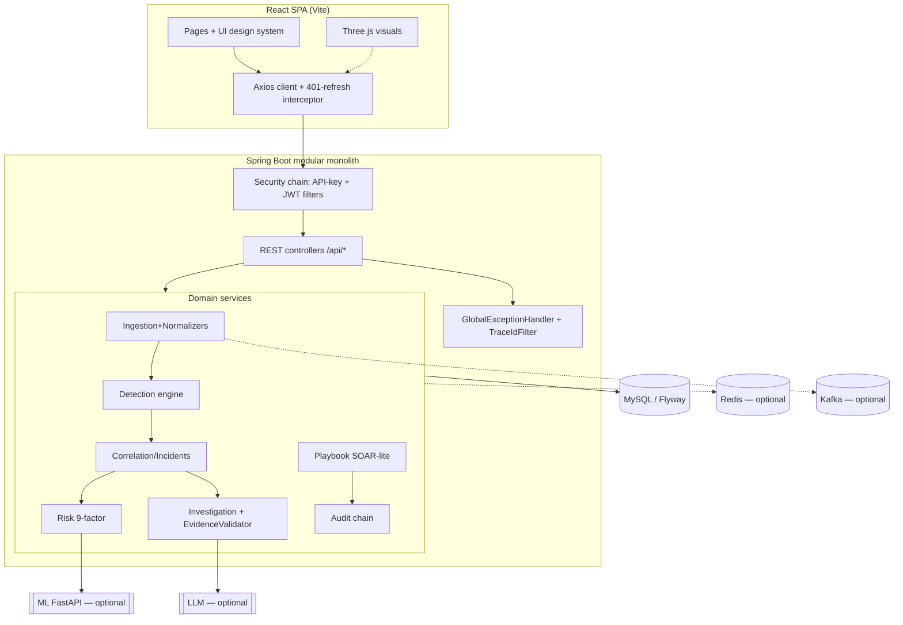
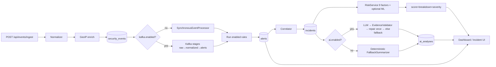
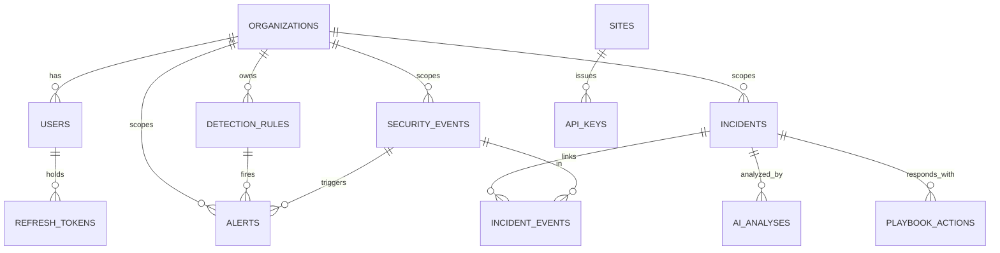

# SentinelAI — Team Project Details & Presentation Guide

> AI-powered mini SOC (Security Operations Center) platform.
> React (Vite) frontend + Spring Boot 3 / Java 21 modular-monolith backend + MySQL, with optional
> Redis, Kafka, LLM, and a Python ML micro-service.
> Generated from the actual source, configs, and git history on branch `feature/ui-motion`
> (2026-10-07). Nothing is invented; anything absent is marked **Not implemented**. No source files
> were modified.

---

# PART A — PROJECT SUMMARY

## A.1 Overview
**Name:** SentinelAI — "AI-powered mini SOC platform" (`pom.xml`: *modular monolith backend*).

**Problem statement.** Small teams cannot afford a commercial SIEM/SOAR stack yet must triage
high-volume security logs with no correlation, no transparent prioritisation, and no safe AI
assistance. SentinelAI ingests security events, detects threats with a pluggable rule engine,
correlates alerts into incidents, scores risk transparently, optionally adds **evidence-validated**
LLM investigation, enables human-approved response playbooks, and shows everything in a React
command-centre dashboard — engineered to run at **$0** hosting cost.

**Objectives.** Normalise heterogeneous logs → detect via admin-editable rules → correlate +
transparent risk scoring → safe (non-hallucinating) AI triage → human-approved reversible response →
graceful degradation of every optional dependency → zero-cost deploy with CI/CD + observability.

**Target users.** SOC **analysts** (triage/investigate), **administrators** (rules, users, sites,
risk config, pipeline ops), and read-only **viewers**. Roles: `ADMIN`, `ANALYST`, `VIEWER`.

**Unique points.** Evidence-validated AI (every claim cites real event IDs; every action targets a
real entity); built-in prompt-injection defence; feature-flagged optional deps (`ai/redis/kafka/ml
.enabled`) with synchronous fallback; hybrid deterministic+ML risk; demo-ready Three.js visuals and
seeded evaluation.

## A.2 Tech Stack (exact versions)

**Backend (`backend/pom.xml`).** Java 21; Spring Boot 3.3.5 (Web, Security, Data JPA, Validation,
Actuator); Spring Kafka & Spring Data Redis (Boot BOM); Flyway core+mysql; MySQL Connector/J; Lombok;
springdoc-openapi 2.6.0; jjwt 0.12.6; Micrometer Prometheus; Testcontainers 1.20.4
(junit/mysql/kafka); Awaitility; JaCoCo 0.8.12; OWASP Dependency-Check 10.0.4 (`-Psecurity`).

**Frontend (`frontend/package.json`).** React/React-DOM ^18.3.1; Vite ^5.4.10; React Router DOM
^6.27.0; Axios ^1.7.7; Recharts ^2.15.4; three ^0.160.1; @react-three/fiber ^8.17.10;
@react-three/drei ^9.114.0; framer-motion ^11.18.2; topojson-client ^3.1.0; world-atlas ^2.0.2;
@fontsource/inter & jetbrains-mono ^5.3.0; Vitest ^2.1.9; @testing-library/react ^16.3.3; Playwright
^1.63.0; Lighthouse ^12.8.2; puppeteer-core ^25.12.0; jsdom ^25.0.1.

**Database.** MySQL (native ENUM, JSON columns via `@JdbcTypeCode(SqlTypes.JSON)`, SHA-256 `CHAR(64)`
hashes). Schema owned by Flyway (`ddl-auto=validate`), 25 migrations V1–V25. README quotes "MySQL 8
via Compose"; local dev uses a native MySQL install.

**AI/LLM.** Pluggable `LlmClient`: `FakeLlmClient` (deterministic default, `provider=fake`) or
`HttpLlmClient` (OpenAI-compatible); key only from `LLM_API_KEY`. **ML (`ml/`, Python):** FastAPI +
scikit-learn — IsolationForest (unsupervised) + GradientBoostingClassifier (supervised), optional
SHAP explanations, joblib store; `/score`, `/health`, `/model-info`.

**Animations/3D.** three.js + @react-three/fiber/drei (attack globe, login backdrop, threat core, 3D
storyline; country borders from world-atlas/topojson); framer-motion for motion.

**Security libs.** Spring Security, jjwt, BCrypt, OWASP Dependency-Check, Trivy (CI), gitleaks +
pre-commit, SonarQube.

**Build/Deploy/Tools.** Maven (wrapper) + npm/Vite; Docker Compose + Caddy + optional Cloudflare
Tunnel; GHCR images via GitHub Actions; Prometheus + Grafana; k6 load tests; Playwright + Lighthouse.

## A.3 Architecture





## A.4 Annotated Folder Tree
```
sentinel-ai/
├── backend/                         # Spring Boot modular monolith (Java 21)
│   ├── pom.xml
│   └── src/
│       ├── main/java/com/sentinelai/
│       │   ├── SentinelAiApplication.java   # entry point, @ConfigurationPropertiesScan
│       │   ├── common/              # cross-cutting: exception advice, ApiResponse, TraceIdFilter,
│       │   │                        #   SecurityConfig, Clock, Jackson hardening, seeders, utils
│       │   ├── auth/                # users, JWT, RBAC, refresh tokens, lockout, password policy
│       │   ├── site/                # multi-site + API keys + ApiKey auth filter
│       │   ├── ingestion/ event/    # ingest API, normalizers, GeoIP; SecurityEvent model
│       │   ├── detection/           # rule engine, 8 rules, backtest, tuning, window stores
│       │   ├── alert/ incident/     # alerts; correlation, timeline, similarity, graph
│       │   ├── risk/ baseline/ adminrisk/   # 9 risk factors; Welford baselines; admin-risk guard
│       │   ├── ai/                  # LLM clients, investigation pipeline, validation, injection
│       │   │                        #   defense, NL search, prompts, evaluation
│       │   ├── playbook/            # SOAR-lite actions, adapters, metrics
│       │   ├── kafka/               # outbox, idempotency, consumers, DLQ, chaos admin
│       │   ├── redis/ cache/ ratelimit/     # optional cache + window store + token-bucket limiter
│       │   ├── ml/                  # ML HTTP client, drift monitor, training-data export
│       │   ├── dashboard/ audit/ honeytoken/ notification/ simulator/ evaluation/ graph/
│       └── main/resources/          # application*.yml, db/migration (V1–V25), prompts, geoip JSON
│       └── test/java/…              # 69 JUnit test classes (unit + Testcontainers integration)
├── frontend/                        # React + Vite SPA
│   └── src/ (App.jsx, pages/, components/[ui,three], three/, services/, context/, theme/, test/)
├── ml/                              # Python FastAPI ML scoring service + training/eval scripts
├── docs/                            # architecture, ADRs, security, evaluation, runbook, viva-qa…
├── infrastructure/                  # docker compose, Caddy, Prometheus, Grafana, k8s placeholder
├── load-tests/                      # k6 scripts
├── scripts/                         # deploy/backup/restore/rollback/chaos/security scripts
├── reports/ backups/                # generated reports, DB backup artifacts
├── .github/workflows/               # CI (ci.yml) + Deploy (deploy.yml)
└── README.md, LICENSE, sonar-project.properties, .gitleaks.toml, .pre-commit-config.yaml
```

---

# PART B — MODULE-WISE BREAKDOWN

The repo is split into **8 logical modules**. Each module lists its purpose, key files, technologies,
working flow, endpoints (where applicable), 5 viva Q&As, and status.

---

## Module 1 — Frontend UI / Pages / Components
**Purpose.** The analyst-facing SPA: authenticated shell, 11 lazy-loaded pages, and reusable
components that render events, alerts, incidents, dashboards, admin tools, and AI panels with
explicit loading/empty/error states and a global error boundary.

**Key files.**
| File | Role / key exports | Connects to |
|---|---|---|
| `frontend/src/main.jsx` | React root; mounts `App` inside `ThemeProvider` + `AuthContext` + Router | App, context, theme |
| `frontend/src/App.jsx` | Route table; lazy page imports; `ProtectedRoute` + `Layout` wrap | pages/, ProtectedRoute, Layout |
| `pages/LoginPage.jsx` | Login form; animated backdrop; calls auth service | auth.service, LoginBackdrop |
| `pages/DashboardPage.jsx` | Command-centre: stat tiles, charts, attack globe | DashboardCharts, three/, dashboard.service |
| `pages/EventsPage.jsx` | Paged/filtered security-event table + NL search | events.service, ai.service |
| `pages/AlertsPage.jsx` | Alert list | alerts.service |
| `pages/IncidentsPage.jsx` | Incident list (paged/filtered) | incidents.service |
| `pages/IncidentDetailPage.jsx` | Detail: timeline, risk waterfall, storyline, AI panel, actions | many components + services |
| `pages/AdminPage.jsx` | User/rule admin, sessions, cache stats | admin.service, rules.service |
| `pages/AdminRiskPage.jsx` | Admin-action risk + pending approvals | admin.service |
| `pages/SitesPage.jsx` | Sites + API-key management + ingest snippet | sites.service |
| `pages/EvaluationPage.jsx` | Detection/AI/response evaluation metrics | evaluation.service |
| `pages/PipelinePage.jsx` | Kafka pipeline status, DLQ, chaos controls | pipeline.service |
| `components/Layout.jsx`, `NavBar.jsx` | Persistent shell + navigation | App |
| `components/ProtectedRoute.jsx` | Guards routes by auth + roles | AuthContext |
| `components/ErrorBoundary.jsx` | Global React error boundary | App |
| `components/DataState.jsx`, `ui/States.jsx`, `ui/Skeleton.jsx` | loading/empty/error states | all pages |
| `components/RiskWaterfall.jsx`, `StorylineGraph.jsx`, `AiInvestigationPanel.jsx`, `ActionsPanel.jsx`, `SimilarIncidentsPanel.jsx`, `TuningCard.jsx`, `PipelineStatusCard.jsx`, `DashboardCharts.jsx` | feature widgets | detail/dashboard pages |
| `components/CommandPalette.jsx`, `OnboardingTour.jsx`, `RouteProgress.jsx` | UX helpers | Layout |
| badges: `SeverityBadge`, `StatusBadge`, `RiskBandBadge`, `MitreChip` | status rendering | tables/detail |

**Technologies & why.** React 18 + React Router 6 (SPA, nested routes, lazy code-splitting to keep
the login payload small); Recharts (dashboard charts); framer-motion (page/UI motion).

**Working flow.** `main.jsx` mounts providers → Router resolves route → `ProtectedRoute` checks auth
(redirect to `/login` if absent) → page component mounts → calls a service → renders loading →
data/empty/error state → user acts (e.g. change incident status) → service POST/PATCH → UI refresh.

**Viva Q&A.**
1. *Why lazy-load pages?* Each page (and heavy deps like Recharts/three) loads on demand, keeping the
   initial/login bundle small — `React.lazy` + `Suspense` in `App.jsx`.
2. *How are unauthorized users handled?* `ProtectedRoute` redirects unauthenticated users to
   `/login` and role-gates admin routes with `roles={['ADMIN']}`.
3. *How do you show errors consistently?* A global `ErrorBoundary` plus `DataState`/`States`
   components give every data view explicit loading/empty/error rendering.
4. *Where is the incident "story" rendered?* `IncidentDetailPage` composes `RiskWaterfall`,
   `StorylineGraph`, `AiInvestigationPanel`, `ActionsPanel`.
5. *How is navigation kept consistent?* A persistent `Layout`/`NavBar` shell stays mounted; only page
   content transitions.

**Status: Complete.**

---

## Module 2 — Frontend 3D / Three.js / Animations / Styling
**Purpose.** The visual identity: a 3D attack globe with live attack lines and country borders, login
backdrop, threat core, 3D storyline, a design-system (`ui/`) and theme tokens, plus framer-motion
motion. All WebGL is guarded so a GPU failure degrades gracefully.

**Key files.**
| File | Role | Connects to |
|---|---|---|
| `three/AttackGlobe.jsx` | Earth model + animated attack arcs | globeConfig, geo, flows |
| `three/geo.js`, `flows.js`, `globeConfig.js` | lat/long→vector, flow generation, globe constants | AttackGlobe |
| `three/LoginBackdrop.jsx`, `ThreatCore.jsx`, `Storyline3D.jsx` | login scene, dashboard core, 3D storyline | pages |
| `three/ThreeErrorBoundary.jsx`, `webgl.js` | WebGL capability check + fallback | all three/ |
| `components/three/*Lazy.jsx` | lazy wrappers (AttackGlobe, LoginBackdrop, ThreatCore, Storyline3D) | pages |
| `components/ui/*` | design system: Button, Card, Table, Tabs, Toast, Modal, Drawer, Skeleton, StatTile, TextField, Tooltip, Badge | all pages |
| `theme/tokens.css`, `ui.css`, `styles.css`, `ThemeProvider.jsx` | color tokens, dark/light, global styles | whole app |

**Technologies & why.** three.js + @react-three/fiber/drei (declarative 3D in React); topojson-client
+ world-atlas (country borders); framer-motion (declarative animation); CSS custom properties for
theming. Tests: `geo.test.js`, `flows.test.js`, `three/fallback.test.jsx`, `ui/motion.test.jsx`,
`ui/ui.test.jsx`.

**Working flow.** A page lazy-imports a `*Lazy` wrapper → `ThreeErrorBoundary` + `webgl.js` verify
WebGL → if unsupported, render a static fallback → else mount the fiber canvas → `geo.js`/`flows.js`
map event data to 3D arcs animated each frame.

**Viva Q&A.**
1. *Why lazy-load 3D?* three.js is heavy; loading it only when a scene is visible protects
   first-paint and login performance.
2. *What if WebGL is unavailable?* `webgl.js` detects support and `ThreeErrorBoundary` renders a
   2D/static fallback — no crash.
3. *How are attack lines positioned on the globe?* `geo.js` converts lat/long to 3D vectors;
   `flows.js` builds arcs between source/target coordinates.
4. *How is theming handled?* CSS custom-property tokens in `tokens.css`, switched by `ThemeProvider`
   (dark/light).
5. *Why framer-motion over CSS animation?* Declarative, interruptible transitions tied to React
   state (page transitions, sliding tab underline, toasts).

**Status: Complete.**

---

## Module 3 — Frontend API Integration, State & Routing
**Purpose.** The data layer between UI and backend: a central Axios instance with auth + silent
token-refresh, per-domain service modules, token storage, auth context/state, and routing config.

**Key files.**
| File | Role | Connects to |
|---|---|---|
| `services/api.js` | Axios instance; request interceptor adds Bearer; response interceptor does single 401-refresh + replay | tokenStore, all services |
| `services/tokenStore.js` | get/set/clear access+refresh tokens | api, AuthContext |
| `services/errors.js` | map API error `code`→user-friendly message | pages/UI |
| `services/*.service.js` | domain calls: auth, events, alerts, incidents, dashboard, rules, sites, admin, pipeline, playbook, ai, evaluation, simulator, health | pages |
| `context/AuthContext.jsx` | auth state (user/role), login/logout | ProtectedRoute, pages |
| `hooks/useHealth.js` | polls `/api/health` | NavBar/status |
| `App.jsx` | route definitions (see Module 1) | — |

**Technologies & why.** Axios (interceptors for cross-cutting auth); React Context (lightweight global
auth state — no Redux needed); `import.meta.env.VITE_API_BASE_URL` (env-driven base URL; Vite dev
proxy forwards `/api`).

**Working flow.** Service calls `api.get/post(...)` → request interceptor attaches
`Authorization: Bearer <access>` → on 401 (non-auth call, has refresh) the response interceptor runs
a **single, de-duplicated** refresh (`refreshing` promise), replays the original request, and on
failure clears tokens and rejects → `errors.js` turns the error `code` into a message for the UI.

**Viva Q&A.**
1. *How is token refresh prevented from stampeding?* A shared `refreshing` promise de-duplicates
   concurrent 401s into one refresh call.
2. *Why a separate `refreshClient`?* So the refresh request doesn't recurse through the interceptors.
3. *How are user-facing messages derived?* `errors.js` maps the backend error `code` to friendly text.
4. *Why Context instead of Redux?* Auth is the only truly global state; Context keeps it simple.
5. *How does the frontend find the backend?* `VITE_API_BASE_URL` or `/api` via the Vite dev proxy.

**Status: Complete.**

---

## Module 4 — Backend REST APIs / Controllers / Services (core SOC)
**Purpose.** The business core: ingest events, run detection, correlate incidents, score risk,
expose dashboards/evaluation, and manage rules/sites/simulator. 24 controllers under `/api`, each
backed by a transactional service and DTOs at the boundary (entities never exposed).

**Key files (representative).** `ingestion/IngestionController` + `IngestionService` + normalizers;
`event/EventController` + `EventService` + `EventSpecifications`; `detection/web/RuleController` +
`service/RuleService` + `engine/SynchronousEventProcessor` + 8 rules; `incident/web/IncidentController`
+ `service/IncidentService` + `correlation/Correlator`; `risk/RiskService` + 9 factors;
`dashboard/web/DashboardController` + `service/DashboardService`; `evaluation/EvaluationController`;
`site/web/SiteController` + `SiteService`; `simulator/web/SimulatorController` + 9 scenarios;
`alert/web/AlertController`; `graph/GraphService`.

**Endpoints (selected; auth = required authority).**
| Method | Path | Purpose | Auth |
|---|---|---|---|
| POST | `/api/events/ingest`, `/ingest/batch` | Ingest raw events | ANALYST/ADMIN/(INGEST) |
| POST/GET | `/api/events`, `/{id}` | Create/list/get events | create: ANALYST/ADMIN; read: any |
| GET | `/api/alerts` | List alerts | any |
| GET | `/api/incidents`, `/{id}`, `/{id}/timeline`, `/risk`, `/evidence`, `/graph` | Incident reads | any |
| PATCH | `/api/incidents/{id}/status`, `/feedback`, `/assign` | Mutate incident | ANALYST/ADMIN |
| GET | `/api/incidents/{id}/similar` | Similar incidents | any |
| GET/POST/PUT/PATCH/DELETE | `/api/rules`, `/{id}`, `/{id}/enabled`, `/{id}/backtest` | Rule CRUD + backtest | read: any; mutate: ADMIN |
| GET | `/api/rules/tuning-suggestions`, `/{id}/tuning-suggestions` | Tuning | ANALYST/ADMIN |
| GET | `/api/dashboard/summary\|alert-reduction\|mitre-coverage\|geo-flows` | Dashboard | any |
| GET | `/api/evaluation/detection` | Detection metrics | any |
| GET/POST/DELETE | `/api/sites`, `/{id}/keys/rotate`, `/keys/{keyId}`, `/{id}/snippet` | Sites + API keys | mutate: ADMIN |
| POST/GET | `/api/simulator/run`, `/runs` | Attack simulator | ADMIN |

**Technologies & why.** Spring Web MVC (REST), Spring Data JPA (persistence + Specifications for
dynamic filtering), Spring events (`SecurityEventCreatedEvent` drives sync detection), Micrometer
(metrics). DTOs enforce the API boundary; `PageResponse` standardises pagination.

**Working flow.** Controller validates DTO → delegates to a `@Transactional` service → service
reads/writes repositories → for ingestion, publishes a domain event → `SynchronousEventProcessor`
runs enabled rules → persists alerts → `Correlator` groups into incidents → `RiskService` scores.

**Viva Q&A.**
1. *How are new detection rules added without touching the engine?* Implement
   `DetectionRuleEvaluator` as a bean; the engine discovers it by `type()` and reads JSON `config`.
2. *How is dynamic event filtering implemented?* JPA `EventSpecifications` compose predicates from
   query params.
3. *How are entities kept off the API?* Every endpoint maps to DTOs (`*Response`/`*Request`); entities
   stay internal.
4. *How is risk made auditable?* `RiskService` sums 9 factors sorted by name, caps at 100, returns a
   breakdown stored as `risk_breakdown` JSON.
5. *What drives correlation?* `Correlator` groups alerts by correlation key within a configurable
   window (`CorrelationProperties`).

**Status: Complete.**

---

## Module 5 — Backend Security (auth, JWT, roles, CORS, validation, exceptions)
**Purpose.** Protect the API: stateless JWT auth, API-key site auth, RBAC, CORS, security headers,
rate limiting, input hardening, uniform error handling, and audit.

**Key files.**
| File | Role |
|---|---|
| `common/config/SecurityConfig.java` | filter chain, public matchers, CORS, headers, 401/403 JSON handlers, BCrypt |
| `auth/security/JwtService.java`, `JwtAuthenticationFilter.java`, `JwtProperties.java` | mint/verify JWT; per-request auth |
| `auth/security/CustomUserDetailsService.java`, `AppUserPrincipal.java` | load users; principal with orgId |
| `auth/service/AuthService.java`, `UserService.java`, `PasswordPolicy.java` | login/refresh/lockout; user mgmt; password rules |
| `auth/domain/RefreshToken.java`, `Role.java`, `User.java` | refresh rotation; roles; user entity |
| `site/security/ApiKeyAuthenticationFilter.java`, `ApiKeyPrincipal.java` | API-key ingestion auth |
| `ratelimit/RateLimitFilter.java`, `TokenBucketRateLimiter.java`, `RateLimitProperties.java` | token-bucket limiting |
| `common/web/GlobalExceptionHandler.java`, `ApiResponse.java`, `TraceIdFilter.java` | one error advice; envelope; MDC trace id + `X-Trace-Id` |
| `common/config/JacksonHardeningConfig.java`, `StartupSecretsValidator.java`, `WebSecurityProperties.java` | JSON depth/size limits; require `JWT_SECRET`; CSP/CORS props |
| `common/util/LogSanitizer.java`, `Hashing.java` | log-injection-safe logging; SHA-256 |
| `audit/service/AuditService.java` | hash-chained audit log + verify |

**Endpoints.** `/api/auth/login`, `/refresh` (public), `/logout`, `/me`; `/api/users` CRUD (ADMIN);
`/api/audit-logs`, `/verify` (ADMIN).

**Technologies & why.** Spring Security (filter chain, method security), jjwt 0.12.6 (compact signed
tokens), BCrypt (adaptive password hashing), Bean Validation (DTO boundary checks).

**Working flow.** Login → `AuthService` verifies BCrypt hash, enforces lockout, issues access+refresh
→ client sends `Authorization: Bearer` → `JwtAuthenticationFilter` validates and sets the principal →
`@PreAuthorize` enforces role → any exception → `GlobalExceptionHandler` → uniform JSON with a code;
`TraceIdFilter` adds the trace id to logs + header.

**Viva Q&A.**
1. *Why stateless JWT and no CSRF?* No cookies/sessions → CSRF tokens aren't applicable; scales
   horizontally.
2. *How is refresh-token theft mitigated?* Rotation on refresh + reuse detection
   (`RefreshTokenReuseTest`).
3. *How are 401 and 403 made consistent?* The entry point and access-denied handler write the same
   `ApiResponse` error JSON as the exception advice.
4. *How is CORS safe with credentials?* Allow-list origins + credential-safe origin **patterns** —
   Spring reflects the matched origin, never `*`.
5. *How are oversized/malicious payloads blocked?* Multipart caps, Tomcat request caps, Jackson
   depth/size hardening, and `HttpMessageNotReadableException` handling.

**Status: Complete** (noting the error envelope and exception hierarchy differ from the written
standard — see Issues).

---

## Module 6 — Database / Entities / Repositories / Schema
**Purpose.** Persistent model and schema. 27 JPA entities across modules, Spring Data repositories,
and 25 Flyway migrations (`V1`–`V25`) owning the MySQL schema (`ddl-auto=validate`). Multi-tenant via
`org_id`.

**Key artifacts.** Entities: `Organization`, `User`, `RefreshToken`, `Site`, `ApiKey`,
`UserSiteAccess`, `SecurityEvent`, `DetectionRule`, `BacktestRun`, `Alert`, `Incident`,
`IncidentEvent`, `IncidentAlert`, `IncidentTimeline`, `AiAnalysis`, `PlaybookAction`, `AuditLog`,
`Notification`, `Honeytoken`, `EntityBaseline`, `AdminBaseline`, `PendingAdminAction`,
`SimulatorRun`, `SimLabel`, `OutboxMessage`, `DlqMessage`, `ProcessedMessage`. Base class
`common/domain/BaseAuditableEntity.java` (created/updated). Migrations: `V1__baseline` →
`V25__playbook_soar` (see `docs/erd.md`).



**Technologies & why.** Spring Data JPA/Hibernate (ORM); Flyway (versioned, reproducible schema);
native ENUM + JSON columns via `@JdbcTypeCode(SqlTypes.JSON)` (`SecurityEventJsonTest`).

**Working flow.** On startup Flyway applies pending migrations → Hibernate validates mappings →
repositories query via derived methods/Specifications → composite-key join tables (`IncidentEventId`,
`IncidentAlertId`, `EntityBaselineId`, etc.) model M:N relations.

**Viva Q&A.**
1. *Why Flyway with validate, not auto-DDL?* Deterministic, version-controlled schema; prevents
   accidental Hibernate DDL in prod.
2. *How are JSON payloads stored/queried?* `@JdbcTypeCode(SqlTypes.JSON)` on JSON columns
   (`raw_payload`, `risk_breakdown`, `matched_event_ids`).
3. *How is multi-tenancy enforced at the data layer?* Every core table carries `org_id` FK to
   `organizations`; services filter by the principal's orgId.
4. *How are many-to-many links modelled?* Join entities with embedded composite ids
   (e.g. `incident_events`).
5. *What ensures transactional integrity?* `@Transactional` services; `TransactionRollbackTest`
   verifies rollback on failure.

**Status: Complete.**

---

## Module 7 — AI, Threat Detection & Log Analysis Logic
**Purpose.** The "intelligence": pluggable detection rules, hybrid risk scoring, behavioural
baselines, the evidence-validated LLM investigation pipeline with injection defence, NL search, and
the optional Python ML service.

**Key files.** Detection: `detection/engine/*` (evaluator interface, window stores, processor) + 8
`detection/rule/*`. Risk: `risk/RiskService` + `risk/factor/*` (9). Baselines: `baseline/*` (Welford).
Admin risk: `adminrisk/*` (8 factors + guard + explainer). AI: `ai/llm/*` (`LlmClient`, `FakeLlmClient`,
`HttpLlmClient`, `GuardedLlmClient`, `TokenBudgetService`), `ai/pipeline/*` (`InvestigationService`,
`FallbackSummarizer`, dispatcher/consumer), `ai/validation/EvidenceValidator`, `ai/security/*`
(`InjectionDetector`, `PromptSanitizer`, `PiiRedactor`), `ai/nlsearch/*`, `ai/prompt/PromptTemplates`,
`resources/prompts/*`. ML: `ml/*` Java client + `ml/` Python (`app.py`, `train.py`, `features.py`).

**Endpoints.** `POST /api/incidents/{id}/investigate`; `GET /api/incidents/{id}/analysis`;
`GET /api/analysis/{id}`; `POST /api/analysis/{id}/review`; `POST /api/search/nl`;
`GET /api/evaluation/ai`; `GET /api/ml/training-data` (ADMIN).

**Technologies & why.** Spring beans for pluggability; a deterministic fake LLM for CI/offline; HTTP
client for OpenAI-compatible models; scikit-learn (IsolationForest + GradientBoosting) + FastAPI for
ML; SHAP for explanations.

**Working flow (AI investigation).** Build size-capped `IncidentContext` + `contextHash`
(idempotent reuse) → if `ai.enabled=false` return deterministic fallback → else load system prompt,
wrap untrusted data in markers (`PromptSanitizer`), render user prompt, cap length → `GuardedLlmClient`
(timeout 20s, 2 retries, budget/circuit) → parse strict JSON → **`EvidenceValidator`**: reject if
schema bad, confidence∉[0,1], a claim cites an event id not in the incident, an action ∉ allow-list
(`block_ip,disable_user,force_password_reset,monitor`), a target not in evidence, or faithfulness
< 0.5 → one repair retry → else deterministic fallback → persist to `ai_analyses` with status
VALID/REJECTED/FALLBACK.

**Working flow (detection + risk).** Event persisted → enabled rules run (thresholds/windows from JSON
`config`; sliding window via Redis or in-memory) → `AlertDraft`→`Alert` → correlate → `RiskService`
sums 9 factors (severity/frequency/repetition/asset/honeytoken/user-behaviour/MITRE/baseline/ML),
caps 100, maps severity.

**Viva Q&A.**
1. *How do you stop the model hallucinating threats?* `EvidenceValidator` hard-rejects fabricated
   event ids, non-allow-listed actions, and targets absent from evidence; low faithfulness →
   fallback.
2. *How is prompt injection defused?* Untrusted log data is wrapped in markers and declared "data,
   not instructions"; `InjectionDetector` flags attempts; NL search returns only a JSON filter, never
   SQL.
3. *What happens if the LLM is down/disabled?* `LlmUnavailableException` or `ai.enabled=false` →
   deterministic `FallbackSummarizer`; the API never errors.
4. *How does ML contribute without being a single point of failure?* `MlRiskFactor` calls `/score`
   with an 800ms timeout + 1 retry, contributes 0 on failure, capped at 30 points; off by default.
5. *How are baselines computed online?* Welford's algorithm (`WelfordState`) maintains running
   mean/variance per entity; z-score ≥ 3 flags deviation.

**Status: Complete** (AI/ML off by default: `ai.enabled=false`, `provider=fake`, `ml.enabled=false`).

---

## Module 8 — DevOps: Configs, Env, Build, Deployment, Testing, Observability
**Purpose.** Everything to configure, build, test, secure, deploy, and observe the platform at zero
cost — plus the optional Kafka/Redis infrastructure modules.

**Key files.** Config: `application.yml`/`-dev`/`-prod` + 19 `@ConfigurationProperties` classes.
Infra: `infrastructure/docker/*` (compose dev/prod, Caddyfile, monitoring/sonar/zap yml),
`infrastructure/prometheus/*`, `infrastructure/grafana/*`. CI/CD: `.github/workflows/ci.yml`,
`deploy.yml`. Scripts: `scripts/{deploy,backup,restore,rollback,chaos-demo,benchmark,
run-evaluation,security-scan}.sh`. Load: `load-tests/*.js` (k6). Quality: `sonar-project.properties`,
`.gitleaks.toml`, `.pre-commit-config.yaml`. Optional infra code: `kafka/*` (outbox, idempotency,
consumers, DLQ, chaos), `redis/*`, `cache/*`.

**Env variables (names only).** `SPRING_PROFILES_ACTIVE`, `SERVER_PORT`, `JWT_SECRET`,
`DB_URL/DB_USER/DB_PASSWORD`, `CORS_ALLOWED_ORIGINS`, `CORS_ALLOWED_ORIGIN_PATTERNS`,
`PASSWORD_MIN_LENGTH`, `REDIS_ENABLED/HOST/PORT`, `KAFKA_ENABLED/BOOTSTRAP_SERVERS/PARTITIONS/
REPLICATION_FACTOR/CONCURRENCY/MAX_RETRIES`, `AI_ENABLED/PROVIDER/MODEL/BASE_URL`, `LLM_API_KEY`,
`AI_DAILY_TOKEN_BUDGET/COST_USD/ORG_TOKEN_QUOTA`, `ML_ENABLED/BASE_URL`, `PLAYBOOK_EXPIRY_MINUTES`,
`TUNING_MIN_SAMPLES`, `TRACING_SAMPLE_RATE`, `NVD_API_KEY`, `VITE_API_BASE_URL`.

**Technologies & why.** Docker Compose + Caddy (TLS) + Cloudflare Tunnel (public $0 access); GitHub
Actions → GHCR (free CI/images); Prometheus + Grafana (metrics/dashboards); k6 (load); Trivy + OWASP
+ gitleaks + SonarQube (security/quality).

**Working flow.** Push → `ci.yml` builds/tests/scans → images to GHCR → `deploy.sh` pulls, runs a
health-gated deploy with smoke test + auto-rollback (`rollback.sh`) → Prometheus scrapes
`/actuator/prometheus` → Grafana dashboards → `backup.sh`/`restore.sh` for DB.

**Viva Q&A.**
1. *What makes it "zero-cost"?* Self-hosted Compose + Caddy + Cloudflare Tunnel; free GitHub Actions +
   GHCR; no paid cloud (ADR-003).
2. *How is a bad deploy prevented from staying live?* Health-gate + smoke test; failure triggers
   `rollback.sh` to the previous image.
3. *How are secrets kept out of git?* Env vars + `.env.example`, gitleaks + pre-commit, `.gitignore`
   for key files; `StartupSecretsValidator` fails fast without `JWT_SECRET`.
4. *Why feature-flag Kafka/Redis?* So the app runs with any subset; `kafka.enabled=false` uses the
   synchronous processor.
5. *How is reliability tested?* k6 load/soak tests, chaos demo (`chaos/*`), and the Kafka
   outbox/idempotency/DLQ pattern.

**Status: Complete** (k8s is a `.gitkeep` placeholder — **Not implemented**; AWS deploy is Phase 18 —
**Planned**).

---

# PART C — TEAM DIVISION (5 MEMBERS)

Workload is balanced by concept density, not just file count: the two heaviest backend areas
(Detection/Risk and AI/Pipeline/DevOps) are split, and frontend is split into experience vs. visuals.
Each member owns their modules' entities and can explain them.

| Member | Focus | Modules | Rough share |
|---|---|---|---|
| 1 | Frontend Experience | Module 1 + Module 3 | ~20% |
| 2 | Frontend Visualization & Design System | Module 2 | ~18% |
| 3 | Security, Auth & API Gateway | Module 5 (+ audit, common/web) | ~20% |
| 4 | Detection, Risk & Incidents | Module 4 core + Module 7 (detection/risk) | ~22% |
| 5 | AI, Data Pipeline & DevOps | Module 7 (AI/ML) + Module 6 + Module 8 | ~20% |

### Member 1 — Frontend Experience
- **Files owned:** `frontend/src/App.jsx`, `main.jsx`, all `pages/*.jsx`, `components/*` (except
  `three/` and `ui/`), `context/AuthContext.jsx`, `hooks/useHealth.js`, `services/*` (api, tokenStore,
  errors, all `*.service.js`).
- **Must explain:** React Router lazy routes + `ProtectedRoute`; the Axios 401-refresh interceptor;
  loading/empty/error states; how pages call services and render DTOs.
- **2-min script:** "I own the analyst experience. The app is a React SPA with eleven lazy-loaded
  pages behind a protected shell — unauthenticated users bounce to login, and admin pages are
  role-gated. All data flows through one Axios client: it attaches the JWT, and on a 401 it silently
  refreshes the token once, de-duplicating concurrent calls, and replays the request — so sessions
  feel seamless. Every data view has explicit loading, empty, and error states, and a global error
  boundary catches the rest. Backend error codes are mapped to friendly messages in `errors.js`. The
  incident detail page is where it all comes together: timeline, risk waterfall, storyline, and the AI
  panel, each from its own service module."
- **Likely questions:** (1) How does silent refresh avoid loops? → `_retry` flag + single `refreshing`
  promise. (2) Why Context not Redux? → auth is the only global state. (3) How are routes
  code-split? → `React.lazy`+`Suspense`. (4) How are admin routes protected? → `ProtectedRoute
  roles`. (5) Where does the base URL come from? → `VITE_API_BASE_URL`/dev proxy.

### Member 2 — Frontend Visualization & Design System
- **Files owned:** `frontend/src/three/*`, `components/three/*`, `components/ui/*`, `theme/*`,
  `components/DashboardCharts.jsx`, `styles.css`, the frontend viz/ui tests.
- **Must explain:** @react-three/fiber globe + attack flows; WebGL fallback; the design-system
  primitives; theme tokens + dark/light; framer-motion transitions.
- **2-min script:** "I own the look and the 3D. The dashboard centrepiece is a three.js attack globe
  built with react-three-fiber: `geo.js` converts lat/long to 3D points and `flows.js` draws animated
  attack arcs between source and target. All 3D is lazy-loaded so it never slows first paint, and a
  WebGL capability check with a Three error boundary falls back to a static view if the GPU can't
  cope. Everything else is built from a small design system — Button, Card, Table, Tabs, Toast, and so
  on — themed with CSS custom-property tokens that switch between dark and light. Motion (page
  transitions, the sliding tab underline, toasts) is framer-motion, which keeps animations tied to
  React state and interruptible."
- **Likely questions:** (1) Why lazy-load three.js? → bundle size/first paint. (2) WebGL
  unsupported? → fallback via `webgl.js`+`ThreeErrorBoundary`. (3) How are arcs placed? → `geo.js`
  vectors. (4) How is theming done? → token CSS vars + ThemeProvider. (5) Which charts and why? →
  Recharts donut/bars/heatmap in `DashboardCharts`.

### Member 3 — Security, Auth & API Gateway
- **Files owned:** `auth/*` (domain, dto, repository, security, service, web), `site/security/*`,
  `ratelimit/*`, `common/config/*` (SecurityConfig, JacksonHardening, StartupSecretsValidator,
  WebSecurityProperties, Clock, OpenApi), `common/web/*` (ApiResponse, GlobalExceptionHandler,
  TraceIdFilter, PageResponse, RequestUtils), `common/util/*`, `audit/*`.
- **Must explain:** JWT mint/verify + refresh rotation; RBAC via `@PreAuthorize`; the single exception
  advice + uniform envelope + trace id; CORS/headers/rate limiting; BCrypt + password policy + lockout;
  hash-chained audit.
- **2-min script:** "I own security end to end. Authentication is stateless JWT — a 15-minute access
  token and a 7-day refresh token that rotates on use with reuse detection. Because it's token-based
  there are no sessions and CSRF doesn't apply. Authorization is role-based through `@PreAuthorize`
  across ADMIN, ANALYST, and VIEWER, plus org-scoping so tenants can't see each other's data. Every
  error — domain or framework, including 401 and 403 — goes through one `@RestControllerAdvice` and
  comes back as a single JSON shape with a safe code; stack traces stay in the server logs, tagged with
  a per-request trace id that we also return as `X-Trace-Id`. I also handle CORS with credential-safe
  origin patterns, security headers, token-bucket rate limiting, Jackson payload hardening, BCrypt
  hashing with a configurable password policy and account lockout, and a hash-chained audit log you can
  verify."
- **Likely questions:** (1) Why no CSRF? → stateless bearer tokens. (2) Refresh theft? → rotation +
  reuse detection. (3) 401 vs 403 consistency? → same `ApiResponse` JSON. (4) CORS with
  credentials? → origin patterns, never `*`. (5) Audit integrity? → SHA-256 hash chain + verify
  endpoint.

### Member 4 — Detection, Risk & Incidents (core SOC backend)
- **Files owned:** `ingestion/*`, `event/*`, `detection/*` (engine, 8 rules, backtest, tuning, config),
  `alert/*`, `incident/*` (correlation, similarity, service, web), `risk/*` (9 factors), `baseline/*`,
  `adminrisk/*`, `dashboard/*`, `evaluation/*`, `honeytoken/*`, `simulator/*`, `graph/*`.
- **Must explain:** the pluggable rule engine; sliding-window state; alert→incident correlation; the
  9-factor risk model; baselines (Welford); backtest/tuning; the simulator.
- **2-min script:** "I own the detection pipeline. An ingested event is normalised and stored, then
  every enabled rule runs against it — eight rules like brute force, credential stuffing, impossible
  travel, and honeytoken access. Crucially the engine is pluggable: a rule is just a Spring bean
  implementing an interface, and all its thresholds and windows live in admin-editable JSON, so
  analysts tune detection without a redeploy. Matches become alerts, which a correlator groups into
  incidents by entity and time window. Each incident gets a transparent risk score — nine weighted
  factors from severity and frequency to MITRE kill-chain stage and behavioural baseline deviation,
  capped at 100 with a stored breakdown, so the score is fully explainable. I can backtest a rule
  against history, generate tuning suggestions from analyst feedback, and reproduce any attack with the
  seeded simulator for demos."
- **Likely questions:** (1) Add a rule without redeploy? → bean + JSON config. (2) Window state
  store? → Redis or in-memory. (3) How is risk explainable? → 9-factor breakdown, deterministic. (4)
  How is correlation decided? → key + window. (5) Why a simulator? → reproducible, labelled scenarios
  for eval/demo.

### Member 5 — AI, Data Pipeline & DevOps
- **Files owned:** `ai/*` (llm, pipeline, validation, security, nlsearch, prompt, eval, web),
  `resources/prompts/*`, `ml/*` (Java client + Python service), `kafka/*`, `redis/*`, `cache/*`,
  `notification/*`, `playbook/*`, `db/migration/*` (schema), `infrastructure/*`, `scripts/*`,
  `.github/workflows/*`, `load-tests/*`, config files.
- **Must explain:** the evidence-validated AI pipeline + injection defence; the ML scoring service;
  Kafka outbox/idempotency/DLQ; Flyway schema; CI/CD + zero-cost deploy + observability; SOAR-lite
  playbooks.
- **2-min script:** "I own the AI brain and the plumbing. The investigation pipeline builds a capped
  context from an incident and calls the LLM — but it's built so the model can only describe what the
  evidence supports: every claim must cite a real event id and every recommended action must target an
  IP or user that actually appears in the logs. Anything else is rejected, repaired once, then
  replaced by a deterministic summary, and untrusted log text is wrapped so prompt injection is treated
  as data, not commands. AI, Redis, Kafka, and ML are all feature-flagged, so the core SOC runs even
  if they're all off. When Kafka is on, events flow through staged consumer groups with a transactional
  outbox, an idempotency table, and a dead-letter queue with replay. The optional Python service scores
  anomalies with IsolationForest and gradient boosting. The schema is 25 Flyway migrations. And it all
  ships at zero cost — GitHub Actions builds images to GHCR, a health-gated script deploys behind Caddy
  with auto-rollback, and Prometheus and Grafana watch it."
- **Likely questions:** (1) Anti-hallucination mechanism? → `EvidenceValidator` + fallback. (2)
  Exactly-once-ish processing? → outbox + idempotency + DLQ. (3) ML not a SPOF? → timeout/retry,
  capped, off by default. (4) Zero-cost deploy? → Compose+Caddy+Tunnel+GHCR. (5) Why migrations over
  auto-DDL? → reproducible, validated schema.

### Presentation order & handoffs
1. **Member 4 (Detection/core)** opens with the problem + the ingest→detect→correlate→risk pipeline —
   the heart of the product. *Handoff:* "once an incident is scored, we ask the AI to investigate —
   over to [Member 5]."
2. **Member 5 (AI/Pipeline/DevOps)** covers safe AI + the event pipeline + how it all deploys.
   *Handoff:* "all of this is protected by our security layer — [Member 3]."
3. **Member 3 (Security)** covers auth, RBAC, errors, hardening, audit. *Handoff:* "the client that
   consumes these secured APIs is our SPA — [Member 1]."
4. **Member 1 (Frontend Experience)** covers pages, routing, the resilient API layer. *Handoff:* "and
   the experience you're seeing is powered by our visuals — [Member 2]."
5. **Member 2 (Visualization)** closes with the attack globe, design system, and motion — the "wow"
   finish. Then Q&A.

---

# PART D — OTHER DETAILS

## D.1 Setup & Run
**Prerequisites:** JDK 21 (`JAVA_HOME` must point at JDK 21), Maven wrapper, Node 18+/npm, MySQL
(local or Compose). Optional: Docker/colima (Testcontainers), Redis, Kafka, Python 3.11 (ML).
```bash
# Backend (dev seeds users: admin/Admin@123, analyst/Analyst@123, viewer/Viewer@123)
cd backend && mvn spring-boot:run
# Frontend
cd frontend && npm install && npm run dev        # http://localhost:5173 (proxies /api → :8080)
# ML (optional)
cd ml && pip install -r requirements.txt && uvicorn app:app --port 8000
# Prod-like zero-cost stack
IMAGE_BASE=sentinel-ai ./scripts/deploy.sh local # Compose + Caddy (+ optional Cloudflare Tunnel)
```
Swagger UI: `/swagger-ui.html`; OpenAPI: `/v3/api-docs`.

## D.2 Testing
- **Backend:** 69 JUnit 5 classes — unit (rules, risk factors, Welford, rate limiter, cache,
  normalizers, audit chain, validators) + Testcontainers integration (real MySQL + Kafka). Security
  suite: cross-tenant, privilege escalation, JWT, refresh reuse, injection payloads, fuzz normalizer,
  payload limits, security headers, endpoint protection. AI suite: pipeline, evidence validator, LLM
  guards, flag-off. Determinism via injected `Clock` + fake LLM. `cd backend && mvn clean verify`
  (needs Docker/colima).
- **Frontend:** 6 Vitest specs + Playwright E2E + Lighthouse. `cd frontend && npm test | npm run e2e`.
- **ML:** pytest in `ml/tests/`.
- **Coverage:** JaCoCo report on `verify` for the SonarQube gate (exact % not committed here).

## D.3 Security measures
Stateless JWT (15m/7d, rotation + reuse detection), API-key site auth, BCrypt + password policy +
lockout, RBAC + org scoping, single error advice (no leaks) + MDC trace id, credential-safe CORS +
CSP/HSTS/headers, token-bucket rate limiting, Jackson payload hardening + request caps, hash-chained
audit, OWASP Dependency-Check + Trivy + gitleaks + SonarQube, secrets only via env.

## D.4 Challenges solved (from git history/comments)
LLM hallucination → `EvidenceValidator` + fallback; prompt injection → markers/sanitizer/flagging;
optional deps breaking core → feature flags + sync fallback + timeouts; Testcontainers on colima →
socket override; flaky CI scanners → resilient setup + `-Psecurity` profile; CSP blocking the globe →
blob/wasm allowed; credentialed CORS for tunnels → origin patterns; Kafka reliability → outbox +
idempotency + DLQ; Lombok on newer JDK → pin JDK 21.

## D.5 Limitations & future scope
**Limitations:** error body/exception hierarchy not yet matching the written standard; AI/ML off by
default (fake LLM); static GeoIP; notifications are persistence/seam only; single-node deploy; k8s
placeholder only; `INGEST` authority non-grantable. **Future:** `SentinelException` + error-code
enums + full error body; real LLM/ML in prod with budget dashboards; live threat-intel/GeoIP;
notification delivery channels; AWS deploy + managed CI/CD (Phase 18); more rules/ML features.

## D.6 Complete File Inventory (one line each)
> Source, config, and doc files. Build artifacts and dependencies (`node_modules/`, `target/`,
> `dist/`, `ml/.venv/`, `__pycache__/`, `.pytest_cache/`, `frontend/test-results/`) are omitted.
> Binary/model files noted collectively.

### Root
| File | Purpose |
|---|---|
| `README.md` | Project overview, tech stack, phases, run/deploy docs index |
| `LICENSE` | License |
| `sonar-project.properties` | SonarQube analysis config |
| `.gitleaks.toml` | Secret-scanning rules |
| `.pre-commit-config.yaml` | Pre-commit hooks (gitleaks etc.) |
| `.gitignore` | Ignored paths |

### Backend — application & common
| File | Purpose |
|---|---|
| `backend/pom.xml` | Maven build, dependencies, plugins, `-Psecurity` profile |
| `…/SentinelAiApplication.java` | Spring Boot entry point; properties scan |
| `…/common/bootstrap/DevDataSeeder.java` | Dev-profile seed: org, users, rules, honeytokens |
| `…/common/bootstrap/ProdAdminSeeder.java` | Prod admin bootstrap from env |
| `…/common/config/SecurityConfig.java` | Security filter chain, CORS, headers, 401/403 JSON, BCrypt |
| `…/common/config/JacksonHardeningConfig.java` | JSON depth/size limits |
| `…/common/config/ClockConfig.java` | Injectable `Clock` for deterministic time |
| `…/common/config/OpenApiConfig.java` | springdoc/Swagger config |
| `…/common/config/StartupSecretsValidator.java` | Fail fast if `JWT_SECRET` missing (non-dev) |
| `…/common/config/WebSecurityProperties.java` | CORS + security-header config props |
| `…/common/domain/BaseAuditableEntity.java` | created/updated timestamp superclass |
| `…/common/domain/Organization.java` | Tenant entity |
| `…/common/domain/Severity.java` | LOW/MEDIUM/HIGH/CRITICAL enum |
| `…/common/exception/{BadRequest,NotFound,Conflict,InvalidStateTransition,RateLimit}Exception.java` | Domain exceptions |
| `…/common/repository/OrganizationRepository.java` | Org repo |
| `…/common/util/Hashing.java` | SHA-256 helper |
| `…/common/util/LogSanitizer.java` | Log-injection-safe sanitiser |
| `…/common/web/ApiResponse.java` | Uniform `{success,data,error,timestamp}` envelope |
| `…/common/web/GlobalExceptionHandler.java` | Single `@RestControllerAdvice` error mapping |
| `…/common/web/TraceIdFilter.java` | Per-request MDC trace id + `X-Trace-Id` header |
| `…/common/web/HealthController.java` | Public `/api/health` |
| `…/common/web/PageResponse.java` | Pagination envelope |
| `…/common/web/RequestUtils.java` | Request helpers (client IP etc.) |

### Backend — auth & site (security)
| File | Purpose |
|---|---|
| `…/auth/domain/{User,Role,RefreshToken}.java` | User, role enum, refresh token entities |
| `…/auth/dto/*` | Login/refresh/create/update/token/user DTOs |
| `…/auth/repository/{User,RefreshToken}Repository.java` | Auth repos |
| `…/auth/security/JwtService.java` | Mint/verify JWTs |
| `…/auth/security/JwtAuthenticationFilter.java` | Per-request JWT auth |
| `…/auth/security/JwtProperties.java` | JWT secret/TTL config |
| `…/auth/security/CustomUserDetailsService.java` | Load user details |
| `…/auth/security/AppUserPrincipal.java` | Principal with orgId/role |
| `…/auth/service/AuthService.java` | Login/refresh/logout + lockout |
| `…/auth/service/UserService.java` | User CRUD/disable |
| `…/auth/service/PasswordPolicy.java` | Password complexity config/validation |
| `…/auth/web/AuthController.java` | `/api/auth/*` endpoints |
| `…/auth/web/UserController.java` | `/api/users` CRUD (ADMIN) |
| `…/site/domain/{Site,ApiKey,UserSiteAccess,SiteStatus,*Id}.java` | Site/key/access entities |
| `…/site/dto/SiteDtos.java` | Site/key DTOs |
| `…/site/repository/*` | Site/key/access repos |
| `…/site/security/ApiKeyAuthenticationFilter.java` | API-key ingestion auth |
| `…/site/security/ApiKeyPrincipal.java` | API-key principal |
| `…/site/SiteService.java`, `SiteProperties.java` | Site logic + config |
| `…/site/web/SiteController.java` | `/api/sites/*` endpoints |

### Backend — ingestion & event
| File | Purpose |
|---|---|
| `…/ingestion/web/IngestionController.java` | `/api/events/ingest(+/batch)` |
| `…/ingestion/IngestionService.java`, `IngestionProperties.java` | Ingest orchestration + config |
| `…/ingestion/dto/*` | Ingest request/response + batch DTOs |
| `…/ingestion/normalize/EventNormalizer.java` | Normalizer interface |
| `…/ingestion/normalize/{AuthLog,WebAccessLog,GenericJson}Normalizer.java` | Format-specific normalizers |
| `…/ingestion/normalize/{NormalizedEvent,NormalizerSupport}.java` | Normalized model + helpers |
| `…/ingestion/enrich/{GeoIpEnricher,StaticGeoIpEnricher}.java` | GeoIP enrichment (static ranges) |
| `…/event/domain/{SecurityEvent,EventType}.java` | Core event entity + type enum |
| `…/event/dto/{CreateEventRequest,EventResponse}.java` | Event DTOs |
| `…/event/event/SecurityEventCreatedEvent.java` | Spring domain event (triggers detection) |
| `…/event/repository/SecurityEventRepository.java` | Event repo |
| `…/event/service/{EventService,EventSpecifications,SecurityEventRecorder}.java` | Query/filter/record logic |
| `…/event/web/EventController.java` | `/api/events` endpoints |

### Backend — detection
| File | Purpose |
|---|---|
| `…/detection/engine/DetectionRuleEvaluator.java` | Pluggable rule interface |
| `…/detection/engine/SynchronousEventProcessor.java` | In-process rule runner (sync path) |
| `…/detection/engine/EventProcessor.java` | Processor interface |
| `…/detection/engine/{RuleContext,LiveRuleContext,BacktestRuleContext}.java` | Rule evaluation context |
| `…/detection/engine/{WindowStore,InMemoryWindowStore,RedisWindowStore,WindowKeys}.java` | Sliding-window state |
| `…/detection/engine/{AlertDraft,ConfigReader,GroupBy,DetectionQueries,RunContextHolder}.java` | Engine helpers |
| `…/detection/rule/{BruteForce,CredentialStuffing,SuspiciousLogin,ImpossibleTravel,AbnormalAccess,HighFrequencyApi,BaselineDeviation,Honeytoken}Rule.java` | 8 detection rules |
| `…/detection/rule/RuleTypes.java` | Rule-type constants |
| `…/detection/domain/{DetectionRule,BacktestRun}.java` | Rule + backtest entities |
| `…/detection/dto/*` | Rule CRUD + enable DTOs |
| `…/detection/config/DetectionProperties.java` | Detection config (severity scores, caps) |
| `…/detection/repository/*` | Rule + backtest repos |
| `…/detection/service/RuleService.java` | Rule CRUD logic |
| `…/detection/web/RuleController.java` | `/api/rules/*` endpoints |
| `…/detection/backtest/{BacktestService,BacktestRequest,BacktestResult}.java` | Rule backtesting |
| `…/detection/tuning/{TuningService,TuningController,TuningProperties,RuleTuning,TuningRecomputeJob}.java` | Feedback-driven tuning |

### Backend — alert, incident, graph, risk, baseline, adminrisk
| File | Purpose |
|---|---|
| `…/alert/domain/Alert.java`, `dto/AlertResponse.java`, `repository/AlertRepository.java`, `web/AlertController.java` | Alert entity/DTO/repo/API |
| `…/incident/domain/{Incident,IncidentEvent,IncidentAlert,IncidentTimeline,IncidentStatus,IncidentFeedback,*Id}.java` | Incident + join + enums |
| `…/incident/dto/*` | Incident detail/risk/timeline/evidence/status/feedback/assign DTOs |
| `…/incident/repository/*` | Incident + join + timeline repos |
| `…/incident/service/IncidentService.java` | Incident lifecycle + transitions |
| `…/incident/correlation/{Correlator,CorrelationService,TimelineService,CorrelationProperties}.java` | Alert→incident correlation + timeline |
| `…/incident/similarity/{SimilarityService,CosineSimilarityService,SimilarIncident,SimilarityController}.java` | Similar incidents |
| `…/incident/web/IncidentController.java` | `/api/incidents/*` endpoints |
| `…/graph/{GraphService,GraphDtos,KillChain}.java` | Attack storyline graph |
| `…/risk/RiskService.java` | Composes 9 factors → score/severity/breakdown |
| `…/risk/{RiskFactor,FactorResult,RiskContext,RiskResult,RiskProperties}.java` | Risk interfaces + config/weights |
| `…/risk/factor/{Severity,Frequency,Repetition,AssetCriticality,Honeytoken,UserBehavior,MitreStage,Baseline,MlRisk}Factor.java` | 9 risk factors |
| `…/baseline/{BehavioralBaselineService(+Impl),BaselineProperties,WelfordState}.java` | Welford baselines |
| `…/baseline/domain/{EntityBaseline,EntityBaselineId}.java`, `repository/*` | Baseline entity/repo |
| `…/adminrisk/*` | Admin-action risk guard, 8 factors, approvals, explainers, controller/DTOs |

### Backend — AI & ML
| File | Purpose |
|---|---|
| `…/ai/AiConfig.java`, `AiProperties.java` | AI wiring + config (flags, budget, faithfulness) |
| `…/ai/llm/LlmClient.java` | LLM seam interface |
| `…/ai/llm/FakeLlmClient.java` | Deterministic default client |
| `…/ai/llm/HttpLlmClient.java` | OpenAI-compatible HTTP client |
| `…/ai/llm/GuardedLlmClient.java` | Timeout/retry/circuit/budget wrapper |
| `…/ai/llm/{LlmRequest,LlmResponse,LlmConfig,LlmUnavailableException,TokenBudgetService}.java` | LLM request/response + budget |
| `…/ai/context/{IncidentContext,IncidentContextBuilder,BuiltContext}.java` | Capped incident context + hash |
| `…/ai/pipeline/InvestigationService.java` | Orchestrates analyze→validate→fallback |
| `…/ai/pipeline/{FallbackSummarizer,AnalysisOutput,InvestigationDispatcher,AiInvestigationConsumer}.java` | Fallback, output model, dispatch |
| `…/ai/validation/{EvidenceValidator,ValidationResult}.java` | Anti-hallucination validation |
| `…/ai/security/{InjectionDetector,InjectionFlagService,PromptSanitizer,PiiRedactor}.java` | Injection defence + PII redaction |
| `…/ai/nlsearch/{NlSearchController,NlSearchService,NlFilter,NlSearchResponse}.java` | NL→JSON-filter search |
| `…/ai/prompt/PromptTemplates.java` | Loads versioned prompt templates |
| `…/ai/domain/{AiAnalysis,AgentType,AnalysisState,AnalysisStatus,ValidationStatus}.java` | Analysis entity + enums |
| `…/ai/repository/AiAnalysisRepository.java` | Analysis repo |
| `…/ai/web/{InvestigationController,AnalysisService,AiDtos}.java` | Investigation endpoints |
| `…/ai/eval/{AiEvaluationController,AiEvaluationService}.java` | AI faithfulness eval |
| `…/ml/{MlScoringClient,HttpMlScoringClient,NoOpMlScoringClient}.java` | ML client (+ no-op) |
| `…/ml/{MlFeatureExtractor,MlScore,MlModelInfo,MlProperties,MlDriftMonitor}.java` | Feature extract, score, drift, config |
| `…/ml/web/MlExportController.java` | `/api/ml/training-data` export |

### Backend — kafka, redis, cache, ratelimit, playbook, notification, simulator, dashboard, audit, evaluation, honeytoken
| File | Purpose |
|---|---|
| `…/kafka/{KafkaConfig,KafkaProperties,EventPublisher,KafkaEventPublisher,PipelineHeaders}.java` | Kafka wiring/config/publish |
| `…/kafka/outbox/{OutboxMessage,OutboxRepository,OutboxService,OutboxRelay,OutboxStatus}.java` | Transactional outbox |
| `…/kafka/idempotency/{IdempotencyService,ProcessedMessage,ProcessedMessageRepository}.java` | Dedup |
| `…/kafka/consumer/*` + `handler/*` | Staged consumers + handlers (raw/detection/correlation/analytics/notification) + retry/DLQ routing |
| `…/kafka/dlq/{DlqMessage,DlqMessageRepository}.java` | Dead-letter persistence |
| `…/kafka/message/*` | Pipeline message types |
| `…/kafka/admin/*` | DLQ replay, pipeline status, lag, chaos + controller/DTOs |
| `…/redis/{RedisConfig,RedisGateway,RedisProperties}.java` | Optional Redis gateway/config |
| `…/cache/{CacheService,CacheServiceImpl,CacheInvalidationListener,IncidentsChangedEvent}.java` | Cache + invalidation |
| `…/ratelimit/{RateLimiter,TokenBucketRateLimiter,RateLimitFilter,RateLimitProperties}.java` | Token-bucket limiting |
| `…/playbook/*` | SOAR-lite: actions, adapters (mock firewall/identity), target policy, expiry job, service, controllers |
| `…/notification/*` | Notification entity/service/repo |
| `…/simulator/*` | Reproducible attack scenarios (9), service, controller, entities/DTOs |
| `…/dashboard/*` | Dashboard service + DTOs + controller |
| `…/audit/*` | Hash-chained audit log + verify |
| `…/evaluation/*` | Detection evaluation metrics |
| `…/honeytoken/*` | Honeytoken entity/repo |

### Backend — resources
| File | Purpose |
|---|---|
| `…/resources/application.yml` | Base config: feature flags, JWT, detection, AI, kafka, metrics |
| `…/resources/application-dev.yml` | Dev defaults (seed, dev JWT secret, Kafka on) |
| `…/resources/application-prod.yml` | Prod hardening (HSTS, env-only secrets) |
| `…/resources/db/migration/V1..V25__*.sql` | 25 Flyway migrations (schema source of truth) |
| `…/resources/prompts/investigation.{system,user}.v1.txt` | Investigation prompt templates |
| `…/resources/prompts/nlsearch.{system,user}.v1.txt` | NL-search prompt templates |
| `…/resources/geoip-ranges.json` | Static GeoIP ranges |

### Backend — tests (69 classes, selected)
| File | Purpose |
|---|---|
| `…/test/.../auth/{AuthApiTest,RbacTest}.java` | Auth + RBAC |
| `…/test/.../security/*` | Cross-tenant, privilege escalation, JWT, refresh reuse, injection, fuzz, payload limits, headers, endpoint protection |
| `…/test/.../ai/*` | AI pipeline, evidence validator, LLM guards, flag-off, eval |
| `…/test/.../detection/*` | Rule engine, rules, window store parity/fallback, backtest, tuning |
| `…/test/.../risk/RiskFactorsTest.java`, `baseline/WelfordStateTest.java` | Risk + baseline math |
| `…/test/.../incident/*`, `…/kafka/*`, `…/ml/*`, `…/playbook/*`, `…/ratelimit/*`, `…/simulator/*`, `…/site/*` | Module integration/unit tests |
| `…/test/.../support/*` | Testcontainers + integration support |

### Frontend
| File | Purpose |
|---|---|
| `frontend/package.json`, `vite.config.js`, `index.html`, `playwright.config.js`, `nginx.conf`, `Dockerfile` | Build/dev/serve config |
| `src/main.jsx`, `App.jsx` | Root mount + routes |
| `src/pages/*.jsx` | 11 pages (Login, Dashboard, Events, Alerts, Incidents, IncidentDetail, Admin, AdminRisk, Sites, Evaluation, Pipeline) |
| `src/components/*.jsx` | Layout, NavBar, ProtectedRoute, ErrorBoundary, feature panels, badges, command palette, onboarding |
| `src/components/ui/*` | Design-system primitives + tests |
| `src/components/three/*Lazy.jsx` | Lazy 3D wrappers + fallback test |
| `src/three/*` | AttackGlobe, LoginBackdrop, ThreatCore, Storyline3D, geo/flows/webgl + tests |
| `src/services/*` | Axios client, tokenStore, errors, 14 domain services |
| `src/context/AuthContext.jsx`, `hooks/useHealth.js` | Auth state + health hook |
| `src/theme/*`, `src/styles.css` | Tokens, ui css, theme provider |
| `src/test/setup.js` | Vitest setup |
| `e2e/*` | Playwright E2E specs |

### ML service (Python)
| File | Purpose |
|---|---|
| `ml/app.py` | FastAPI scoring service (`/score`, `/health`, `/model-info`) |
| `ml/train.py` | Train IsolationForest + GradientBoosting models |
| `ml/features.py` | Feature engineering |
| `ml/synth.py` | Synthetic data generator |
| `ml/evaluate.py` | Model evaluation |
| `ml/model_store.py` | joblib model load/store |
| `ml/validate_public.py` | Public validation script |
| `ml/tests/{conftest,test_api,test_features}.py` | pytest suite |
| `ml/requirements.txt`, `Dockerfile`, `.dockerignore`, `.gitignore`, `README.md` | Build/docs |
| `ml/models/*` | Trained model binaries + metrics (committed artifacts — see Issues) |

### Infrastructure, scripts, CI, load tests
| File | Purpose |
|---|---|
| `infrastructure/docker/docker-compose.yml`, `.prod.yml` | Dev + prod Compose stacks |
| `infrastructure/docker/Caddyfile` | Reverse proxy + TLS |
| `infrastructure/docker/{monitoring,sonar,zap}.yml`, `.env.example` | Observability/scan/compose env |
| `infrastructure/prometheus/{prometheus,alert.rules}.yml` | Prometheus config + alerts |
| `infrastructure/grafana/**` | Grafana dashboards + provisioning |
| `infrastructure/k8s/.gitkeep` | k8s placeholder (**Not implemented**) |
| `scripts/{deploy,rollback,backup,restore,chaos-demo,benchmark,run-evaluation,security-scan}.sh` | Ops scripts |
| `.github/workflows/ci.yml`, `deploy.yml` | CI + deploy pipelines |
| `.github/modernize/java-upgrade/**` | Java-upgrade tooling hooks |
| `load-tests/{ingest,login-burst,dashboard,soak,lib}.js`, `README.md` | k6 load tests |

### Docs
| File | Purpose |
|---|---|
| `docs/architecture.md`, `ai-design.md`, `detection.md`, `risk-model.md`, `admin-risk.md` | Design docs |
| `docs/detection-rules.md`, `event-taxonomy.md`, `playbooks.md`, `erd.md`, `api-contracts.md` | Reference docs |
| `docs/ai-evaluation.md`, `ml-evaluation.md`, `ml-features.md`, `final-evaluation.md`, `performance.md`, `slo.md` | Evaluation/perf |
| `docs/deployment.md`, `runbook.md`, `demo-script.md`, `deploy-status.md`, `security/**`, `adr/**` | Ops + decisions |
| `docs/engineering-standards.md`, `project-audit.md`, `viva-qa.md`, `credits.md`, `ui-design.md` | Standards + prep |
| `docs/PROJECT_DETAILS.md` | Capstone single-doc report (companion to this file) |
| `docs/TEAM_PROJECT_DETAILS.md` | This document |

## D.7 Issues Found
1. **Error body deviates from the written standard.** `ApiResponse.ApiError` returns
   `{code,message,details}` inside `{success,data,error,timestamp}`; the project engineering standards
   specifies top-level `status`, `path`, `traceId`, and a `fieldErrors` array. `traceId` is only in
   the `X-Trace-Id` header.
2. **No `SentinelException` hierarchy / error-code enums.** Ad-hoc exceptions with string codes;
   `ValidationException`, `UnauthorizedException`, `ForbiddenException`, `ExternalServiceException`
   from the target list are not present as domain types.
3. **`INGEST` authority non-grantable.** `IngestionController` authorizes
   `hasAnyRole('ANALYST','ADMIN','INGEST')` but `Role` only defines ADMIN/ANALYST/VIEWER — the INGEST
   branch is dead (site ingestion uses the API-key filter instead).
4. **Shared `/api/evaluation` base path** across three controllers (`EvaluationController`,
   `AiEvaluationController`, `PlaybookMetricsController`) — distinct sub-paths, no clash, but
   surprising for maintenance.
5. **Docs vs runtime DB mismatch.** README says "MySQL 8 via Docker Compose"; local dev runs a native
   MySQL install.
6. **AI/ML off by default** (`ai.enabled=false`, `provider=fake`, `ml.enabled=false`) — a fresh
   checkout showcases fallback paths, not real model output, unless env vars are set.
7. **Committed ML artifacts/caches.** `ml/models/*.joblib`, `ml/__pycache__/`, `ml/.pytest_cache/`,
   `ml/.venv/` appear under `ml/`; model binaries/venvs are normally git-ignored.
8. **k8s is a placeholder** (`infrastructure/k8s/.gitkeep`) and AWS deployment is unbuilt (Phase 18).

---

*Generated by static analysis of the repository on 2026-10-07. No source files were modified.*

---

# PART E — SIEM EXTENSIONS (branch `feature/demo-center`)

SentinelAI was extended into a QRadar-style SIEM at capstone scale: **collect → parse/normalize →
correlate → score → respond → audit**, fully offline and keyless. Everything below is additive; the
original modules are unchanged in behaviour unless noted.

## E.1 QRadar concept map

| QRadar concept | SentinelAI implementation | Where |
|---|---|---|
| Log source + protocol | Log Sources (typed, per-source hashed ingest key, enable/disable, EPS, parse errors) | `logsource/`, Log Sources page |
| DSM (parser) | One `LogLineParser` per format: access log, auth.log, JSON lines, CSV | `ingestion/parse/` |
| Log Activity / AQL | Event Search with an AQL-like query language + CSV export | `search/`, Event Search page |
| Rules + building blocks | Data-driven rules (validated config) + reusable condition sets | `detection/buildingblock/`, Rules page |
| Reference sets | Watchlists of IPs/CIDRs, users, strings, usable in building blocks | `reference/`, Reference Sets page |
| Threat intel (X-Force) | Offline bundled blocklists (sample feeds) → offense credibility | `threatintel/` |
| Offenses + magnitude | Incidents ranked by magnitude = f(severity, relevance, credibility) | `offense/`, Offenses page |
| SOAR | Human-approved actions: dry-run → approve → execute → rollback (simulated) | `playbook/` |
| Watson for Cyber Security | Offline rule/template "AI" analyst + Ask AI | `ai/local/`, `ai/assistant/` |

## E.2 New backend modules

| Package | Purpose | Key classes |
|---|---|---|
| `ai.local`, `ai.assistant` | Keyless offline analyst (default provider `local`) and Ask AI | `LocalAnalysisEngine`, `LocalLlmClient`, `LocalIncidentAssistant`, `AskIntent` |
| `common.mitre` | Offline MITRE ATT&CK technique catalog | `MitreCatalog` (+ `mitre-techniques.json`) |
| `detection.rule` (new rules) | Port scan, SQLi, malware, privilege escalation, exfiltration, phishing, DDoS | `EventCountRule` (shared base), `DataExfiltrationRule`, … |
| `detection.buildingblock` | Building blocks gate rules in the live engine and backtests | `BuildingBlockMatcher`, `BuildingBlockService`, `Cidr` |
| `demo` | Demo Center over the existing simulator, sample replay, safe reset | `DemoService`, `SampleReplayService`, `DemoDataCleaner` |
| `logsource` | Log Sources + `/api/ingest/events` and `/api/ingest/raw` | `LogSourceService`, `IngestEventsController` |
| `ingestion.parse` | Parser framework and raw-line ingest (agent, upload, replay) | `LogParserService`, `LogIngestService`, 4 parsers |
| `offense` | Magnitude, offense list/detail, notes | `MagnitudeCalculator`, `OffenseService` |
| `search` | Query language → JPA criteria, search + CSV | `QueryParser`, `QuerySpecification`, `EventSearchService`, `CsvWriter` |
| `reference` | Reference sets and the lookup used by building blocks | `ReferenceSetService`, `DbReferenceLookup` |
| `threatintel` | Offline blocklist loader | `ThreatIntelService` |
| `playbook` (extended) | Isolate Host (mock EDR), one-click proposals | `IsolateHostAction`, `MockEndpoint`, `PlaybookProposalService` |
| `simulator` (extended) | `TimeAnchor` re-times runs to now / last 24h (scenario content unchanged) | `TimeAnchor` |

## E.3 New endpoints

| Method + path | Role | Purpose |
|---|---|---|
| `GET /api/public/demo` | public | Demo flag + quick-login accounts (only in demo profile) |
| `GET /api/demo/scenarios`, `/chain`, `/datasets` | ADMIN | Demo Center catalog (demo profile only) |
| `POST /api/demo/scenarios/{id}/run`, `/seed`, `/reset`, `/replay/{dataset}` | ADMIN | Run a simulator scenario live, seed baseline, reset demo data, replay a sample file |
| `GET /api/ai/status`, `GET /api/ai/questions` | any | Offline-mode badge, Ask AI suggestions |
| `POST /api/incidents/{id}/ask` | any | Ask AI about an incident |
| `GET /api/incidents/{id}/action-targets`, `POST /api/incidents/{id}/actions` | ANALYST+ (propose) | One-click response proposals (targets must be in the evidence) |
| `GET/POST /api/log-sources`, `PATCH …/{id}/enabled`, `POST …/{id}/keys/rotate`, `DELETE …/{id}` | list ANALYST+, manage ADMIN | Log Sources |
| `POST /api/log-sources/{id}/upload` | ANALYST+ | Upload + parse a log file |
| `POST /api/ingest/events`, `POST /api/ingest/raw` | API key | JSON events / raw log lines (agent) |
| `GET /api/rules/types`; `GET/POST/PUT/DELETE /api/building-blocks` | read any, edit ADMIN | Rule types, building blocks |
| `GET /api/offenses`, `/{id}`, `/{id}/magnitude`, `/assignees`, `GET/POST /{id}/notes` | read any, notes ANALYST+ | Offenses |
| `GET /api/search/events`, `/export`, `/fields` | any | Event search, CSV, field help |
| `GET/POST/DELETE /api/reference-sets`, `GET/POST/DELETE …/{id}/items` | read any, items ANALYST+, sets ADMIN | Reference sets |
| `GET /api/threat-intel`, `/check`, `POST /reload` | read any, reload ADMIN | Offline threat intel |

## E.4 New tables / migrations

| Migration | Change |
|---|---|
| `V26__demo_attack_event_types` | New event types (LOGIN_SUCCESS, PORT_SCAN, SQL_INJECTION, MALWARE_DETECTED, PRIVILEGE_ESCALATION, DATA_TRANSFER, PHISHING_CLICK, NETWORK_FLOOD) |
| `V27__log_sources` | `sites.source_type`, `description`, `parse_error_count`; index for EPS |
| `V28__event_outcome` | `security_events.outcome` (SUCCESS/FAILURE/UNKNOWN) |
| `V29__building_blocks` | `building_blocks` + 4 seeded blocks |
| `V30__incident_notes` | `incident_notes` |
| `V31__reference_sets` | `reference_sets`, `reference_set_items` + 3 seeded sets |

## E.5 Frontend additions

Pages: **Demo Center**, **Log Sources** (upload + replay), **Rules** (structured editor + building
blocks), **Offenses**, **Event Search**, **Reference Sets & Threat Intel**. Components: `AskAiPanel`,
`AiModeBadge`, `MagnitudePanel`, `MagnitudeBar`, `OffenseCasePanel`, `RuleEditor`,
`BuildingBlocksPanel`, `ParseReport`. Hook: `useLiveRefresh` (interval + instant reload on
`emitDataChanged`, across tabs via `BroadcastChannel`). Login page: quick-login buttons in demo mode.

## E.6 Other new files

- `agent/sentinel_agent.py` + `agent/README.md` — stdlib-only tail-and-ship agent.
- `backend/src/main/resources/samples/*` — bundled sample logs (nginx, auth.log, JSON lines, CSV).
- `backend/src/main/resources/threatintel/*.txt` — sample offline blocklists (illustrative only).
- `backend/src/main/resources/application-demo.yml`, `infrastructure/docker/docker-compose.demo.yml`,
  `scripts/demo.sh` — the one-command keyless demo.

## E.7 Tests added

Offline engine + Ask AI (unit + API), new count rules, proposals + Isolate Host lifecycle, Demo Center
(every chain scenario raises alerts and incidents, seed, reset safety, RBAC, disabled mode), log sources
and ingest auth/limits, every parser + bundled samples, raw ingest/upload, building blocks (operators,
fail-closed, gating detection), rule validation and edits changing detection, magnitude formula and
offense API, query parser + search API + CSV safety, reference sets driving rules, threat intel →
credibility.

## E.8 Phases 8–15 additions

| Module | Key files | Endpoints | Tables (migration) |
|---|---|---|---|
| Case management | `incident/service/IncidentService` (workflow, priority, filters), `offense/CaseTimelineService`, `offense/OffenseService` (note edit/delete) | `PATCH /api/incidents/{id}/priority`, `GET /api/incidents/{id}/case-timeline`, `PUT/DELETE /api/offenses/{id}/notes/{noteId}`, list filters `priority, assigneeId, unassigned` | `incidents.priority`, `closed_at`, status `CLOSED`; `incident_notes.updated_at/edited_by` (V32) |
| Reports | `report/*` (`ReportDataService`, `PdfReportRenderer` PDFBox, `CsvReportRenderer`, `ReportScheduleService`, `ReportScheduler`) | `/api/reports/generate`, `/api/reports`, `/{id}/download`, `/schedules` CRUD, `/schedules/{id}/run` | `generated_reports`, `report_schedules` (V33) |
| Assets | `asset/*` (`AssetResolver` at ingest, `AssetService` import/relink), risk `AssetCriticalityFactor` names assets | `/api/assets` CRUD, `/import`, `/relink` | `assets`, `security_events.asset_id` (V34) |
| Vulnerabilities | `vuln/*`, risk `VulnerabilityFactor` | `/api/vulnerabilities`, `/import`, `/{id}/status` | `vulnerabilities` (V35) |
| UBA rules | `detection/rule/UserBaselineQueries`, `UnusualLoginHourRule`, `NewLoginLocationRule`, `FailedLoginSpikeRule` | via Rules API | — (rules seeded) |
| Saved searches | `search/saved/*`, `PinnedSearchWidgets.jsx` | `/api/saved-searches` CRUD, `/{id}/stats`, `/pinned` | `saved_searches` (V36) |
| Notifications | `notification/channel/*` (`NotificationDispatcher`, `InAppSender`, `EmailSender`, `WebhookSender`) | `/api/notifications`, `/read-all`, `/api/notification-settings/{channels,rules,deliveries}`, `/channels/{id}/test` | `notification_channels`, `notification_rules`, `notification_deliveries` (V37) |
| SOAR playbooks | `soar/*` (`SoarExecutor`, `SoarService`), `playbook/PlaybookProposalService` (automation caller) | `/api/soar/playbooks` CRUD, `/{id}/run`, `/api/soar/runs`, `/api/incidents/{id}/playbooks` | `soar_playbooks`, `soar_runs` (V38) |

New pages: Reports, Assets, Notifications (admin), Playbooks; bell in the top bar. New tests: `CaseManagementApiTest`,
`ReportUnitTest`, `ReportApiTest`, `AssetApiTest`, `VulnerabilityApiTest`, `UbaRulesTest`, `SavedSearchApiTest`,
`NotificationApiTest`, `SoarPlaybookTest`.

## E.9 Phases 17–24 additions

| Module | Key files | Endpoints | Tables (migration) |
|---|---|---|---|
| Honeytokens | `honeytoken/HoneytokenService`, `HoneypathFilter`, `detection/rule/HoneytokenRule` (hash lookup) | `/api/honeytokens` CRUD, `/{id}/test` | `honeytokens` (V39) |
| Plain-English search | `search/nl/PlainEnglishTranslator` (offline rules: types, outcomes, IPs, users, countries, time ranges) | `GET /api/search/events/translate?text=` | — |
| Detection coverage | `coverage/CoverageService` (runs `DemoCatalog` scenarios through `SimulatorService`, pure `report()`), `CoverageReport`, `common/mitre/MitreCatalog.all()` | `POST /api/coverage/run` (admin), `GET /api/coverage/runs`, `/runs/{id}/export?format=pdf\|csv` | `coverage_runs` (V40) |
| Rule sandbox | `detection/sandbox/RuleSandboxService` (transient events, `BacktestRuleContext`, current vs edited diff) | `POST /api/rules/{id}/sandbox` (analyst+) | — (nothing persisted) |
| Attack graph | `frontend/src/three/attackGraphModel.js` (pure, unit-tested), `AttackGraph3D.jsx`, `components/AttackGraphPanel.jsx` (2D fallback, replay) | uses incident evidence | — |
| Blast radius | `playbook/BlastRadiusService`; `PlaybookService.dryRun` adds `preview`, `execute(..., confirm)` | `POST /api/actions/{id}/execute?confirm=true` for HIGH impact (409 otherwise) | — (stored in `dry_run_result` + audit) |
| Executive | `executive/ExecutiveService` (score, penalties, MTTD/MTTR, series, top risks, offline `plainLanguage`), `ExecutiveController` | `GET /api/executive?days=`, `/api/executive/report.pdf` | — |

New pages: Honeytokens, Coverage, Executive; Rules → Test; incident Attack graph; impact preview in Response actions.
New tests: `HoneytokenTripwireTest`, `PlainEnglishTranslatorTest`, `CoverageApiTest`, `RuleSandboxApiTest`,
`BlastRadiusTest`, `ExecutiveApiTest`, frontend `attackGraphModel.test.js`.
