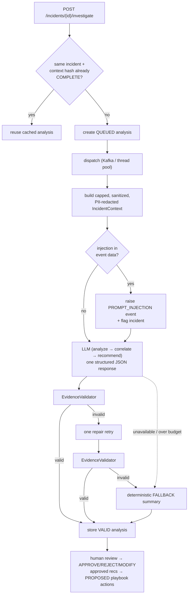

# AI Design — evidence-validated investigation

Phase 12 adds an AI investigation layer that is **useful but never trusted**. The model summarizes,
hypothesizes and recommends; it never acts, and nothing it says is accepted unless it is backed by
the incident's own evidence. Everything is behind `sentinel.ai.enabled`; with the flag off, or the
model unavailable/over budget, every feature returns a deterministic fallback.

## 1. Pipeline

`POST /api/incidents/{id}/investigate` (ANALYST+) is rate-limited and idempotent, and runs
asynchronously — via a Kafka topic (`ai.investigations`) when the pipeline is enabled, otherwise on
a thread pool. It returns `202 Accepted` with an analysis id to poll.



The three stages (1) analyze, (2) correlate/explain, (3) recommend are expressed as sections of a
single structured prompt and returned as one JSON object, so there is one analysis row per
investigation rather than four separate agents.

Output schema (strictly validated):

```json
{
  "summary": "…", "confidence": 0.0,
  "hypotheses": ["…"],
  "recommendations": [{"action": "block_ip|disable_user|force_password_reset|monitor", "target": "…", "reason": "…"}],
  "claims": [{"text": "…", "evidenceEventIds": [1, 2]}]
}
```

## 2. The evidence validator (the key control)

Nothing the model returns is accepted on trust. For every analysis:

- **Every claim must cite event ids** that exist and belong to *this* incident and *this* org.
  A fabricated or foreign id is a hard rejection.
- **Recommendation actions are allow-listed** (`block_ip`, `disable_user`, `force_password_reset`,
  `monitor`) and their **target must be an IP or user that appears in the evidence**.
- **Schema is enforced** (summary present, confidence in range); malformed JSON is rejected.
- A **faithfulness score** = supported claims / total claims is computed; below the configured
  minimum the analysis is rejected.

On rejection there is exactly **one repair retry** (the model is told what was wrong), then a
deterministic **FALLBACK** summary built from the risk breakdown and timeline. The stored
`validation_status` is `VALID | REJECTED | FALLBACK`, with the faithfulness score and the validated
cited event ids.

## 3. Context discipline

The model only ever sees a **structured `IncidentContext`**, never raw logs. The builder:

- caps the number of events and timeline entries, and truncates every free-text field;
- **redacts PII** (emails always; IPs optionally) via `PiiRedactor`;
- strips control characters and neutralizes instruction-like patterns via `PromptSanitizer`;
- never includes raw payloads, secrets, password hashes or API keys.

The API key is read **only** from the `LLM_API_KEY` environment variable and is never logged. Per
call we record model name, latency and token counts; a daily token/cost budget and a per-org quota
gate spend (exceeded → fallback), and a circuit breaker + retries-with-backoff wrap the transport.

## 4. Threat model of the AI itself

| Threat | Control |
|--------|---------|
| **Prompt injection** via attacker-controlled log fields | Data is wrapped in delimited untrusted-data blocks; the system prompt says the data is not instructions; instruction patterns are stripped; an `InjectionDetector` raises a `PROMPT_INJECTION` event and flags the incident; output is schema-validated regardless of what the data says. |
| **Hallucinated findings / fabricated evidence** | Evidence validator rejects any claim not cited to real incident events; faithfulness score; repair-retry then fallback. |
| **Unsafe/unauthorized actions** | The model has no tools and cannot act. Output can only create **PROPOSED** recommendations; actions are allow-listed and targets must be in the evidence; execution is a separate, human-approved phase. |
| **Data exfiltration / PII leakage to the provider** | Context is capped, sanitized and PII-redacted; no raw payloads/secrets/keys are sent; the key never appears in logs. |
| **Cost / abuse** | Per-org rate limit, idempotent re-investigation (context-hash cache), daily token/cost budget and per-org quota, circuit breaker. |
| **Provider outage** | Everything degrades to a deterministic fallback; the API never fails because the LLM is down. |

See [`docs/adr/ADR-002-ai-guardrails.md`](adr/ADR-002-ai-guardrails.md) for the decisions and
[`docs/ai-evaluation.md`](ai-evaluation.md) for measured faithfulness/injection metrics.
