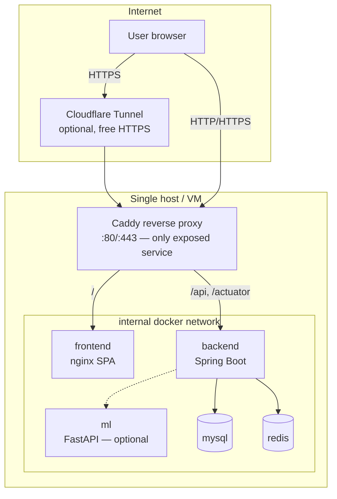

# Deployment

SentinelAI deploys as a set of Docker containers behind a Caddy reverse proxy — **$0 of
infrastructure**: no AWS, no managed services. It runs the same way on a laptop and on a free-tier
VM, and can be exposed to the internet over HTTPS via an optional Cloudflare Tunnel (no open ports).

## Architecture



Only Caddy publishes ports; the app, DB and cache live on an internal network. Images are pulled
from `ghcr.io/<owner>/sentinel-ai-{backend,frontend,ml}` by tag.

## Local deploy (built images, tag `local`)

```bash
cp infrastructure/docker/.env.example infrastructure/docker/.env   # edit secrets
# Build the three images locally as sentinel-ai-*:local
docker build -t sentinel-ai-backend:local  backend
docker build -t sentinel-ai-frontend:local frontend
docker build -t sentinel-ai-ml:local       ml
# Point compose at local images and deploy (health-checked + smoke-tested + auto-rollback)
#   set IMAGE_BASE=sentinel-ai and TAG=local in .env, or inline:
IMAGE_BASE=sentinel-ai ./scripts/deploy.sh local
```

Open http://localhost. The deploy records the previous tag and **rolls back automatically** if the
health checks or smoke test fail.

## VM deploy (Oracle Cloud Always Free, or any Linux VM)

1. Provision a free VM (e.g. Oracle Cloud Always Free Ampere A1), install Docker + Compose.
2. `git clone` this repo, `cp infrastructure/docker/.env.example infrastructure/docker/.env`, fill
   in secrets, set `IMAGE_BASE=ghcr.io/<owner>/sentinel-ai` and `TAG=<sha-or-version>`.
3. `./scripts/deploy.sh <tag>`.

### Free public HTTPS with Cloudflare Tunnel (no open ports)

1. In the Cloudflare Zero Trust dashboard, create a tunnel and copy its token.
2. Put `TUNNEL_TOKEN=...` in `.env`, map the tunnel hostname to `http://caddy:80`.
3. Start with the tunnel profile:
   ```bash
   COMPOSE_PROFILES=tunnel docker compose --env-file infrastructure/docker/.env \
     -f infrastructure/docker/docker-compose.prod.yml up -d
   ```
   The app is now reachable at your `*.trycloudflare`/custom domain over HTTPS, firewall untouched.

### Optional CI/CD over SSH

`.github/workflows/deploy.yml` deploys on a version tag or manual dispatch. It is **disabled unless**
the `SSH_HOST` secret is set; configure `SSH_HOST`, `SSH_USER`, `SSH_KEY` to enable. It simply runs
`scripts/deploy.sh` on the VM, inheriting the same health-check + auto-rollback behaviour.

## Secrets handling

- All secrets come from `infrastructure/docker/.env` (gitignored); `.env.example` documents each.
- Production uses `SPRING_PROFILES_ACTIVE=prod`, which **fails fast** on a missing/weak
  `JWT_SECRET`, missing `DB_PASSWORD`, or a missing `LLM_API_KEY` when AI+http is enabled
  (`StartupSecretsValidator`). Secrets are never printed by the scripts or logged by the app.
- First boot can create one admin from `ADMIN_USERNAME`/`ADMIN_PASSWORD` (only on an empty DB).

## Backup & restore runbook

```bash
./scripts/backup.sh                       # backups/sentinelai-<ts>.sql.gz, prunes > RETENTION_DAYS
./scripts/restore.sh backups/sentinelai-<ts>.sql.gz
```
`backup.sh` uses `mysqldump --single-transaction` (consistent, non-locking). Schedule it with cron.
Restore is tested in VERIFY (write row → backup → delete → restore → row present).

## Rollback runbook

- Automatic: `deploy.sh` rolls back to the previously-recorded tag if health/smoke fails.
- Manual: `./scripts/rollback.sh <previous-tag>`. The last good tag is stored in
  `infrastructure/docker/.deploy-state`.

## Crash recovery

Every service sets `restart: unless-stopped`, so the Docker daemon restarts a container that exits
abnormally (and after a host reboot), unless it was explicitly stopped. Note: on some local engines
(observed with colima), an external `docker kill` is treated like a manual stop and is **not**
auto-restarted — recover with `docker compose ... up -d` or `docker start`. In standard Docker and on
a production VM, a real process crash is restarted by the policy.

## Database migrations (Flyway)

Flyway runs on backend startup (`ddl-auto=validate`). Keep migrations **backward-compatible** so an
old container and the new schema can coexist during the brief overlap of a rolling restart:

- Additive first: add nullable columns / new tables; backfill; only later (a subsequent release)
  drop or tighten. Never rename or drop a column in the same release that stops writing it.
- Expand-then-contract for renames. This keeps rollback to the previous image safe against the
  already-migrated schema.

## Cost

| Component | Choice | Cost |
|-----------|--------|------|
| Compute | Laptop or Oracle Cloud Always Free VM | $0 |
| Container registry | GitHub Container Registry (public) | $0 |
| CI/CD | GitHub Actions (free tier) | $0 |
| Reverse proxy / TLS | Caddy (Let's Encrypt) | $0 |
| Public HTTPS URL | Cloudflare Tunnel (free) | $0 |
| Database / cache | MySQL + Redis containers | $0 |
| **Total** | | **$0** |
