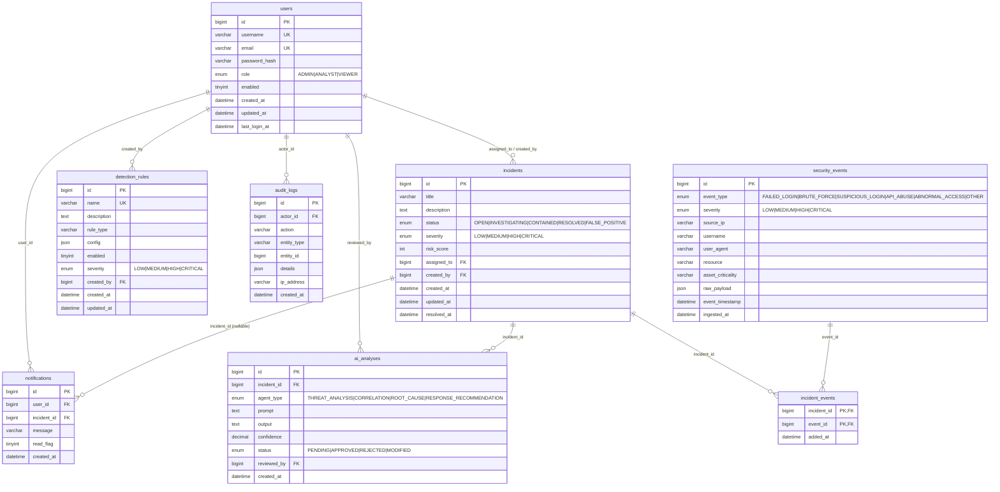

# SentinelAI — Entity-Relationship Diagram (Phase 2)

The domain model created in Phase 2 (Flyway migrations `V2`–`V9`). Enum columns use native
MySQL `ENUM`; `raw_payload`, `config`, and `details` are `JSON`.

## Relationships & delete behavior

| Child → Parent | Column | ON DELETE | Rationale |
|---|---|---|---|
| incidents → users | `assigned_to` | SET NULL | Keep the incident if the assignee is removed. |
| incidents → users | `created_by` | SET NULL | Keep the incident if the author is removed. |
| incident_events → incidents | `incident_id` | CASCADE | Links are meaningless without the incident. |
| incident_events → security_events | `event_id` | CASCADE | Links are meaningless without the event. |
| detection_rules → users | `created_by` | SET NULL | Keep the rule if the author is removed. |
| ai_analyses → incidents | `incident_id` | CASCADE | Analyses belong to their incident. |
| ai_analyses → users | `reviewed_by` | SET NULL | Keep the analysis if the reviewer is removed. |
| audit_logs → users | `actor_id` | SET NULL | Audit trail must survive user deletion (insert-only). |
| notifications → users | `user_id` | CASCADE | Notifications belong to their user. |
| notifications → incidents | `incident_id` | SET NULL | Notification can outlive the incident it referenced. |

`incident_events` is the many-to-many join between `incidents` and `security_events`, modeled
in JPA as an explicit join entity (composite key `incident_id + event_id`) so the link can
carry its own `added_at` timestamp.
