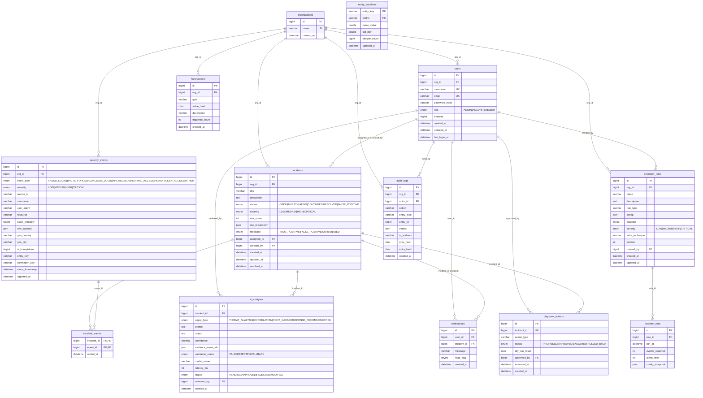

# SentinelAI — Entity-Relationship Diagram (Phase 2)

Domain model created in Phase 2 (Flyway migrations `V2`–`V14`, InnoDB / utf8mb4). Enum columns
use native MySQL `ENUM` (uppercase values); `*_payload` / `*_breakdown` / `config` / `details` /
`evidence_event_ids` / `dry_run_result` / `config_snapshot` are `JSON`; hashes are `CHAR(64)`.
Every org-scoped table references `organizations` via `org_id`.

## Foreign keys & delete behavior

| Child → Parent | Column | ON DELETE |
|---|---|---|
| incident_events → incidents | incident_id | CASCADE |
| incident_events → security_events | event_id | CASCADE |
| backtest_runs → detection_rules | rule_id | CASCADE |
| incidents → users | assigned_to, created_by | SET NULL |
| detection_rules → users | created_by | SET NULL |
| ai_analyses → users | reviewed_by | SET NULL |
| audit_logs → users | actor_id | SET NULL |
| playbook_actions → users | approved_by | SET NULL |
| users / security_events / incidents / detection_rules / audit_logs / honeytokens → organizations | org_id | RESTRICT |
| ai_analyses → incidents | incident_id | RESTRICT |
| notifications → users | user_id | RESTRICT |
| notifications → incidents | incident_id | RESTRICT |
| playbook_actions → incidents | incident_id | RESTRICT |

CASCADE for owned links (`incident_events`, `backtest_runs`); SET NULL for optional user
references (so records survive user deletion); RESTRICT everywhere else.

`incident_events` and `entity_baselines` use composite primary keys. `audit_logs` is insert-only
(hash-chained via `prev_hash`/`entry_hash`); its repository exposes no update/delete.

## Indexes

Hot-path indexes: `event_timestamp`, `source_ip`, `severity`, `event_type`, `username`,
`entity_key`, `correlation_key`, composite `(org_id, event_timestamp)`, incident `status` and
`severity`, plus an index on every foreign-key column (InnoDB).
