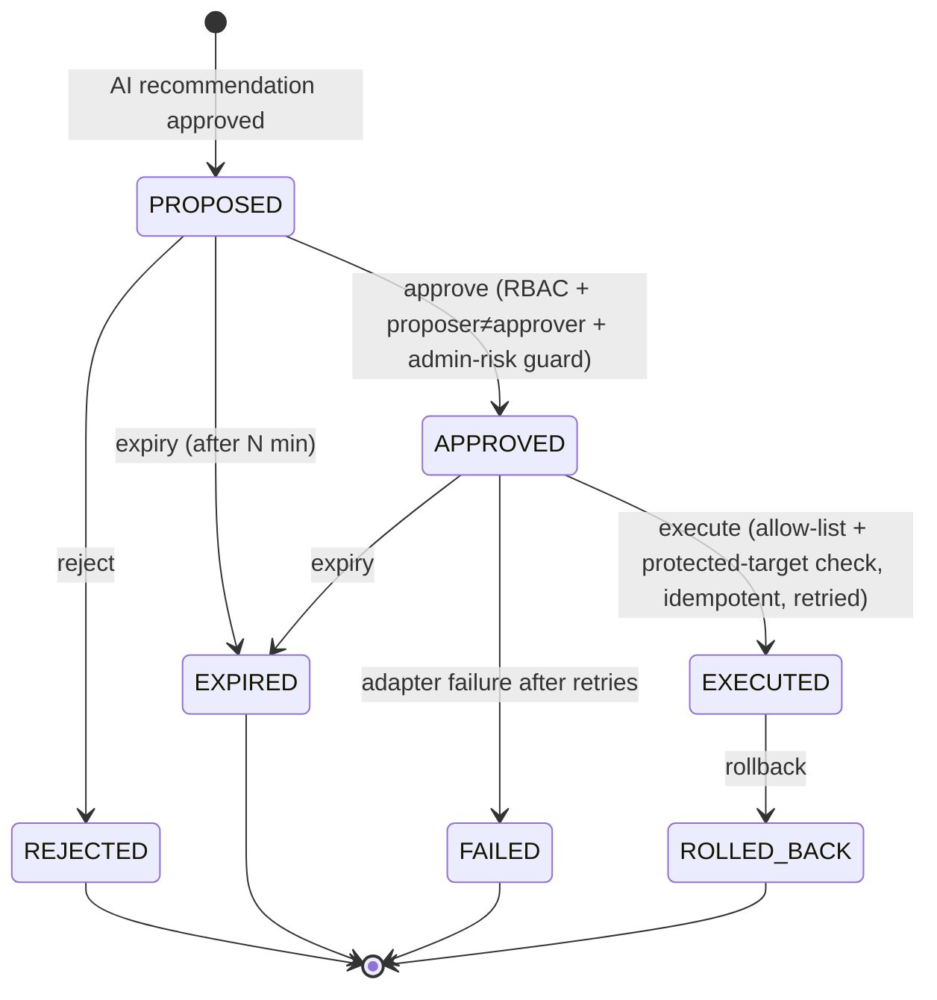

# SOAR-lite Playbooks

Phase 13 adds human-approved response actions, a feedback-driven tuning loop, and similar-incident
lookup. Actions are **proposed by AI, approved by humans, executed against adapters** (never real
systems directly), and every step is reversible, audited and time-boxed.

## Response actions

`ResponseAction` implementations — `block_ip`, `disable_user`, `force_password_reset`,
`revoke_sessions`, `add_watchlist` — run against `FirewallAdapter` / `IdentityAdapter` interfaces
(mock implementations ship now; real integrations plug in later). Each supports `dryRun` (preview +
blast radius), `execute` (with before/after state) and `rollback`.

## State machine

Dry-run never changes state. Illegal transitions throw `InvalidStateTransitionException`.

## Safety rules

- **Protected targets are never acted on.** An admin account (disable / reset / revoke) and an
  internal-network / loopback / allow-listed IP (block) are refused at both dry-run and execute.
- **Destructive-action allow-list** in config: a destructive action type not on the allow-list can
  never execute.
- **Two-person rule for HIGH/CRITICAL.** Those actions require an **ADMIN** approver who is **not**
  the proposer, and the approver passes the **admin-risk guard**. ANALYSTs may approve LOW/MEDIUM.
- **Expiry.** Proposals/approvals expire after a configured window and can no longer be executed.
- **Idempotent execute.** Executing the same action twice is a no-op.
- **Retries + failure handling.** Adapter calls are retried; exhausted failures move the action to
  FAILED with a reason (the partition/flow is never blocked).
- **Full audit + timeline.** Every transition is audit-logged with before/after state, and execution
  is also an incident-timeline entry. Rollback restores the prior state.

## Feedback-driven tuning

Analyst TRUE_POSITIVE / FALSE_POSITIVE feedback drives `GET /api/rules/{id}/tuning-suggestions`
(and a scheduled recompute). For each rule it computes the false-positive rate over reviewed
incidents and replays the rule at higher thresholds to report, e.g., *"raise threshold 5 → 8:
removes 80% of false positives (4), loses 0 true positives"*. Suggestions require a minimum reviewed
sample size and are **never auto-applied** — an admin applies one through the normal, audited,
admin-risk-guarded rule-edit path.

## Similar past incidents

`GET /api/incidents/{id}/similar` returns the most similar past incidents by feature-vector cosine
similarity (rule types, MITRE techniques, entity type, severity, time-of-day, event-type counts),
with the shared features and how each was resolved — including a "what worked before" hint when the
same executed action resolved the earlier incidents. Per-org vectors are cached and invalidated when
incidents change.

## Response-time evaluation

`GET /api/evaluation/response-time` reports the median/average time from an incident being raised to
its first approved response action — a SOAR MTTR for the evaluation harness.
