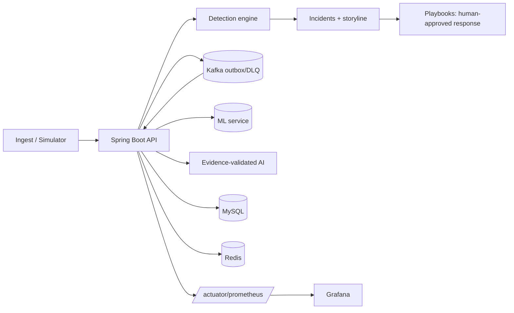

# SentinelAI — Project Report

> A zero-cost, AI-assisted mini Security Operations Center. Final-year capstone.

## Abstract
SentinelAI ingests security events, correlates them into incidents through a pluggable detection
engine, scores risk with a rules+ML hybrid, and adds evidence-validated AI triage and human-approved
SOAR response — all behind a hardened API and a React command center, deployed at **$0** on Docker
Compose with full Prometheus/Grafana observability. It demonstrates a realistic SOC pipeline
(event → alert → incident → investigate → respond → audit) with security, resilience, and honesty
(simulated data, bounded ML/AI claims) as first-class concerns.

## 1. Problem
Security teams drown in alerts: high volume, low signal, slow triage, and risky manual response.
Commercial SIEM/SOAR platforms are powerful but costly and opaque. A student/edge context needs a
system that is **free to run**, **transparent**, **secure by construction**, and **demonstrably
correct** — without pretending simulated data is production truth.

## 2. Related work
- **Splunk / Microsoft Sentinel**: mature SIEM+SOAR, cloud-scale, paid, closed. SentinelAI mirrors
  the pipeline (ingest→detect→correlate→respond) at zero cost and full transparency.
- **Wazuh (open source)**: agent-based HIDS + SIEM; strong on endpoint telemetry. SentinelAI instead
  focuses on a clean event model, an explainable risk/AI layer, and human-approved SOAR with safety
  rails.
- SentinelAI's differentiators: evidence-validated AI (no hallucinated verdicts), deterministic
  decisioning with AI only for wording, two-person reversible SOAR, and a tamper-evident audit chain.

## 3. Architecture
Spring Boot modular monolith (domain packages: `event`, `detection`, `risk`, `incident`, `ai`,
`playbook`, `adminrisk`, `kafka`, `baseline`, `audit`, `site`…), MySQL (Flyway migrations), Redis
(cache + rate limit), Kafka (event pipeline with outbox + idempotency + DLQ, optional), a Python
FastAPI ML service, and a React/Vite SPA. Caddy reverse-proxies and serves the SPA; Prometheus +
Grafana provide metrics. Everything is Docker Compose; optional Cloudflare Tunnel gives a free public
HTTPS URL. Diagrams: [architecture](../architecture.md), [threat model](../security/threat-model.md).

## 4. Data model (ER)
Core entities: `organization`, `users`, `security_events`, `alerts`, `incidents`
(+`incident_alerts`, `incident_events`, `incident_timeline`), `detection_rules`, `audit_logs`
(hash-chained), `entity_baselines`, `playbook_actions`, `honeytokens`, `sites`/`api_keys`. Full
diagram: [ERD](../erd.md).

## 5. API summary
Stateless JWT; `/api/v1` alias; ISO-8601 UTC; consistent pagination/sorting. Key groups: auth,
events, alerts, incidents (+timeline/risk/graph/similar/actions), rules (+backtest/tuning), dashboard
(+geo-flows), admin (users/audit/pipeline/risk), simulator, evaluation. Full table in the
[README](../../README.md#endpoints); interactive docs at `/swagger-ui.html`.

## 6. Security
OWASP-Top-10 hardening pass (headers/CSP, config CORS allow-list, JWT hardening + refresh-reuse
detection, org-scoped access control with an enforced endpoint-protection test, input size/depth
limits, SSRF guard, log-injection sanitizing, secrets fail-fast), gitleaks + OWASP Dependency-Check +
Trivy + ZAP + SonarQube wiring, a STRIDE threat model, and a tamper-evident audit chain. See
[`docs/security/`](../security/).

## 7. Testing
~174 backend tests (Testcontainers: real MySQL/Redis/Kafka), including security regression
(JWT/RBAC/IDOR/injection/payload-limits/fuzz), Kafka chaos (zero loss/dupes), AI guardrails
(faithfulness + prompt-injection), and detection backtests. Frontend: Vitest (components + 3D
fallback) + Playwright (login→dashboard→incident→investigate→approve, reduced-motion, WebGL-off).
Load: k6. CI runs all of it and gates image publish.

## 8. Results
- **Detection**: incident-level recall 0.75 (6/8 seeded scenarios); alert-reduction ~98.6%
  (events→incidents). Per-rule precision/recall via the deterministic eval harness.
- **Performance**: reads ~1,237 req/s @ p95 94 ms (cached); single ingest ~130 ms. See
  [`performance.md`](../performance.md), [`final-evaluation.md`](../final-evaluation.md).
- **Resilience**: Kafka chaos → zero loss/duplicates. **Observability**: live Grafana dashboards
  (rate, p50/95/99, JVM, DB, Kafka lag) — see `docs/screenshots/05-grafana.png`.

## 9. Limitations
Simulated data (not production traffic); single node (no HA); the 8 GB dev box co-locates infra +
observability, which bounds the measured write throughput; AI metrics use the deterministic
FakeLlmClient in CI; mock SOAR adapters (no real firewall/IdP yet).

## 10. Future work
Real firewall/IdP integrations, more detection rules, end-to-end OTel tracing through Kafka,
multi-tenant hardening, and a managed AWS deployment (ECS/RDS/ElastiCache/MSK) with autoscaling —
the module interfaces and stateless API already support the split (see [ADR-003](../adr/ADR-003-zero-cost-deploy.md)).

---
*Export to PDF:* `pandoc docs/report/report.md -o docs/report/SentinelAI-report.pdf` (requires pandoc
+ a LaTeX engine), or print the rendered Markdown to PDF from your browser/IDE.
