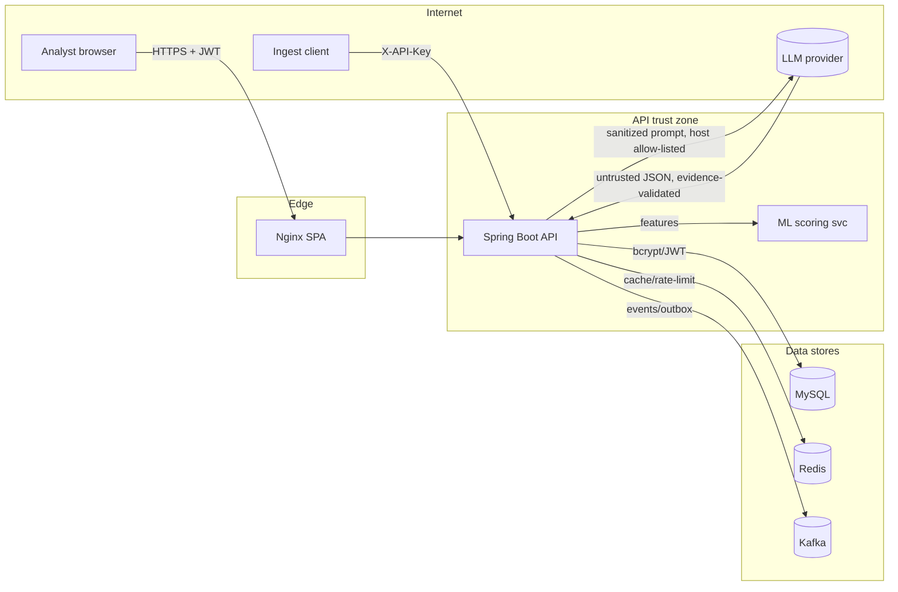

# SentinelAI — Threat Model (STRIDE)

Scope: SentinelAI itself — the SOC platform — not the attacks it is built to detect. Covers the API,
datastores, and the optional AI (LLM) and Kafka components.

## Assets

- **Credentials & tokens**: password hashes (bcrypt), JWT signing secret, refresh tokens (stored as
  SHA-256 hashes), per-site API keys.
- **Security data**: events, alerts, incidents, audit chain, AI analyses, playbook actions.
- **Tenancy**: each record belongs to an `org`; cross-tenant isolation is a core guarantee.
- **Response capability**: playbook actions can block IPs / disable users (via mock adapters today).
- **Secrets at rest/in transit**: `JWT_SECRET`, `DB_PASSWORD`, `LLM_API_KEY`.

## Trust boundaries

1. Browser ↔ API (public internet → authenticated API).
2. API ↔ MySQL / Redis / Kafka (internal network).
3. API ↔ LLM provider (outbound internet; untrusted response content).
4. Ingest clients ↔ API (API-key authenticated, per-site).
5. Analyst ↔ privileged operations (RBAC + admin-risk guard + playbook approval).

## Data-flow diagram

## STRIDE threats & mitigations

| # | STRIDE | Threat | Mitigation | Proof (test) |
|---|--------|--------|------------|--------------|
| T1 | Spoofing | Forged / `alg:none` / tampered JWT | HS256 pinned, `verifyWith` (HMAC only), required issuer+audience, exp/nbf with bounded skew | `JwtSecurityTest` |
| T2 | Spoofing | Credential stuffing / brute force | Lockout after N failures, generic errors (no user enumeration), self-monitoring events | `AuthApiTest` |
| T3 | Tampering | Audit-log tampering | Hash-chained audit records with verify endpoint | `AuditChainTest` |
| T4 | Tampering | Malicious/oversized JSON crashing the parser | Jackson `StreamReadConstraints` (depth/size), request-size caps → 4xx not 5xx | `PayloadLimitsTest` |
| T5 | Repudiation | Denying a privileged action | Every transition audited with actor + before/after; playbook needs approval | `PlaybookFlowTest`, audit chain |
| T6 | Info disclosure | Cross-tenant data access (IDOR) | Every by-id lookup filters on `org`; endpoint enumeration guard | `CrossTenantAccessTest`, `EndpointProtectionTest` |
| T7 | Info disclosure | Stack traces / SQL leaking to clients | Single `@RestControllerAdvice`, safe messages, server-side logging only | `GlobalExceptionHandler` |
| T8 | Info disclosure | Secrets in repo/logs | Env-only secrets, gitleaks (pre-commit + CI), prod fail-fast, no prompt/key logging | `gitleaks`, `StartupSecretsValidator` |
| T9 | DoS | Unbounded payloads / request floods | Size/depth caps, rate limiting (Redis), AI budget/circuit-breaker | `RateLimitFilterTest`, `PayloadLimitsTest` |
| T10 | Elevation | Lower role performing admin ops | Method `@PreAuthorize`, admin-risk guard, two-person playbook rule | `PrivilegeEscalationTest` |
| T11 | Spoofing (AI) | Prompt injection via event data | Prompt sanitizer + data wrapping, evidence validator, decision computed deterministically | prompt-injection suite |
| T12 | Tampering (AI) | SSRF via LLM base URL / redirects | Outbound host derived from config only, https-or-localhost, redirects disabled | `HttpLlmClient` SSRF guard |
| T13 | Tampering (Kafka) | Poison/duplicate messages | Idempotency keys, retry→DLQ, consumer never crashes on bad input | `KafkaPipelineTest`, `FuzzNormalizerTest` |
| T14 | Spoofing | CSRF on state-changing calls | Stateless bearer auth, no cookies/session → no CSRF vector (see AR-03) | `SecurityConfig` stateless |
| T15 | Info disclosure | Clickjacking / MIME sniffing | `X-Frame-Options: DENY` + CSP `frame-ancestors 'none'`, `nosniff` | `SecurityHeadersTest` |

## Residual risk

- **Single-instance assumptions**: some auth flows commit per-call rather than in one transaction
  (documented); acceptable for the current single-node deployment.
- **Mock response adapters**: playbook actions act on mock firewall/identity; real integrations
  will need their own authn/z and threat review.
- **Self-managed secrets**: no external secrets manager yet; prod relies on env injection + fail-fast.
- **AI provider trust**: the LLM is semi-trusted; mitigations reduce but cannot eliminate the risk
  of a crafted response, hence the deterministic decisioning and evidence validation.
